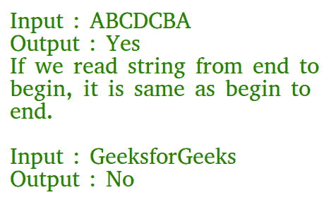

# 检查给定字符串是否是回文的 C 程序

> 原文:[https://www . geesforgeks . org/c-program-check-given-string-回文/](https://www.geeksforgeeks.org/c-program-check-given-string-palindrome/)

给定一个字符串，写一个 c 函数检查它是否是回文。
如果一个字符串的反串与字符串相同，则称该字符串为回文。比如“abba”是回文，但“abbc”不是回文。



**算法:**
ispalindome(str)
1)求 str 的长度。让长度为 n.
2)将低和高索引分别初始化为 0 和 n-1。
3)当低指数“l”小于高指数“h”时，执行以下操作。
…..a)如果字符串[l]与字符串[h]不同，则返回 false。
…..b)递增 l 和递减 h，即做 l++和 h–。
4)如果我们到达这里，这意味着我们没有发现遗漏
下面是 C 实现，检查给定的字符串是否是回文。

## C

```
#include <stdio.h>
#include <string.h>

// A function to check if a string str is palindrome
void isPalindrome(char str[])
{
    // Start from leftmost and rightmost corners of str
    int l = 0;
    int h = strlen(str) - 1;

    // Keep comparing characters while they are same
    while (h > l)
    {
        if (str[l++] != str[h--])
        {
            printf("%s is not a palindrome\n", str);
            return;
        }
    }
    printf("%s is a palindrome\n", str);
}

// Driver program to test above function
int main()
{
    isPalindrome("abba");
    isPalindrome("abbccbba");
    isPalindrome("geeks");
    return 0;
}
```

**Output**

```
abba is a palindrome
abbccbba is a palindrome
geeks is not a palindrome

```

[递归功能，检查一个字符串是否是回文](https://www.geeksforgeeks.org/recursive-function-check-string-palindrome/)
如果发现有不正确的地方，请写评论，或者想分享更多关于上面讨论的话题的信息