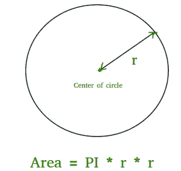

# 程序寻找圆的面积

> 原文:[https://www.geeksforgeeks.org/c-program-find-area-circle/](https://www.geeksforgeeks.org/c-program-find-area-circle/)

圆的面积可以简单地用下面的公式来计算。



```
Area = pi * r2
where r is radius of circle and it maybe in float because value of pie is 3.14 
```

## C++

```
// C++ program to find area
// of circle
#include <iostream>
const double pi = 3.14159265358979323846;
using namespace std;

// function to calculate the area of circle
float findArea(float r)
{
    return (pi * r * r);
}
// driver code
int main()
{
    float r, Area;
    r = 5;

    // function calling
    Area = findArea(r);
    // displaying the area
    cout << "Area of Circle is :" << Area;
    return 0;
}
```

## C

```
// C program to find area
// of circle
#include <stdio.h>
#include <math.h>
#define PI 3.142

double findArea(int r)
{
   return PI * pow(r, 2);
}

int main()
{
    printf("Area is %f", findArea(5));
    return 0;
}
```

## Java 语言(一种计算机语言，尤用于创建网站)

```
// Java program to find area
// of circle

class Test
{
    static final double PI = Math.PI;

    static double findArea(int r)
    {
       return PI * Math.pow(r, 2);
    }

    // Driver method
    public static void main(String[] args)
    {
        System.out.println("Area is " +  findArea(5));
    }
}
```

## 蟒蛇 3

```
# Python3 program to find Area of a circle

def findArea(r):
    PI = 3.142
    return PI * (r*r);

# Driver method
print("Area is %.6f" % findArea(5));

# This code is contributed by Chinmoy Lenka
```

## C#

```
// C# program to find area of circle
using System;

class GFG
{
    static double PI = Math.PI;

    static double findArea(int r)
    {
    return PI * Math.Pow(r, 2);
    }

    // Driver method
    static void Main()
    {
        Console.Write("Area is " + findArea(5));
    }
}

// This code is contributed by Sam007.
```

## 服务器端编程语言（Professional Hypertext Preprocessor 的缩写）

```
<?php
// PHP program to find area
// of circle

function findArea( $r)
{
    $PI =3.142;
    return $PI * pow($r, 2);
}

// Driver Code
echo("Area is ");
echo(findArea(5));
return 0;

// This code is contributed by vt_m.
?>
```

## java 描述语言

```
<script>

// Javascript program to find area
// of circle

let pi = 3.14159265358979323846; 

// function to calculate the area of circle
function findArea(r)
{
    return (pi * r * r);
}

// Driver code
    let r, Area;
    r = 5;

    // function calling
    Area = findArea(r);

    // displaying the area
    document.write("Area of Circle is :" + Area);

// This code is contributed by Mayank Tyagi

</script>
```

**输出:**

```
Area is 78.550000
```

***时间复杂度:** O(1)*

***辅助空间:**O(1)*T4】