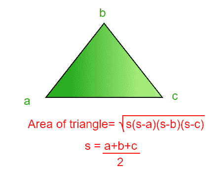

# 计算三角形面积的程序

> 原文:[https://www.geeksforgeeks.org/c-program-find-area-triangle/](https://www.geeksforgeeks.org/c-program-find-area-triangle/)

**使用给定边寻找区域:**

**示例:**

```
Input : a = 5, b = 7, c = 8
Output : Area of a triangle is 17.320508

Input : a = 3, b = 4, c = 5
Output : Area of a triangle is 6.000000
```

[三角形](http://en.wikipedia.org/wiki/Triangle#Other_area_formulas)的面积可以简单地用以下公式计算。

```
Area = sqrt(s*(s-a)*(s-b)*(s-c))
where a, b and c are lengths of sides of
triangle and s = (a+b+c)/2
```



## C++

```
// C++ Program to find the area 
// of triangle 
#include <bits/stdc++.h>
using namespace std;

float findArea(float a, float b, float c) 
{ 
    // Length of sides must be positive 
    // and sum of any two sides 
    // must be smaller than third side. 
    if (a < 0 || b < 0 || c < 0 || 
       (a + b <= c) || a + c <= b || 
                       b + c <= a) 
    { 
        cout << "Not a valid triangle"; 
        exit(0); 
    } 
    float s = (a + b + c) / 2; 
    return sqrt(s * (s - a) * 
                    (s - b) * (s - c)); 
} 

// Driver Code
int main() 
{ 
    float a = 3.0; 
    float b = 4.0; 
    float c = 5.0; 

    cout << "Area is " << findArea(a, b, c); 
    return 0; 
} 

// This code is contributed 
// by rathbhupendra
```

## C

```
#include <stdio.h> 
#include <stdlib.h> 

float findArea(float a, float b, float c)
{
    // Length of sides must be positive and sum of any two sides
    // must be smaller than third side.
    if (a < 0 || b < 0 || c <0 || (a+b <= c) ||
        a+c <=b || b+c <=a)
    {
        printf("Not a valid triangle");
        exit(0);
    }
    float s = (a+b+c)/2;
    return sqrt(s*(s-a)*(s-b)*(s-c));
}

int main()
{
    float a = 3.0;
    float b = 4.0;
    float c = 5.0;

    printf("Area is %f", findArea(a, b, c));
    return 0;
}
```

## Java 语言(一种计算机语言，尤用于创建网站)

```
// Java program to print
// Floyd's triangle

class Test
{
    static float findArea(float a, float b, float c)
    {
        // Length of sides must be positive and sum of any two sides
        // must be smaller than third side.
        if (a < 0 || b < 0 || c <0 || (a+b <= c) ||
            a+c <=b || b+c <=a)
        {
            System.out.println("Not a valid triangle");
            System.exit(0);
        }
        float s = (a+b+c)/2;
        return (float)Math.sqrt(s*(s-a)*(s-b)*(s-c));
    }

    // Driver method
    public static void main(String[] args) 
    {
        float a = 3.0f;
        float b = 4.0f;
        float c = 5.0f;

        System.out.println("Area is " + findArea(a, b, c));
    }
}
```

## 计算机编程语言

```
# Python Program to find the area 
# of triangle 

# Length of sides must be positive 
# and sum of any two sides 
def findArea(a,b,c): 

    # must be smaller than third side. 
    if (a < 0 or b < 0 or c < 0 or (a+b <= c) or (a+c <=b) or (b+c <=a) ): 
        print('Not a valid triangle') 
        return

    # calculate the semi-perimeter 
    s = (a + b + c) / 2

    # calculate the area 
    area = (s * (s - a) * (s - b) * (s - c)) ** 0.5
    print('Area of a triangle is %f' %area) 

# Initialize first side of triangle 
a = 3.0
# Initialize second side of triangle 
b = 4.0
# Initialize Third side of triangle 
c = 5.0
findArea(a,b,c) 

# This code is contributed by Shariq Raza 
```

## C#

```
// C# program to print
// Floyd's triangle
using System;

class Test {

    // Function to find area
    static float findArea(float a, float b,
                        float c)
    {

        // Length of sides must be positive
        // and sum of any two sides
        // must be smaller than third side.
        if (a < 0 || b < 0 || c <0 || 
        (a + b <= c) || a + c <=b || 
            b + c <=a)
        {
            Console.Write("Not a valid triangle");
            System.Environment.Exit(0);
        }
        float s = (a + b + c) / 2;
        return (float)Math.Sqrt(s * (s - a) * 
                            (s - b) * (s - c));
    }

    // Driver code
    public static void Main() 
    {
        float a = 3.0f;
        float b = 4.0f;
        float c = 5.0f;

        Console.Write("Area is " + findArea(a, b, c));
    }
}

// This code is contributed Nitin Mittal.
```

## 服务器端编程语言（Professional Hypertext Preprocessor 的缩写）

```
<?php
function findArea($a, $b, $c)
{
    // Length of sides must be positive
    // and sum of any two sides must
    // be smaller than third side.
    if ($a < 0 or $b < 0 or
        $c < 0 or ($a + $b <= $c) or
        $a + $c <= $b or $b + $c <= $a)
    {
        echo "Not a valid triangle";
        exit(0);
    }
    $s = ($a + $b + $c) / 2;
    return sqrt($s * ($s - $a) * 
            ($s - $b) * ($s - $c));
}

// Driver Code
$a = 3.0;
$b = 4.0;
$c = 5.0;

echo "Area is ", findArea($a, $b, $c);

// This code is contributed anuJ_67.
?>
```

## java 描述语言

```
<script>

// javascript Program to find the area 
// of triangle 

function findArea( a,  b,  c) 
{ 
    // Length of sides must be positive 
    // and sum of any two sides 
    // must be smaller than third side. 
    if (a < 0 || b < 0 || c < 0 || 
       (a + b <= c) || a + c <= b || 
                       b + c <= a) 
    { 
        document.write( "Not a valid triangle"); 
        return;
    } 
    let s = (a + b + c) / 2; 
    return Math.sqrt(s * (s - a) * 
                    (s - b) * (s - c)); 
} 

// Driver Code

    let a = 3.0; 
    let b = 4.0; 
    let c = 5.0; 

  document.write( "Area is " + findArea(a, b, c)); 

// This code is contributed by todaysgaurav 

</script>
```

**输出:**

```
Area is 6
```

***时间复杂度:** O(log <sub>2</sub> n)*

***辅助空间:** O(1)*
**使用坐标寻找区域:**

如果给我们三个角的坐标，我们可以应用下面的[鞋带公式](https://www.geeksforgeeks.org/area-of-a-polygon-with-given-n-ordered-vertices/)来表示面积。

```
Area

= | 1/2 [ (x1y2 + x2y3 + ... + xn-1yn + xny1) -
(x2y1 + x3y2 + ... + xnyn-1 + x1yn) ] | 
```

## C++

```
// C++ program to evaluate area of a polygon using
// shoelace formula
#include <bits/stdc++.h>
using namespace std;

// (X[i], Y[i]) are coordinates of i'th point.
double polygonArea(double X[], double Y[], int n)
{
    // Initialize area
    double area = 0.0;

    // Calculate value of shoelace formula
    int j = n - 1;
    for (int i = 0; i < n; i++)
    {
        area += (X[j] + X[i]) * (Y[j] - Y[i]);
        j = i;  // j is previous vertex to i
    }

    // Return absolute value
    return abs(area / 2.0);
}

// Driver program to test above function
int main()
{
    double X[] = {0, 2, 4};
    double Y[] = {1, 3, 7};

    int n = sizeof(X)/sizeof(X[0]);

    cout << polygonArea(X, Y, n);
}
```

## Java 语言(一种计算机语言，尤用于创建网站)

```
// Java program to evaluate area of 
// a polygon usingshoelace formula
import java.io.*;
import java.math.*;

class GFG {

    // (X[i], Y[i]) are coordinates of i'th point.
    static double polygonArea(double X[], double Y[], int n)
    {
        // Initialize area
        double area = 0.0;

        // Calculate value of shoelace formula
        int j = n - 1;
        for (int i = 0; i < n; i++)
        {
            area += (X[j] + X[i]) * (Y[j] - Y[i]);

            // j is previous vertex to i
            j = i; 
        }

        // Return absolute value
        return Math.abs(area / 2.0);
    }

    // Driver program 
    public static void main (String[] args) 
    {
        double X[] = {0, 2, 4};
        double Y[] = {1, 3, 7};

        int n = X.length;
        System.out.println(polygonArea(X, Y, n));
    }
}

// This code is contributed
// by Nikita Tiwari.
```

## 蟒蛇 3

```
# Python 3 program to evaluate
# area of a polygon using
# shoelace formula

# (X[i], Y[i]) are coordinates of i'th point.
def polygonArea(X,Y, n) :

    # Initialize area
    area = 0.0

    # Calculate value of shoelace formula
    j = n - 1
    for i in range( 0, n) :
        area = area + (X[j] + X[i]) * (Y[j] - Y[i])
        j = i  # j is previous vertex to i

    # Return absolute value
    return abs(area // 2.0)

# Driver program to test above function
X = [0, 2, 4]
Y = [1, 3, 7]

n = len(X)
print(polygonArea(X, Y, n))

# This code is contributed
# by Nikita Tiwari.
```

## C#

```
// C# program to evaluate area of 
// a polygon usingshoelace formula
using System;

class GFG {

    // (X[i], Y[i]) are coordinates 
    // of i'th point.
    static double polygonArea(double []X,
                       double []Y, int n)
    {
        // Initialize area
        double area = 0.0;

        // Calculate value of shoelace
        // formula
        int j = n - 1;
        for (int i = 0; i < n; i++)
        {
            area += (X[j] + X[i]) * 
                        (Y[j] - Y[i]);

            // j is previous vertex to i
            j = i; 
        }

        // Return absolute value
        return Math.Abs(area / 2.0);
    }

    // Driver program 
    public static void Main () 
    {
        double []X = {0, 2, 4};
        double []Y = {1, 3, 7};

        int n = X.Length;
        Console.WriteLine(
                 polygonArea(X, Y, n));
    }
}

// This code is contributed by anuj_67.
```

## 服务器端编程语言（Professional Hypertext Preprocessor 的缩写）

```
<?php
// PHP program to evaluate area of a 
// polygon using shoelace formula

// (X[i], Y[i]) are coordinates
// of i'th point.
function polygonArea( $X, $Y, $n)
{

    // Initialize area
    $area = 0.0;

    // Calculate value of 
    // shoelace formula
    $j = $n - 1;
    for ( $i = 0; $i < $n; $i++)
    {
        $area += ($X[$j] + $X[$i]) * 
                 ($Y[$j] - $Y[$i]);

        // j is previous vertex to i
        $j = $i; 
    }

    // Return absolute value
    return abs($area / 2.0);
}

    // Driver Code
    $X = array(0, 2, 4);
    $Y = array(1, 3, 7);
    $n = count($X);
    echo polygonArea($X, $Y, $n);

// This code is contributed by anuj_67.
?>
```

## java 描述语言

```
<script>

// Javascript program to evaluate area of a polygon using
// shoelace formula

// (X[i], Y[i]) are coordinates of i'th point.
function polygonArea(X, Y, n)
{

    // Initialize area
    let area = 0.0;

    // Calculate value of shoelace formula
    let j = n - 1;
    for (let i = 0; i < n; i++)
    {
        area += (X[j] + X[i]) * (Y[j] - Y[i]);
        j = i; // j is previous vertex to i
    }

    // Return absolute value
    return Math.abs(area / 2.0);
}

// Driver program to test above function
    let X = [0, 2, 4];
    let Y = [1, 3, 7];

    let n = X.length;

    document.write(polygonArea(X, Y, n));

// This code is contributed by Mayank Tyagi

</script>
```

**输出:**

```
2
```

***时间复杂度:** O(n)*

***辅助空间:** O(1)*

https://www.youtube.com/watch?v=-fuEL8MEtOc