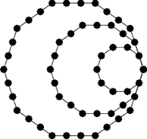

# C 程序求十进制数

> 原文:[https://www . geesforgeks . org/c-program-find-decagonal-number/](https://www.geeksforgeeks.org/c-program-find-decagonal-number/)

十边形数是将三角形和正方形的概念扩展到十边形(十边形)的一种图形数。第 n <sup>个</sup>十边形数字计算 n 个嵌套十边形图案中的点数，所有十边形共享一个公共角，其中图案中的第 i <sup>个</sup>十边形具有由彼此间隔一个单位的 I 个点组成的边。第 n 个十边形数由公式 D(n)=4n <sup>2</sup> -3n 给出；
前几个十边形数字是:
0、1、10、27、52、85、126、175、232、297、370、451、540、637、742、855、976、1105、1242……

[](https://media.geeksforgeeks.org/wp-content/uploads/decagonal-number.png) 
例:

```
Input : n = 2
Output : 10

Input : n = 5
Output : 85

Input : n = 7
Output: 175

```

```
// C program to find nth decagonal number
#include <stdio.h>
#include <stdlib.h>

// Finding the nth  Decagonal Number
int decagonalNum(int n)
{
    return (4 * n * n - 3 * n);
}

// Driver program to test above function
int main()
{
    int n = 10;
    printf("Decagonal Number is = %d",
           decagonalNum(n));

    return 0;
}
```

**Output:**

```
Decagonal Number is = 370

```