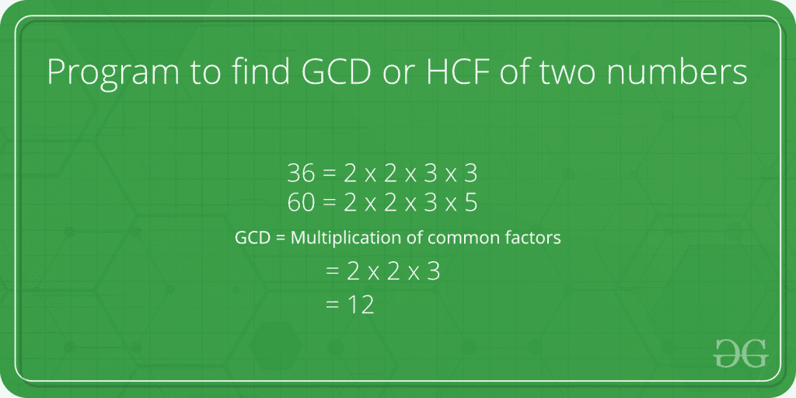

# 程序查找两个数的 GCD 或 HCF

> 原文:[https://www . geesforgeks . org/c-program-find-gcd-hcf-two-numbers/](https://www.geeksforgeeks.org/c-program-find-gcd-hcf-two-numbers/)

两个数的 GCD(最大公约数)或 HCF(最高公因数)是两个数相除的最大数。



例如，20 和 28 的 GCD 是 4，98 和 56 的 GCD 是 14。**对于解**假设 a=98 & b=56

所以 a= a-b 和 b 保持不变，所以 a=98-56=42 & b= 56。所以 b=b-a 和 a 是一样的

b= 56-42 = 14 & a= 42。42 是 14 的 3 倍所以 **HCF** 是 14。同样 a=36 & b=60，这里 b > a 所以 b = 24 & a= 36 现在 a > b 所以 a= 12 & b= 24。12 是 36 和 60 的 HCF。这个概念总是令人满意的。

一个**简单的解决方案**是[找到两个数的所有素因子](https://www.geeksforgeeks.org/print-all-prime-factors-of-a-given-number/)，然后找到两个数中所有因子的交集。最后返回交集中元素的乘积。
一个**高效的解决方案**是使用[欧几里德算法](https://www.geeksforgeeks.org/euclidean-algorithms-basic-and-extended/)，这是用于此目的的主要算法。这个想法是，如果从一个较大的数字中减去一个较小的数字，两个数字的 GCD 不会改变。

## C++

```
// C++ program to find GCD of two numbers
#include <iostream>
using namespace std;
// Recursive function to return gcd of a and b
int gcd(int a, int b)
{
    // Everything divides 0
    if (a == 0)
       return b;
    if (b == 0)
       return a;

    // base case
    if (a == b)
        return a;

    // a is greater
    if (a > b)
        return gcd(a-b, b);
    return gcd(a, b-a);
}

// Driver program to test above function
int main()
{
    int a = 98, b = 56;
    cout<<"GCD of "<<a<<" and "<<b<<" is "<<gcd(a, b);
    return 0;
}
```

## C

```
// C program to find GCD of two numbers
#include <stdio.h>

// Recursive function to return gcd of a and b
int gcd(int a, int b)
{
    // Everything divides 0
    if (a == 0)
       return b;
    if (b == 0)
       return a;

    // base case
    if (a == b)
        return a;

    // a is greater
    if (a > b)
        return gcd(a-b, b);
    return gcd(a, b-a);
}

// Driver program to test above function
int main()
{
    int a = 98, b = 56;
    printf("GCD of %d and %d is %d ", a, b, gcd(a, b));
    return 0;
}
```

## Java 语言(一种计算机语言，尤用于创建网站)

```
// Java program to find GCD of two numbers
class Test
{
    // Recursive function to return gcd of a and b
    static int gcd(int a, int b)
    {
        // Everything divides 0
        if (a == 0)
          return b;
        if (b == 0)
          return a;

        // base case
        if (a == b)
            return a;

        // a is greater
        if (a > b)
            return gcd(a-b, b);
        return gcd(a, b-a);
    }

    // Driver method
    public static void main(String[] args)
    {
        int a = 98, b = 56;
        System.out.println("GCD of " + a +" and " + b + " is " + gcd(a, b));
    }
}
```

## 蟒蛇 3

```
# Recursive function to return gcd of a and b
def gcd(a,b):

    # Everything divides 0
    if (a == 0):
        return b
    if (b == 0):
        return a

    # base case
    if (a == b):
        return a

    # a is greater
    if (a > b):
        return gcd(a-b, b)
    return gcd(a, b-a)

# Driver program to test above function
a = 98
b = 56
if(gcd(a, b)):
    print('GCD of', a, 'and', b, 'is', gcd(a, b))
else:
    print('not found')

# This code is contributed by Danish Raza
```

## C#

```
// C# program to find GCD of two
// numbers
using System;

class GFG {

    // Recursive function to return
    // gcd of a and b
    static int gcd(int a, int b)
    {

        // Everything divides 0
        if (a == 0)
          return b;
        if (b == 0)
          return a;

        // base case
        if (a == b)
            return a;

        // a is greater
        if (a > b)
            return gcd(a - b, b);

        return gcd(a, b - a);
    }

    // Driver method
    public static void Main()
    {
        int a = 98, b = 56;
        Console.WriteLine("GCD of "
          + a +" and " + b + " is "
                      + gcd(a, b));
    }
}

// This code is contributed by anuj_67.
```

## 服务器端编程语言（Professional Hypertext Preprocessor 的缩写）

```
<?php
// PHP program to find GCD
// of two numbers

// Recursive function to
// return gcd of a and b
function gcd($a, $b)
{

    // Everything divides 0
    if ($a == 0)
       return $b;
    if ($b == 0)
       return $a;

    // base case
    if($a == $b)
        return $a ;

    // a is greater
    if($a > $b)
        return gcd( $a-$b , $b ) ;

    return gcd( $a , $b-$a ) ;
}

// Driver code
$a = 98 ;
$b = 56 ;

echo "GCD of $a and $b is ", gcd($a , $b) ;

// This code is contributed by Anivesh Tiwari
?>
```

## java 描述语言

```
<script>

// Javascript program to find GCD of two numbers

// Recursive function to return gcd of a and b
function gcd(a, b)
{
    // Everything divides 0
    if (a == 0)
    return b;
    if (b == 0)
    return a;

    // base case
    if (a == b)
        return a;

    // a is greater
    if (a > b)
        return gcd(a-b, b);
    return gcd(a, b-a);
}

// Driver program to test above function

    let a = 98, b = 56;
    document.write("GCD of "+ a + " and " + b + " is " + gcd(a, b));

// This code is contributed by Mayank Tyagi

</script>
```

**输出:**

```
GCD of 98 and 56 is 14
```

**动态编程**方法(**自上而下使用记忆**):

## C++

```
// C++ program to find GCD of two numbers
#include <bits/stdc++.h>
using namespace std;

int static dp[1001][1001];

// Function to return gcd of a and b
int gcd(int a, int b)
{
    // Everything divides 0
    if (a == 0)
        return b;
    if (b == 0)
        return a;

    // base case
    if (a == b)
        return a;

    // if a value is already
    // present in dp
    if(dp[a][b] != -1)
        return dp[a][b];

    // a is greater
    if (a > b)
        dp[a][b] = gcd(a-b, b);

    // b is greater
    else
        dp[a][b] = gcd(a, b-a);

    // return dp
    return dp[a][b];
}

// Driver program to test above function
int main()
{
    int a = 98, b = 56;
    memset(dp, -1, sizeof(dp));
    cout<<"GCD of "<<a<<" and "<<b<<" is "<<gcd(a, b);
    return 0;
}
```

## Java 语言(一种计算机语言，尤用于创建网站)

```
// Java program to find GCD of two numbers
import java.util.*;
public class GFG
{
    static int [][]dp = new int[1001][1001];

    // Recursive function to return gcd of a and b
    static int gcd(int a, int b)
    {

        // Everything divides 0
        if (a == 0)
          return b;
        if (b == 0)
          return a;

        // base case
        if (a == b)
            return a;

        // if a value is already
    // present in dp
    if(dp[a][b] != -1)
        return dp[a][b];

    // a is greater
    if (a > b)
        dp[a][b] = gcd(a-b, b);

    // b is greater
    else
        dp[a][b] = gcd(a, b-a);

    // return dp
    return dp[a][b];
    }

    // Driver method
    public static void main(String[] args)
    {
        for(int i = 0; i < 1001; i++) {
            for(int j = 0; j < 1001; j++) {
                dp[i][j] = -1;
            }
        }
        int a = 98, b = 56;
        System.out.println("GCD of " + a +" and " + b + " is " + gcd(a, b));
    }
}

// This code is contributed by Samim Hossain Mondal.
```

## 计算机编程语言

```
# function to return gcd of a and b

# Taking the matrix as globally
dp = [[-1 for i in range(1001)] for j in range(1001)]

def gcd(a,b):

    # Everything divides 0
    if (a == 0):
        return b
    if (b == 0):
        return a

    # base case
    if (a == b):
        return a

    if(dp[a][b] != -1):
        return dp[a][b]

    # a is greater
    if (a > b):
        dp[a][b] = gcd(a-b, b)
    else:
        dp[a][b] = gcd(a, b-a)

    return dp[a][b]

# Driver program to test above function
a = 98
b = 56
if(gcd(a, b)):
    print('GCD of', a, 'and', b, 'is', gcd(a, b))
else:
    print('not found')

# This code is contributed by Samim Hossain Mondal.
```

## C#

```
// C# program to find GCD of two numbers
using System;
class GFG
{
    static int [,]dp = new int[1001, 1001];

    // Recursive function to return gcd of a and b
    static int gcd(int a, int b)
    {

        // Everything divides 0
        if (a == 0)
          return b;
        if (b == 0)
          return a;

        // base case
        if (a == b)
            return a;

    // if a value is already
    // present in dp
    if(dp[a, b] != -1)
        return dp[a, b];

    // a is greater
    if (a > b)
        dp[a, b] = gcd(a-b, b);

    // b is greater
    else
        dp[a, b] = gcd(a, b-a);

    // return dp
    return dp[a, b];
    }

    // Driver method
    public static void Main()
    {
        for(int i = 0; i < 1001; i++) {
            for(int j = 0; j < 1001; j++) {
                dp[i, j] = -1;
            }
        }
        int a = 98, b = 56;
        Console.Write("GCD of " + a +" and " + b + " is " + gcd(a, b));
    }
}

// This code is contributed by Samim Hossain Mondal.
```

## java 描述语言

```
//<script>
// Javascript program to find GCD of two numbers
var dp = new Array(1001);

// Loop to create 2D array using 1D array
for (var i = 0; i < dp.length; i++) {
    dp[i] = new Array(1001);
}

// Function to return gcd of a and b
function gcd(a, b)
{

    // Everything divides 0
    if (a == 0)
        return b;
    if (b == 0)
        return a;

    // base case
    if (a == b)
        return a;

    // if a value is already
    // present in dp
    if(dp[a][b] != -1)
        return dp[a][b];

    // a is greater
    if (a > b)
        dp[a][b] = gcd(a-b, b);

    // b is greater
    else
        dp[a][b] = gcd(a, b-a);

    // return dp
    return dp[a][b];
}

// Driver program to test above function
    let a = 98, b = 56;

    for(let i = 0; i < 1001; i++) {
        for(let j = 0; j < 1001; j++) {
            dp[i][j] = -1;
        }
    }
    document.write("GCD of "+ a + " and " + b + " is " + gcd(a, b));

// This code is contributed by Samim Hossain Mondal

</script>
```

**Output**

```
GCD of 98 and 56 is 14
```

**时间复杂度:** O(a * b)

**辅助空间:** O(1)

一个**更有效的解决方案**是在[欧几里德算法](https://www.geeksforgeeks.org/euclidean-algorithms-basic-and-extended/)中使用模算子。

## C++

```
// C++ program to find GCD of two numbers
#include <iostream>
using namespace std;
// Recursive function to return gcd of a and b
int gcd(int a, int b)
{
    if (b == 0)
        return a;
    return gcd(b, a % b);

}

// Driver program to test above function
int main()
{
    int a = 98, b = 56;
    cout<<"GCD of "<<a<<" and "<<b<<" is "<<gcd(a, b);
    return 0;
}
```

## C

```
// C program to find GCD of two numbers
#include <stdio.h>

// Recursive function to return gcd of a and b
int gcd(int a, int b)
{
    if (b == 0)
        return a;
    return gcd(b, a % b);
}

// Driver program to test above function
int main()
{
    int a = 98, b = 56;
    printf("GCD of %d and %d is %d ", a, b, gcd(a, b));
    return 0;
}
```

## Java 语言(一种计算机语言，尤用于创建网站)

```
// Java program to find GCD of two numbers
class Test
{
    // Recursive function to return gcd of a and b
    static int gcd(int a, int b)
    {
      if (b == 0)
        return a;
      return gcd(b, a % b);
    }

    // Driver method
    public static void main(String[] args)
    {
        int a = 98, b = 56;
        System.out.println("GCD of " + a +" and " + b + " is " + gcd(a, b));
    }
}
```

## 蟒蛇 3

```
# Recursive function to return gcd of a and b
def gcd(a,b):

    # Everything divides 0
    if (b == 0):
         return a
    return gcd(b, a%b)

# Driver program to test above function
a = 98
b = 56
if(gcd(a, b)):
    print('GCD of', a, 'and', b, 'is', gcd(a, b))
else:
    print('not found')

# This code is contributed by Danish Raza
```

## C#

```
// C# program to find GCD of two
// numbers
using System;

class GFG {

    // Recursive function to return
    // gcd of a and b
    static int gcd(int a, int b)
    {     
       if (b == 0)
          return a;
       return gcd(b, a % b);
    }

    // Driver method
    public static void Main()
    {
        int a = 98, b = 56;
        Console.WriteLine("GCD of "
          + a +" and " + b + " is "
                      + gcd(a, b));
    }
}

// This code is contributed by anuj_67.
```

## 服务器端编程语言（Professional Hypertext Preprocessor 的缩写）

```
<?php
// PHP program to find GCD
// of two numbers

// Recursive function to
// return gcd of a and b
function gcd($a, $b)
{
    // Everything divides 0
    if($b==0)
        return $a ;

    return gcd( $b , $a % $b ) ;
}

// Driver code
$a = 98 ;
$b = 56 ;

echo "GCD of $a and $b is ", gcd($a , $b) ;

// This code is contributed by Anivesh Tiwari
?>
```

## java 描述语言

```
<script>

// Javascript program to find GCD of two number

// Recursive function to return gcd of a and b

function gcd(a, b){

  // Everything divides 0
  if(b == 0){
    return a;
  }

  return gcd(b, a % b);
}

// Driver code
let a = 98;
let b = 56;

document.write(`GCD of ${a} and ${b} is ${gcd(a, b)}`);

// This code is contributed by _saurabh_jaiswal

</script>
```

**输出:**

```
GCD of 98 and 56 is 14
```

上述算法的时间复杂度为 O(log(max(a，b)))这一点的推导是从最坏情况的分析中得到的。我们要做的是，我们问走一步的最少的两个数字是什么，它们是(1，1)。如果我们想将步数增加到 2，同时尽可能保持低的数字，我们可以将数字取为(1，2)。同样，对于 3 个步骤，数字是(2，3)，4 是(3，5)，5 是(5，8)。所以我们可以注意到一个模式，对于第 n 步，数字是(fib(n)，fib(n+1))。所以最坏的时间复杂度是 O(n)，其中 a>= fib(n)，b>= fib(n+1)。

斐波那契数列是一个指数增长的数列，其中第 n/(n-1)项的比率接近(sqrt(5)-1)/2，这也被称为黄金比率。因此，我们可以看到算法的时间复杂度随着项的指数增长而线性增加，因此时间复杂度为 log(max(a，b))。

请参考两个以上(或数组)数字的[GCD](https://www.geeksforgeeks.org/gcd-two-array-numbers/)找到两个以上数字的 HCF。
如果你发现任何不正确的地方，或者你想分享更多关于上述话题的信息，请写评论