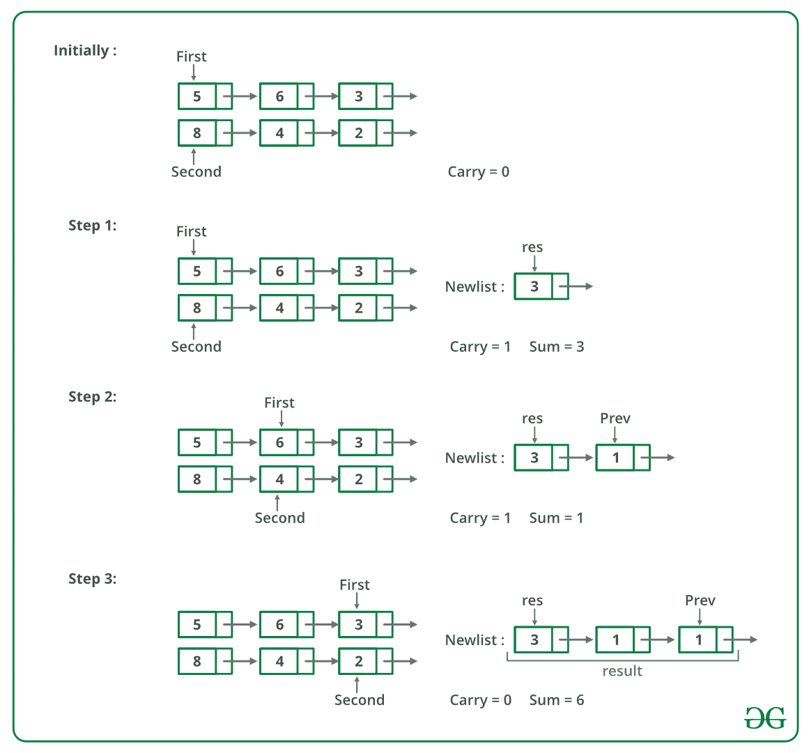

# 用链表表示的两个数相加的 C 程序-集合 2

> 原文:[https://www . geesforgeks . org/c-用于添加两个数字的程序-由链表表示-set-2/](https://www.geeksforgeeks.org/c-program-for-adding-two-numbers-represented-by-linked-lists-set-2/)

给定两个由两个链表表示的数字，编写一个返回求和列表的函数。求和列表是两个输入数字相加的链表表示。不允许修改列表。另外，不允许使用显式的额外空间(提示:使用递归)。

**例**:

```
Input:
First List: 5->6->3  
Second List: 8->4->2 

Output:
Resultant list: 1->4->0->5
```

我们在这里讨论了一个解决方案，它适用于链表，其中最低有效位是链表的第一个节点，最高有效位是最后一个节点。在这个问题中，最重要的节点是第一个节点，最不重要的数字是最后一个节点，我们不允许修改列表。这里使用递归从右向左计算总和。

以下是步骤。
**【1)**计算给定的两个链表的大小。
**2)** 如果大小相同，则使用递归计算总和。将递归调用堆栈中的所有节点保留到最右边的节点，计算最右边节点的总和，并向左侧结转。
**3)** 如果尺寸不一样，那么按照以下步骤:
…。 **a)** 计算两个链表的大小差。让差异成为*差异*
…。 **b)** 在更大的链表中向前移动 *diff* 节点。现在使用步骤 2 计算较小列表和较大列表的右边子列表(大小相同)的总和。另外，存储这个总和的进位。
……。 **c)** 计算进位(上一步计算)与较大列表的剩余左子列表之和。此总和的节点被添加到上一步获得的总和列表的开头。

以下是上述方法的模拟运行:



下图是上述方法的实现。

## C

```
// A C recursive program to add two 
// linked lists
#include <stdio.h>
#include <stdlib.h>

// A linked List Node
struct Node 
{
    int data;
    struct Node* next;
};

typedef struct Node node;

/* A utility function to insert a 
   node at the beginning of 
   linked list */
void push(struct Node** head_ref, 
          int new_data)
{
    // Allocate node 
    struct Node* new_node = 
           (struct Node*)malloc(sizeof(struct Node));

    // Put in the data  
    new_node->data = new_data;

    // Link the old list off the 
    // new node 
    new_node->next = (*head_ref);

    // Move the head to point to the 
    // new node 
    (*head_ref) = new_node;
}

// A utility function to print 
// linked list 
void printList(struct Node* node)
{
    while (node != NULL) 
    {
        printf("%d  ", node->data);
        node = node->next;
    }
    printf("n");
}

// A utility function to swap 
// two pointers
void swapPointer(Node** a, Node** b)
{
    node* t = *a;
    *a = *b;
    *b = t;
}

/* A utility function to get size 
   of linked list */
int getSize(struct Node* node)
{
    int size = 0;
    while (node != NULL) 
    {
        node = node->next;
        size++;
    }
    return size;
}

// Adds two linked lists of same 
// size represented by head1
// and head2 and returns head of 
// the resultant linked list.
// Carry is propagated while 
// returning from the recursion
node* addSameSize(Node* head1,
                  Node* head2,   
                  int* carry)
{
    // Since the function assumes
    // linked lists are of same
    // size, check any of the two 
    // head pointers
    if (head1 == NULL)
        return NULL;

    int sum;

    // Allocate memory for sum 
    // node of current two nodes
    Node* result = 
          (Node*)malloc(sizeof(Node));

    // Recursively add remaining nodes
    // and get the carry
    result->next = addSameSize(head1->next, 
                               head2->next, carry);

    // Add digits of current nodes 
    // and propagated carry
    sum = head1->data + head2->data + *carry;
    *carry = sum / 10;
    sum = sum % 10;

    // Assigne the sum to current 
    // node of resultant list
    result->data = sum;

    return result;
}

// This function is called after 
// the smaller list is added
// to the bigger lists's sublist 
// of same size.  Once the
// right sublist is added, the 
// carry must be added toe left
// side of larger list to get 
// the final result.
void addCarryToRemaining(Node* head1, Node* cur, 
                         int* carry, Node** result)
{
    int sum;

    // If diff. number of nodes are 
    // not traversed, add carry
    if (head1 != cur) 
    {
        addCarryToRemaining(head1->next,
                            cur, carry,
                            result);

        sum = head1->data + *carry;
        *carry = sum / 10;
        sum %= 10;

        // Add this node to the front 
        // of the result
        push(result, sum);
    }
}

// The main function that adds two 
// linked lists represented
// by head1 and head2\. The sum of
// two lists is stored in a
// list referred by result
void addList(Node* head1, 
             Node* head2, 
             Node** result)
{
    Node* cur;

    // first list is empty
    if (head1 == NULL) 
    {
        *result = head2;
        return;
    }

    // second list is empty
    else if (head2 == NULL)
    {
        *result = head1;
        return;
    }

    int size1 = getSize(head1);
    int size2 = getSize(head2);

    int carry = 0;

    // Add same size lists
    if (size1 == size2)
        *result = addSameSize(head1, 
                              head2, 
                              &carry);

    else 
    {
        int diff = abs(size1 - size2);

        // First list should always be 
        // larger than second
        // list. If not, swap pointers
        if (size1 < size2)
            swapPointer(&head1, &head2);

        // move diff. number of nodes in 
        // first list
        for (cur = head1; diff--; 
             cur = cur->next);

        // Get addition of same size 
        // lists
        *result = addSameSize(cur, 
                              head2, 
                              &carry);

        // Get addition of remaining first 
        // list and carry
        addCarryToRemaining(head1, cur, 
                            &carry, result);
    }

    // If some carry is still there, add 
    // a new node to the fron of the 
    // result list. e.g. 999 and 87
    if (carry)
        push(result, carry);
}

// Driver code
int main()
{
    Node *head1 = NULL, 
         *head2 = NULL, 
         *result = NULL;

    int arr1[] = {9, 9, 9};
    int arr2[] = {1, 8};

    int size1 = (sizeof(arr1) / 
                 sizeof(arr1[0]));
    int size2 = (sizeof(arr2) / 
                 sizeof(arr2[0]));

    // Create first list as 9->9->9
    int i;
    for (i = size1 - 1; i >= 0; --i)
        push(&head1, arr1[i]);

    // Create second list as 1->8
    for (i = size2 - 1; i >= 0; --i)
        push(&head2, arr2[i]);

    addList(head1, head2, &result);
    printList(result);
    return 0;
}
```

**输出:**

```
1 0 1 7
```

**时间复杂度:**
O(m+n)，其中 m 和 n 是给定的两个链表的大小。

更多详情请参考[完整文章添加两个链表表示的数字|集合 2](https://www.geeksforgeeks.org/sum-of-two-linked-lists/) ！