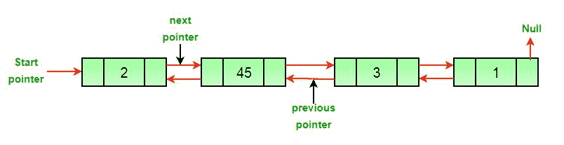
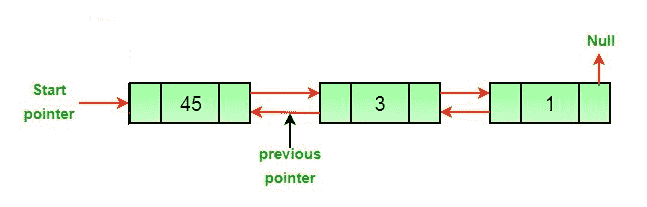
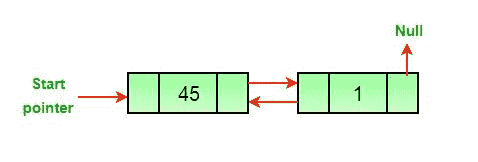
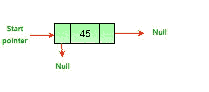
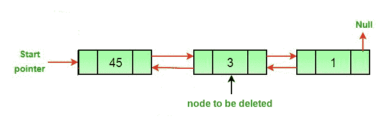

# 删除双向链表中节点的 C 程序

> 原文:[https://www . geesforgeks . org/c-用于删除双链表中节点的程序/](https://www.geeksforgeeks.org/c-program-for-deleting-a-node-in-a-doubly-linked-list/)

**先决条件:** [双向链接列表集 1|介绍和插入](https://www.geeksforgeeks.org/doubly-linked-list/)

编写一个函数来删除双向链表中的给定节点。
**原双链表**



**方法:**双链表中节点的删除可以分为三大类:

*   **删除头节点后。**



*   **删除中间节点后。**



*   **删除最后一个节点后。**



**如果要删除的节点的指针和头指针已知，那么上述三种情况都可以分两步处理。**

1.  如果要删除的节点是头节点，则将下一个节点作为头。
2.  如果删除了一个节点，请连接已删除节点的下一个和上一个节点。



**算法**

*   让要删除的节点为 *del* 。
*   如果要删除的节点是头节点，则将头指针更改为下一个当前头。

```
if *headnode* == *del* then
      *headnode* =  *del*.nextNode
```

*   如果存在上一个 *del* ，则将上一个的*下一个*设置为 *del* 。

```
if *del*.nextNode != *none* 
      *del*.nextNode.previousNode = *del*.previousNode 
```

*   如果在 *del* 旁边，则设置 *del* 旁边的 *prev* 。

```
if *del*.previousNode != *none* 
      *del*.previousNode.nextNode = *del*.next
```

## C

```
// C program to implement
// the above approach
#include <stdio.h>
#include <stdlib.h>

// A node of the doubly linked list 
struct Node 
{
    int data;
    struct Node* next;
    struct Node* prev;
};

/* Function to delete a node in a Doubly 
   Linked List. head_ref --> pointer to 
   head node pointer. del  -->  pointer 
   to node to be deleted. */
void deleteNode(struct Node** head_ref, 
                struct Node* del)
{
    // Base case 
    if (*head_ref == NULL || del == NULL)
        return;

    // If node to be deleted is head node 
    if (*head_ref == del)
        *head_ref = del->next;

    /* Change next only if node to be deleted 
       is NOT the last node */
    if (del->next != NULL)
        del->next->prev = del->prev;

    /* Change prev only if node to be deleted 
       is NOT the first node */
    if (del->prev != NULL)
        del->prev->next = del->next;

    // Finally, free the memory occupied by del
    free(del);
    return;
}

// UTILITY FUNCTIONS 
/* Function to insert a node at the 
   beginning of the Doubly Linked List */
void push(struct Node** head_ref, 
          int new_data)
{
    // Allocate node 
    struct Node* new_node = 
           (struct Node*)malloc(sizeof(struct Node));

    // Put in the data  
    new_node->data = new_data;

    /* Since we are adding at the beginning,
       prev is always NULL */
    new_node->prev = NULL;

    // Link the old list off the new node 
    new_node->next = (*head_ref);

    // Change prev of head node to new node 
    if ((*head_ref) != NULL)
        (*head_ref)->prev = new_node;

    // Move the head to point to the new node 
    (*head_ref) = new_node;
}

/* Function to print nodes in a given doubly 
   linked list. This function is same as 
   printList() of singly linked list */
void printList(struct Node* node)
{
    while (node != NULL) 
    {
        printf("%d ", node->data);
        node = node->next;
    }
}

// Driver code
int main()
{
    // Start with the empty list 
    struct Node* head = NULL;

    /* Let us create the doubly 
       linked list 10<->8<->4<->2 */
    push(&head, 2);
    push(&head, 4);
    push(&head, 8);
    push(&head, 10);

    printf(
    "Original Linked list ");
    printList(head);

    /* Delete nodes from the doubly 
       linked list */
    // Delete first node
    deleteNode(&head, head); 

    // Delete middle node
    deleteNode(&head, head->next); 

    // Delete last node
    deleteNode(&head, head->next); 

    /* Modified linked list will be 
       NULL<-8->NULL */
    printf(
    "Modified Linked list ");
    printList(head);

    getchar();
}
```

**输出:**

```
Original Linked list 10 8 4 2 
Modified Linked list 8
```

**复杂度分析:**

*   **时间复杂度:** O(1)。
    因为不需要遍历链表，所以时间复杂度是恒定的。
*   **空间复杂度:** O(1)。
    由于不需要额外的空间，所以空间复杂度不变。

详情请参考[删除双向链表](https://www.geeksforgeeks.org/delete-a-node-in-a-doubly-linked-list/)中的一个节点的完整文章！