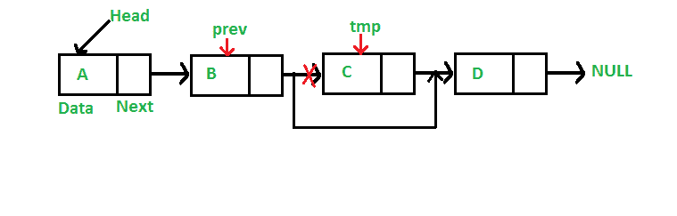

# 删除链表中节点的 C 程序

> 原文:[https://www . geesforgeks . org/c-删除链表中节点的程序/](https://www.geeksforgeeks.org/c-program-for-deleting-a-node-in-a-linked-list/)

我们在之前关于单链表的文章中讨论过[链表介绍](https://www.geeksforgeeks.org/linked-list-set-1-introduction/)和[链表插入](https://www.geeksforgeeks.org/linked-list-set-2-inserting-a-node/)。
让我们制定问题陈述，了解删除过程。*给定一个‘键’，删除链表中该键的第一次出现*。

**<u>迭代方法:</u>**
要从链表中删除一个节点，我们需要做以下步骤。
1)找到要删除节点的上一个节点。
2)更改上一个节点的下一个。
3)为要删除的节点释放内存。



由于链表的每个节点都是使用 C 语言中的 malloc()动态分配的，所以我们需要调用 [free()](http://www.cplusplus.com/reference/cstdlib/free/) 来释放分配给待删除节点的内存。

## C

```
// A complete working C program
// to demonstrate deletion in
// singly linked list
#include <stdio.h>
#include <stdlib.h>

// A linked list node
struct Node {
    int data;
    struct Node* next;
};

/* Given a reference (pointer to pointer) to the head of a
   list and an int, inserts a new node on the front of the
   list. */
void push(struct Node** head_ref, int new_data)
{
    struct Node* new_node
        = (struct Node*)malloc(sizeof(struct Node));
    new_node->data = new_data;
    new_node->next = (*head_ref);
    (*head_ref) = new_node;
}

/* Given a reference (pointer to pointer) to the head of a
   list and a key, deletes the first occurrence of key in
   linked list */
void deleteNode(struct Node** head_ref, int key)
{
    // Store head node
    struct Node *temp = *head_ref, *prev;

    // If head node itself holds the key to be deleted
    if (temp != NULL && temp->data == key) {
        *head_ref = temp->next; // Changed head
        free(temp); // free old head
        return;
    }

    // Search for the key to be deleted, keep track of the
    // previous node as we need to change 'prev->next'
    while (temp != NULL && temp->data != key) {
        prev = temp;
        temp = temp->next;
    }

    // If key was not present in linked list
    if (temp == NULL)
        return;

    // Unlink the node from linked list
    prev->next = temp->next;

    free(temp); // Free memory
}

// This function prints contents of linked list starting
// from the given node
void printList(struct Node* node)
{
    while (node != NULL) {
        printf(" %d ", node->data);
        node = node->next;
    }
}

// Driver code
int main()
{
    /* Start with the empty list */
    struct Node* head = NULL;

    push(&head, 7);
    push(&head, 1);
    push(&head, 3);
    push(&head, 2);

    puts("Created Linked List: ");
    printList(head);
    deleteNode(&head, 1);
    puts("
Linked List after Deletion of 1: ");
    printList(head);
    return 0;
}
```

**Output:**

```
Created Linked List: 
 2  3  1  7 
Linked List after Deletion of 1: 
 2  3  7
```

详情请参考[链表|集合 3(删除节点)](https://www.geeksforgeeks.org/linked-list-set-3-deleting-node/)整篇文章！