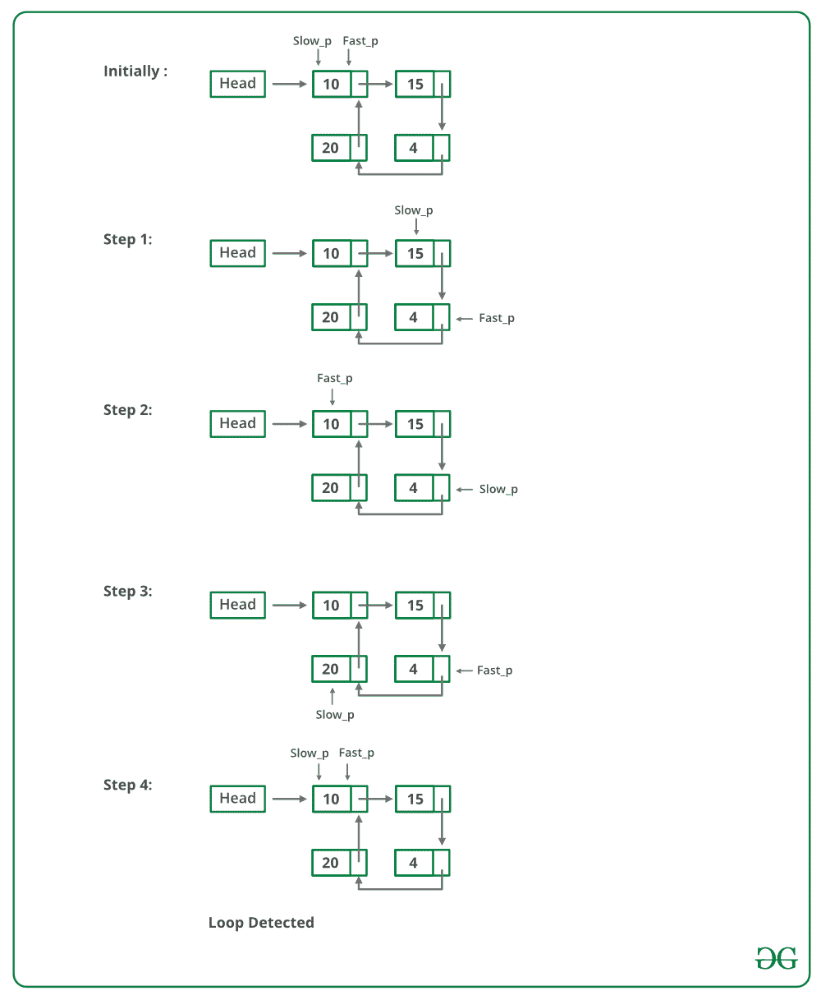

# 检测链表中循环的 C 程序

> 原文:[https://www . geesforgeks . org/c-检测链表中循环的程序/](https://www.geeksforgeeks.org/c-program-for-detecting-loop-in-a-linked-list/)

给定一个链表，检查链表是否有循环。下图显示了一个带有循环的链表。


**<u>解法</u>:弗洛伊德的寻周算法**
**法:**这是最快的方法，下面已经介绍过了:

*   使用两个指针遍历链表。
*   将一个指针(slow_p)移动一个，将另一个指针(fast_p)移动两个。
*   如果这些指针在同一个节点相遇，那么就有一个循环。如果指针没有相遇，那么链表就没有循环。

下图显示了 detectloop 函数在代码中的工作方式:



弗洛伊德循环查找算法的实现；

## C

```
// C program to detect loop in a linked list
#include <stdio.h>
#include <stdlib.h>

/* Link list node */
struct Node {
    int data;
    struct Node* next;
};

void push(struct Node** head_ref, int new_data)
{
    /* allocate node */
    struct Node* new_node
        = (struct Node*)malloc(sizeof(struct Node));

    /* put in the data  */
    new_node->data = new_data;

    /* link the old list off the new node */
    new_node->next = (*head_ref);

    /* move the head to point to the new node */
    (*head_ref) = new_node;
}

int detectLoop(struct Node* list)
{
    struct Node *slow_p = list, *fast_p = list;

    while (slow_p && fast_p && fast_p->next) {
        slow_p = slow_p->next;
        fast_p = fast_p->next->next;
        if (slow_p == fast_p) {
            return 1;
        }
    }
    return 0;
}

/* Driver program to test above function*/
int main()
{
    /* Start with the empty list */
    struct Node* head = NULL;

    push(&head, 20);
    push(&head, 4);
    push(&head, 15);
    push(&head, 10);

    /* Create a loop for testing */
    head->next->next->next->next = head;

    if (detectLoop(head))
        printf("Loop found");
    else
        printf("No Loop");
    return 0;
}
```

**Output**

```
Loop found
```

**复杂度分析:**

*   **时间复杂度:** O(n)。
    只需要遍历一次循环。
*   **辅助空间:** O(1)。
    不需要空间。

**以上算法是如何工作的？**
请看:[弗洛伊德的慢速和快速指针进场是如何工作的？](https://www.geeksforgeeks.org/how-does-floyds-slow-and-fast-pointers-approach-work/)
https://www.youtube.com/watch?v=Aup0kOWoMVg

更多详情请参考完整文章[检测链表中的循环](https://www.geeksforgeeks.org/detect-loop-in-a-linked-list/)！