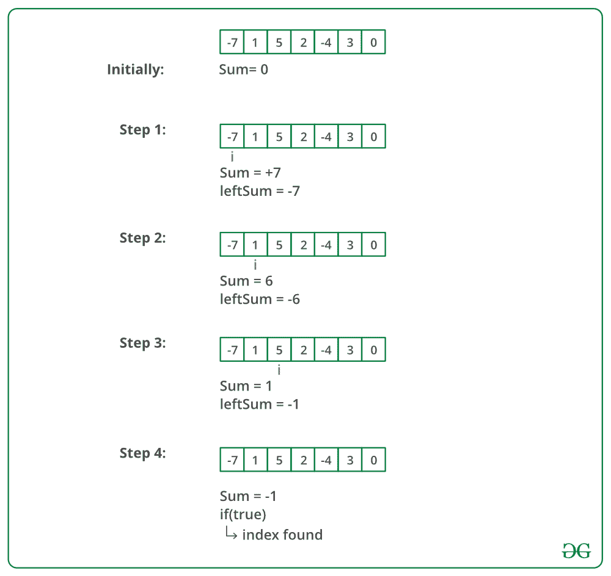

# 数组平衡指数 C 程序

> 原文:[https://www . geesforgeks . org/c-平衡程序-数组索引/](https://www.geeksforgeeks.org/c-program-for-equilibrium-index-of-an-array/)

数组的平衡索引是这样一种索引，即较低索引处的元素之和等于较高索引处的元素之和。例如，在数组 A 中:

**示例:**

> **输入** : A[] = {-7，1，5，2，-4，3，0}
> 输出 : 3
> 3 是均衡指标，因为:
> A[0]+A[1]+A[2]= A[4]+A[5]+A[6]
> 
> **输入** : A[] = {1，2，3}
> **输出** : -1

写一个函数*int balance(int[]arr，int n)*；给定大小为 n 的序列 arr[,返回一个平衡指数(如果有的话),如果不存在平衡指数，则返回-1。

**方法 1(简单但低效)**
使用两个循环。外循环遍历所有元素，内循环找出外循环选择的当前索引是否为平衡索引。这个解决方案的时间复杂度是 O(n^2).

## C

```
// C program to find equilibrium
// index of an array

#include <stdio.h>

int equilibrium(int arr[], int n)
{
    int i, j;
    int leftsum, rightsum;

    /* Check for indexes one by one until 
      an equilibrium index is found */
    for (i = 0; i < n; ++i) {       

        /* get left sum */
        leftsum = 0; 
        for (j = 0; j < i; j++)
            leftsum += arr[j];

        /* get right sum */
        rightsum = 0; 
        for (j = i + 1; j < n; j++)
            rightsum += arr[j];

        /* if leftsum and rightsum are same, 
           then we are done */
        if (leftsum == rightsum)
            return i;
    }

    /* return -1 if no equilibrium index is found */
    return -1;
}

// Driver code
int main()
{
    int arr[] = { -7, 1, 5, 2, -4, 3, 0 };
    int arr_size = sizeof(arr) / sizeof(arr[0]);
    printf("%d", equilibrium(arr, arr_size));

    getchar();
    return 0;
}
```

**Output**

```
3
```

**时间复杂度:** O(n^2)

**方法二(刁钻高效)**
思路是先得到阵的总和。然后迭代数组并不断更新初始化为零的左和。在循环中，我们可以通过逐个减去元素得到正确的和。感谢 Sambasiva 提出了这个解决方案，并为此提供了代码。

```
1) Initialize leftsum  as 0
2) Get the total sum of the array as *sum*
3) Iterate through the array and for each index i, do following.
    a)  Update *sum* to get the right sum.  
           *sum* = *sum* - arr[i] 
       // *sum* is now right sum
    b) If leftsum is equal to *sum*, then return current index. 
       // update leftsum for next iteration.
    c) leftsum = leftsum + arr[i]
4) return -1 
// If we come out of loop without returning then
// there is no equilibrium index
```

下图显示了上述方法的试运行:



下面是上述方法的实现:

## C

```
// C program to find equilibrium
// index of an array

#include <stdio.h>

int equilibrium(int arr[], int n)
{
    int sum = 0; // initialize sum of whole array
    int leftsum = 0; // initialize leftsum

    /* Find sum of the whole array */
    for (int i = 0; i < n; ++i)
        sum += arr[i];

    for (int i = 0; i < n; ++i) {
        sum -= arr[i]; // sum is now right sum for index i

        if (leftsum == sum)
            return i;

        leftsum += arr[i];
    }

    /* If no equilibrium index found, then return 0 */
    return -1;
}

// Driver code
int main()
{
    int arr[] = { -7, 1, 5, 2, -4, 3, 0 };
    int arr_size = sizeof(arr) / sizeof(arr[0]);
    printf("First equilibrium index is %d", 
                 equilibrium(arr, arr_size));

    getchar();
    return 0;
}
```

**Output**

```
First equilibrium index is 3
```

**产量:**
第一均衡指数为 3

**时间复杂度:** O(n)

更多详情请参考完整文章[数组平衡指数](https://www.geeksforgeeks.org/equilibrium-index-of-an-array/)！