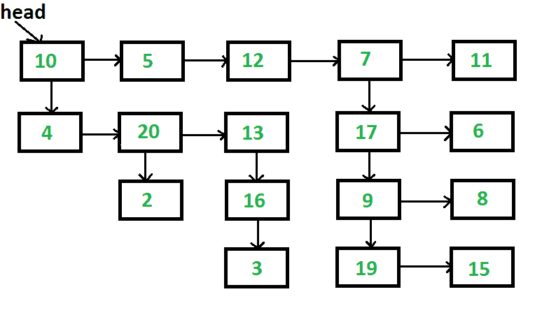

# 展平多级链表的 C 程序

> 原文:[https://www . geesforgeks . org/c-program-for-扁平化-多级链表/](https://www.geeksforgeeks.org/c-program-for-flattening-a-multilevel-linked-list/)

给定一个链表，其中除了下一个指针之外，每个节点都有一个子指针，这个子指针可以指向也可以不指向一个单独的列表。这些子列表可能有一个或多个自己的子列表，以此类推，产生一个多级数据结构，如下图所示。你被赋予列表第一层的头。展平列表，以便所有节点都出现在单级链接列表中。您需要展平列表，使第一级的所有节点都应该首先出现，然后是第二级的节点，依此类推。
每个节点都是一个 C 结构，定义如下。

## C

```
struct List
{
    int data;
    struct List *next;
    struct List *child;
};
```

[](https://media.geeksforgeeks.org/wp-content/cdn-uploads/flattenList.png)

以上列表应转换为 10-> 5-> 12-> 7-> 11-> 4-> 20-> 13-> 17-> 6-> 2-> 16-> 9-> 8-> 3-> 19-> 15

问题清楚地表明，我们需要一层一层地变平。一个解决方案的思路是，我们从第一层开始，逐个处理所有节点，如果一个节点有一个子节点，那么我们在列表的末尾追加这个子节点，否则，我们什么都不做。处理完第一级后，所有下一级节点将被追加到第一级之后。对于附加的节点，遵循相同的过程。

```
1) Take "cur" pointer, which will point to head of the first level of the list
2) Take "tail" pointer, which will point to end of the first level of the list
3) Repeat the below procedure while "curr" is not NULL.
    I) if current node has a child then
    a) append this new child list to the "tail"
        tail->next = cur->child
    b) find the last node of new child list and update "tail"
        tmp = cur->child;
        while (tmp->next != NULL)
            tmp = tmp->next;
        tail = tmp;
    II) move to the next node. i.e. cur = cur->next
```

下面是上述算法的实现。

## C

```
// Program to flatten list with next 
// and child pointers
#include <stdio.h>
#include <stdlib.h>

// Macro to find number of elements 
// in array
#define SIZE(arr) (sizeof(arr)/
                   sizeof(arr[0]))

// A linked list node has data, 
// next pointer and child pointer
struct Node
{
    int data;
    struct Node *next;
    struct Node *child;
};

// A utility function to create a linked list 
// with n nodes. The data of nodes is taken 
// from arr[].  All child pointers are set as NULL
struct Node *createList(int *arr, int n)
{
    struct Node *head = NULL;
    struct Node *p;

    int i;
    for (i = 0; i < n; ++i) 
    {
        if (head == NULL)
            head = p = (struct Node *)malloc(sizeof(*p));
        else 
        {
            p->next = (struct Node *)malloc(sizeof(*p));
            p = p->next;
        }
        p->data = arr[i];
        p->next = p->child = NULL;
    }
    return head;
}

// A utility function to print all nodes 
// of a linked list
void printList(struct Node *head)
{
    while (head != NULL) 
    {
        printf("%d ", head->data);
        head = head->next;
    }
    printf("");
}

// This function creates the input list.  
// The created list is same as shown in 
// the above figure
struct Node *createList(void)
{
    int arr1[] = {10, 5, 12, 7, 11};
    int arr2[] = {4, 20, 13};
    int arr3[] = {17, 6};
    int arr4[] = {9, 8};
    int arr5[] = {19, 15};
    int arr6[] = {2};
    int arr7[] = {16};
    int arr8[] = {3};

    // Create 8 linked lists 
    struct Node *head1 = createList(arr1, 
                                    SIZE(arr1));
    struct Node *head2 = createList(arr2, 
                                    SIZE(arr2));
    struct Node *head3 = createList(arr3, 
                                    SIZE(arr3));
    struct Node *head4 = createList(arr4, 
                                    SIZE(arr4));
    struct Node *head5 = createList(arr5, 
                                    SIZE(arr5));
    struct Node *head6 = createList(arr6, 
                                    SIZE(arr6));
    struct Node *head7 = createList(arr7, 
                                    SIZE(arr7));
    struct Node *head8 = createList(arr8, 
                                    SIZE(arr8));

    // Modify child pointers to create the 
    // list shown above 
    head1->child = head2;
    head1->next->next->next->child = head3;
    head3->child = head4;
    head4->child = head5;
    head2->next->child = head6;
    head2->next->next->child = head7;
    head7->child = head8;

    /* Return head pointer of first linked list.  
       Note that all nodes are reachable from 
       head1 */
    return head1;
}

/* The main function that flattens a 
   multilevel linked list */
void flattenList(struct Node *head)
{
    // Base case
    if (head == NULL)
       return;

    struct Node *tmp;

    /* Find tail node of first level 
       linked list */
    struct Node *tail = head;
    while (tail->next != NULL)
        tail = tail->next;

    // One by one traverse through all nodes 
    // of first level linked list till we 
    // reach the tail node
    struct Node *cur = head;
    while (cur != tail)
    {
        // If current node has a child
        if (cur->child)
        {
            // then append the child at the 
            // end of current list
            tail->next = cur->child;

            // and update the tail to new      
            // last node
            tmp = cur->child;
            while (tmp->next)
                tmp = tmp->next;
            tail = tmp;
        }

        // Change current node
        cur = cur->next;
    }
}

// Driver code
int main(void)
{
    struct Node *head = NULL;
    head = createList();
    flattenList(head);
    printList(head);
    return 0;
}
```

**输出:**

```
10 5 12 7 11 4 20 13 17 6 2 16 9 8 3 19 15
```

**时间复杂度:**由于每个节点最多被访问两次，因此时间复杂度为 O(n)，其中 n 是给定链表中的节点数。

更多详情请参考[整平多级链表](https://www.geeksforgeeks.org/flatten-a-linked-list-with-next-and-child-pointers/)整篇文章！