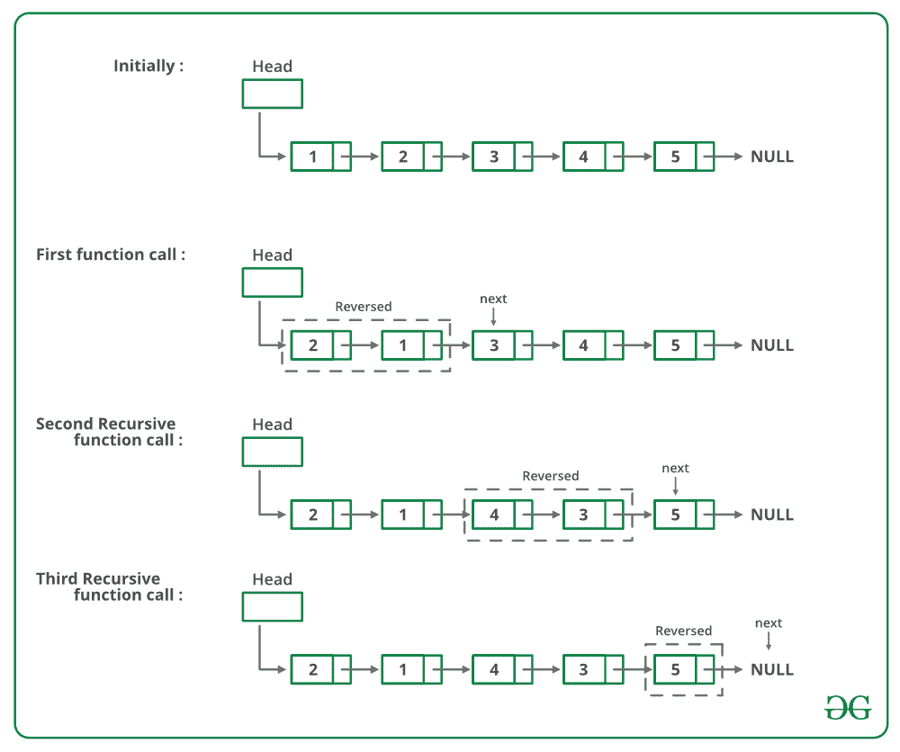

# 给定链表成对交换元素的 C 程序

> 原文:[https://www . geesforgeks . org/c-程序对成对交换给定链表的元素/](https://www.geeksforgeeks.org/c-program-for-pairwise-swapping-elements-of-a-given-linked-list/)

给定一个单链表，编写一个成对交换元素的函数。

```
Input: 1->2->3->4->5->6->NULL 
Output: 2->1->4->3->6->5->NULL

Input: 1->2->3->4->5->NULL 
Output: 2->1->4->3->5->NULL

Input: 1->NULL 
Output: 1->NULL

```

例如，如果链表是 1->2->3->4->5，那么函数应该将其改为 2->1->4->3->5，如果链表是，那么函数应该将其改为。

**方法 1(迭代):**
从头节点开始遍历列表。同时用下一个节点的数据遍历每个节点的交换数据。
以下是上述方法的实施:

## C

```
/* C program to pairwise swap elements 
   in a given linked list */
#include <stdio.h>
#include <stdlib.h>

// A linked list node 
struct Node 
{
    int data;
    struct Node* next;
};

/* Function to swap two integers 
   at addresses a and b */
void swap(int* a, int* b);

/* Function to pairwise swap elements 
   of a linked list */
void pairWiseSwap(struct Node* head)
{
    struct Node* temp = head;

    /* Traverse further only if there 
       are at-least two nodes left */
    while (temp != NULL && 
           temp->next != NULL) 
    {
        /* Swap data of node with its 
           next node's data */
        swap(&temp->data, 
             &temp->next->data);

        // Move temp by 2 for the 
        // next pair 
        temp = temp->next->next;
    }
}

// UTILITY FUNCTIONS 
// Function to swap two integers 
void swap(int* a, int* b)
{
    int temp;
    temp = *a;
    *a = *b;
    *b = temp;
}

/* Function to add a node at the 
   beginning of Linked List */
void push(struct Node** head_ref, int new_data)
{
    // Allocate node 
    struct Node* new_node = 
           (struct Node*)malloc(sizeof(struct Node));

    // Put in the data 
    new_node->data = new_data;

    // Link the old list off the new node 
    new_node->next = (*head_ref);

    // Move the head to point to the 
    // new node 
    (*head_ref) = new_node;
}

/* Function to print nodes in a 
   given linked list */
void printList(struct Node* node)
{
    while (node != NULL) 
    {
        printf("%d ", node->data);
        node = node->next;
    }
}

// Driver code
int main()
{
    struct Node* start = NULL;

    /* The constructed linked list is: 
       1->2->3->4->5 */
    push(&start, 5);
    push(&start, 4);
    push(&start, 3);
    push(&start, 2);
    push(&start, 1);

    printf(
    "Linked list before calling pairWiseSwap()");
    printList(start);

    pairWiseSwap(start);

    printf(
    "Linked list after calling pairWiseSwap()");
    printList(start);

    return 0;
}
```

**输出:**

```
Linked list before calling pairWiseSwap()
1 2 3 4 5 
Linked list after calling pairWiseSwap()
2 1 4 3 5 
```

**时间复杂度:** O(n)

**方法 2(递归):**
如果链表中有 2 个或 2 个以上的节点，那么交换前两个节点，递归调用链表的其余部分。
下图是上述方法的试运行:



下面是上述方法的实现:

## C

```
/* Recursive function to pairwise swap 
   elements of a linked list */
void pairWiseSwap(struct node* head)
{
    /* There must be at-least two nodes 
       in the list */
    if (head != NULL && head->next != NULL) 
    {
        /* Swap the node's data with data 
           of next node */
        swap(head->data, head->next->data);

        /* Call pairWiseSwap() for rest of 
           the list */
        pairWiseSwap(head->next->next);
    }
}
```

**时间复杂度:** O(n)
这里提供的解决方案是交换节点的数据。如果数据包含许多字段，将会有许多交换操作。参见 [**这个**](https://www.geeksforgeeks.org/pairwise-swap-elements-of-a-given-linked-list-by-changing-links/) **了解一个改变链接而不是交换数据的实现。**

**更多详情请参考完整文章[给定链表](https://www.geeksforgeeks.org/pairwise-swap-elements-of-a-given-linked-list/)的成对交换元素！**