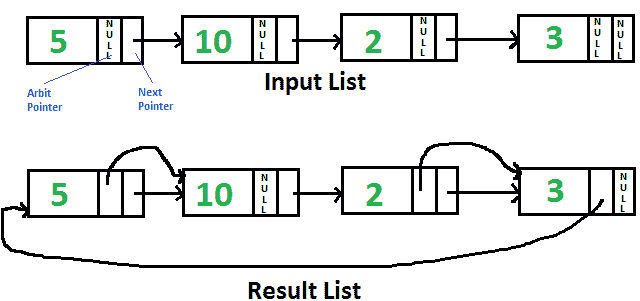

# 用任意指针指向链表中下一个更高值节点的 C 程序

> 原文:[https://www . geesforgeks . org/c-program-for-指向下一个更高值的节点-带任意指针的链表/](https://www.geeksforgeeks.org/c-program-for-pointing-to-next-higher-value-node-in-a-linked-list-with-an-arbitrary-pointer/)

给定单链表，每个节点都有一个额外的“任意”指针，该指针当前指向空。需要使“任意”指针指向下一个更高值的节点。



**强烈建议尽量减少浏览器，先自己试试**

一个**简单的解决方法**就是逐个遍历所有节点，对于每个节点，找到当前节点下一个值较大的节点，改变下一个指针。该解决方案的时间复杂度为 0(n<sup>2</sup>)。

一个**有效的解决方案**在 0(nLogn)时间内有效。想法是对链表使用[合并排序](https://www.geeksforgeeks.org/merge-sort-for-linked-list/)。
1)遍历输入列表，并将下一个指针复制到每个节点的仲裁指针。
2)对仲裁指针形成的链表进行合并排序。

以下是上述想法的实现。所有的合并排序功能都取自[这里的](https://www.geeksforgeeks.org/merge-sort-for-linked-list/)。这里修改了所取的函数，以便它们在仲裁指针上工作，而不是在下一个指针上工作。

## C

```
// C program to populate arbit pointers to 
// next higher value using merge sort
#include<stdio.h>
#include<stdlib.h>

// Link list node 
struct Node
{
    int data;
    struct Node* next, *arbit;
};

// Function prototypes 
struct Node* SortedMerge(struct Node* a, 
                         struct Node* b);
void FrontBackSplit(struct Node* source,
                    struct Node** frontRef, 
                    struct Node** backRef);

/* Sorts the linked list formed by 
   arbit pointers (does not change 
   next pointer or data) */
void MergeSort(struct Node** headRef)
{
    struct Node* head = *headRef;
    struct Node* a, *b;

    // Base case -- length 0 or 1 
    if ((head == NULL) || 
        (head->arbit == NULL))
        return;

    // Split head into 'a' and 'b' 
    // sublists 
    FrontBackSplit(head, &a, &b);

    // Recursively sort the sublists 
    MergeSort(&a);
    MergeSort(&b);

    // answer = merge the two sorted 
    // lists together 
    *headRef = SortedMerge(a, b);
}

/* See https://www.geeksforgeeks.org/?p=3622 
   for details of this function */
struct Node* SortedMerge(struct Node* a, 
                         struct Node* b)
{
    struct Node* result = NULL;

    // Base cases 
    if (a == NULL)
        return (b);
    else if (b==NULL)
        return (a);

    // Pick either a or b, and recur 
    if (a->data <= b->data)
    {
        result = a;
        result->arbit = 
        SortedMerge(a->arbit, b);
    }
    else
    {
        result = b;
        result->arbit = 
        SortedMerge(a, b->arbit);
    }

    return (result);
}

/* Split the nodes of the given list into 
   front and back halves, and return the 
   two lists using the reference parameters.
   If the length is odd, the extra node 
   should go in the front list. Uses the 
   fast/slow pointer strategy.  */
void FrontBackSplit(struct Node* source,
                    struct Node** frontRef, 
                    struct Node** backRef)
{
    struct Node* fast, *slow;

    if (source==NULL || 
        source->arbit==NULL)
    {
        // length < 2 cases 
        *frontRef = source;
        *backRef = NULL;
        return;
    }

    slow = source,  
    fast = source->arbit;

    /* Advance 'fast' two nodes, and 
       advance 'slow' one node */
    while (fast != NULL)
    {
        fast = fast->arbit;
        if (fast != NULL)
        {
            slow = slow->arbit;
            fast = fast->arbit;
        }
    }

    /* 'slow' is before the midpoint in 
        the list, so split it in two at 
        that point. */
    *frontRef = source;
    *backRef = slow->arbit;
    slow->arbit = NULL;
}

/* Function to insert a node at the 
   beginning of the linked list */
void push(struct Node** head_ref, 
          int new_data)
{
    // Allocate node 
    struct Node* new_node =
           (struct Node*) malloc(sizeof(struct Node));

    // Put in the data  
    new_node->data = new_data;

    // Link the old list off the new node 
    new_node->next = (*head_ref);

    new_node->arbit = NULL;

    // Move the head to point to 
    // the new node 
    (*head_ref) = new_node;
}

// Utility function to print 
// result linked list
void printListafter(struct Node *node, 
                    struct Node *anode)
{
    printf("Traversal using Next Pointer");
    while (node!=NULL)
    {
        printf("%d, ", node->data);
        node = node->next;
    }

    printf("Traversal using Arbit Pointer");
    while (anode!=NULL)
    {
        printf("%d, ", anode->data);
        anode = anode->arbit;
    }
}

// This function populates arbit pointer 
// in every node to the next higher value. 
// And returns pointer to the node with
// minimum value
struct Node* populateArbit(struct Node *head)
{
    // Copy next pointers to arbit pointers
    struct Node *temp = head;
    while (temp != NULL)
    {
        temp->arbit = temp->next;
        temp = temp->next;
    }

    // Do merge sort for arbitrary pointers
    MergeSort(&head);

    // Return head of arbitrary pointer 
    // linked list
    return head;
}

// Driver code
int main()
{
    // Start with the empty list 
    struct Node* head = NULL;

    // Let us create the list shown above 
    push(&head, 3);
    push(&head, 2);
    push(&head, 10);
    push(&head, 5);

    // Sort the above created Linked List 
    struct Node *ahead = populateArbit(head);

    printf("Result Linked List is: ");
    printListafter(head, ahead);

    getchar();
    return 0;
}
```

**输出:**

```
Result Linked List is:
Traversal using Next Pointer
5, 10, 2, 3,
Traversal using Arbit Pointer
2, 3, 5, 10,
```

更多详情请参考完整文章[用任意指针](https://www.geeksforgeeks.org/point-to-next-higher-value-node-in-a-linked-list-with-an-arbitrary-pointer/)指向链表中下一个更高值的节点！