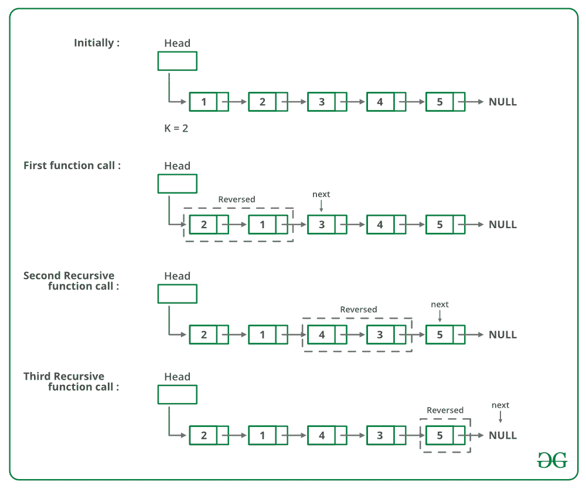

# 用于在给定大小的组中反转链表的 C 程序–设置 1

> 原文:[https://www . geeksforgeeks . org/c-程序反转-给定大小组中的链表-set-1/](https://www.geeksforgeeks.org/c-program-for-reversing-a-linked-list-in-groups-of-given-size-set-1/)

给定一个链表，编写一个函数来反转每 k 个节点(其中 k 是函数的输入)。

**示例:**

> 输入:1->【2】>【3】>【4】>【5】>【6】>【7】>【8】>【null】，K = 3
> **输出【0】**

**算法** : [*反转*](https://www.geeksforgeeks.org/reverse-a-linked-list/) *(head，k)*

*   反转大小为 k 的第一个子列表。反转时，跟踪下一个节点和上一个节点。让指向下一个节点的指针为*下一个*，指向上一个节点的指针为*上一个*。反向链表见[本帖](https://www.geeksforgeeks.org/reverse-a-linked-list/)。
*   *head- > next = reverse(next，k)* (递归调用列表的其余部分并链接两个子列表)
*   返回 *prev* ( *prev* 成为新的列表头(参见[这篇文章](https://www.geeksforgeeks.org/reverse-a-linked-list/)的一个迭代方法的图表)

下图显示了反向功能的工作原理:



下面是上述方法的实现:

## C

```
// C program to reverse a linked list
//  in groups of given size
#include<stdio.h>
#include<stdlib.h>

// Link list node
struct Node
{
    int data;
    struct Node* next;
};

/* Reverses the linked list in groups 
   of size k and returns the pointer 
   to the new head node. */
struct Node *reverse (struct Node *head, 
                      int k)
{
    if (!head)
        return NULL;

    struct Node* current = head;
    struct Node* next = NULL;
    struct Node* prev = NULL;
    int count = 0;     

    /* Reverse first k nodes of the 
       linked list */ 
    while (current != NULL && count < k)
    {
        next  = current->next;
        current->next = prev;
        prev = current;
        current = next;
        count++;
    }

    /* next is now a pointer to (k+1)th node 
       Recursively call for the list starting 
       from current. And make rest of the list 
       as next of first node */
    if (next !=  NULL)
       head->next = reverse(next, k); 

    // prev is new head of the input list
    return prev;
}

// UTILITY FUNCTIONS
// Function to push a node 
void push(struct Node** head_ref, 
          int new_data)
{
    // Allocate node 
    struct Node* new_node =
           (struct Node*) malloc(sizeof(struct Node));

    // Put in the data    
    new_node->data  = new_data;

    // Link the old list off the 
    // new node 
    new_node->next = (*head_ref);    

    // Move the head to point to the 
    // new node 
    (*head_ref) = new_node;
}

// Function to print linked list
void printList(struct Node *node)
{
    while (node != NULL)
    {
        printf("%d  ", node->data);
        node = node->next;
    }
}    

// Driver code
int main(void)
{
    // Start with the empty list
    struct Node* head = NULL;

     // Create Linked list is 
     // 1->2->3->4->5->6->7->8->9 
     push(&head, 9);
     push(&head, 8);
     push(&head, 7);
     push(&head, 6);
     push(&head, 5);
     push(&head, 4);
     push(&head, 3);
     push(&head, 2);
     push(&head, 1);           

     printf("Given linked list ");
     printList(head);
     head = reverse(head, 3);

     printf("Reversed Linked list ");
     printList(head);

     return(0);
}
```

**输出:**

```
Given Linked List
1 2 3 4 5 6 7 8 9 
Reversed list
3 2 1 6 5 4 9 8 7 
```

**复杂度分析:**

*   **时间复杂度:** O(n)。
    遍历列表只做一次，它有 n 个元素。
*   **辅助空间:** O(n/k)。
    对于每个大小为 n、n/k 或(n/k)+1 的链表，在递归过程中将进行调用。

更多详细信息，请参考完整的文章[在给定大小的组中反向链表|集合 1](https://www.geeksforgeeks.org/reverse-a-list-in-groups-of-given-size/) ！