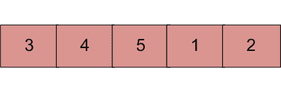

# 用于在排序和旋转的数组中搜索元素的程序

> 原文:[https://www . geesforgeks . org/c-program-for-search-a-element-in-a-sorted-and-rotated-array/](https://www.geeksforgeeks.org/c-program-for-search-an-element-in-a-sorted-and-rotated-array/)

排序数组中的元素可以通过[二分搜索法](https://www.geeksforgeeks.org/binary-search/)在 O(log n)时间内找到。但是假设我们在你事先不知道的某个枢轴上旋转一个升序排序的数组。举个例子，1 2 3 4 5 可能变成 3 4 5 1 2。设计一种方法，在 O(log n)时间内找到旋转数组中的元素。



**例:**

```
Input  : arr[] = {5, 6, 7, 8, 9, 10, 1, 2, 3};
         key = 3
Output : Found at index 8

Input  : arr[] = {5, 6, 7, 8, 9, 10, 1, 2, 3};
         key = 30
Output : Not found

Input : arr[] = {30, 40, 50, 10, 20}
        key = 10   
Output : Found at index 3
```

**这里提供的所有解决方案都假设数组中的所有元素都是不同的。**
**<u>基本解:</u>**
**进场:**

1.  其思想是找到枢轴点，将数组分成两个子数组并执行二分搜索法运算。
2.  查找透视的主要思想是–对于排序(按递增顺序)和透视数组，透视元素是其下一个元素小于它的唯一元素。
3.  利用上面的说法和二分搜索法的支点可以找到。
4.  找到轴心后，将数组分成两个子数组。
5.  现在，单独的子数组被排序，因此可以使用二分搜索法搜索元素。

**执行:**

```
Input arr[] = {3, 4, 5, 1, 2}
Element to Search = 1
  1) Find out pivot point and divide the array in two
      sub-arrays. (pivot = 2) /*Index of 5*/
  2) Now call binary search for one of the two sub-arrays.
      (a) If element is greater than 0th element then
             search in left array
      (b) Else Search in right array
          (1 will go in else as 1 < 0th element(3))
  3) If element is found in selected sub-array then return index
     Else return -1.
```

以下是上述方法的实现:

## C

```
/* Program to search an element in 
   a sorted and pivoted array*/
#include <stdio.h>

int findPivot(int[], int, int);
int binarySearch(int[], int, int, int);

/* Searches an element key in a pivoted 
   sorted array arrp[] of size n */
int pivotedBinarySearch(int arr[], int n, int key)
{
    int pivot = findPivot(arr, 0, n - 1);

    // If we didn't find a pivot, 
// then array is not rotated at all
    if (pivot == -1)
        return binarySearch(arr, 0, n - 1, key);

    // If we found a pivot, then first 
// compare with pivot and then
    // search in two subarrays around pivot
    if (arr[pivot] == key)
        return pivot;
    if (arr[0] <= key)
        return binarySearch(arr, 0, pivot - 1, key);
    return binarySearch(arr, pivot + 1, n - 1, key);
}

/* Function to get pivot. For array 
   3, 4, 5, 6, 1, 2 it returns 3 (index of 6) */
int findPivot(int arr[], int low, int high)
{
    // base cases
    if (high < low)
        return -1;
    if (high == low)
        return low;

    int mid = (low + high) / 2; /*low + (high - low)/2;*/
    if (mid < high && arr[mid] > arr[mid + 1])
        return mid;
    if (mid > low && arr[mid] < arr[mid - 1])
        return (mid - 1);
    if (arr[low] >= arr[mid])
        return findPivot(arr, low, mid - 1);
    return findPivot(arr, mid + 1, high);
}

/* Standard Binary Search function*/
int binarySearch(int arr[], int low, int high, int key)
{
    if (high < low)
        return -1;
    int mid = (low + high) / 2; /*low + (high - low)/2;*/
    if (key == arr[mid])
        return mid;
    if (key > arr[mid])
        return binarySearch(arr, (mid + 1), high, key);
    return binarySearch(arr, low, (mid - 1), key);
}

/* Driver program to check above functions */
int main()
{
    // Let us search 3 in below array
    int arr1[] = { 5, 6, 7, 8, 9, 10, 1, 2, 3 };
    int n = sizeof(arr1) / sizeof(arr1[0]);
    int key = 3;
    printf("Index of the element is : %d",
           pivotedBinarySearch(arr1, n, key));
    return 0;
}
```

**输出:**

```
Index of the element is : 8
```

**复杂度分析:**

*   **时间复杂度:** O(log n)。
    二分搜索法需要对数 n 比较来找到元素。所以时间复杂度为 O(log n)。
*   **空间复杂度:** O(1)，不需要额外空间。

更多详情请参考[完整文章在排序旋转数组](https://www.geeksforgeeks.org/search-an-element-in-a-sorted-and-pivoted-array/)中搜索元素！