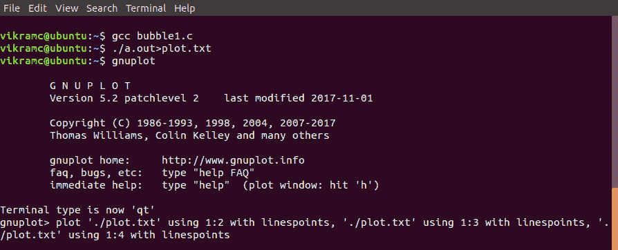
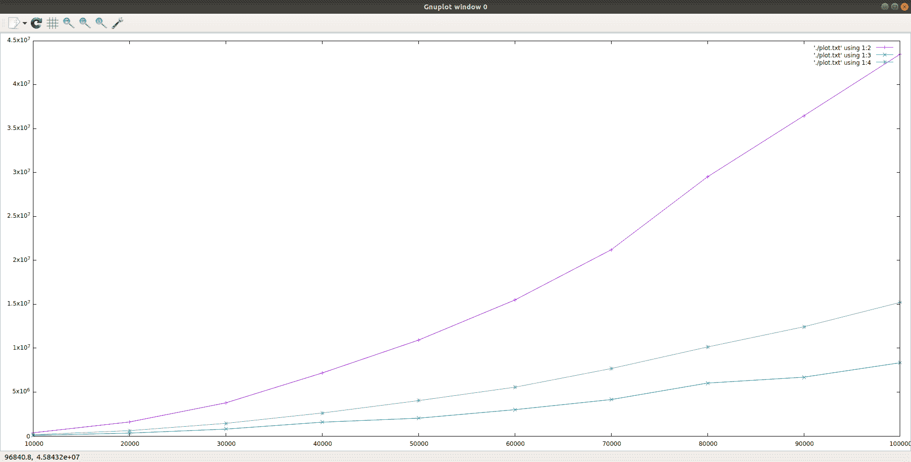

# 使用 Gnuplot 进行冒泡、插入和选择排序的时间复杂度绘图的 C 程序

> 原文:[https://www . geesforgeks . org/c-program-for-time-complexity-plot-of-bubble-insert-and-selection-sort-use-gnuplot/](https://www.geeksforgeeks.org/c-program-for-time-complexity-plot-of-bubble-insertion-and-selection-sort-using-gnuplot/)

**前提:** [冒泡排序、插入排序、选择排序的比较。](https://www.geeksforgeeks.org/comparison-among-bubble-sort-selection-sort-and-insertion-sort/)

**编写 C 程序，对[冒泡排序](https://www.geeksforgeeks.org/bubble-sort/)、[插入排序](https://www.geeksforgeeks.org/insertion-sort/)、[选择排序](https://www.geeksforgeeks.org/selection-sort/)的时间复杂度进行绘图分析(使用 Gnuplot)。**
针对这个问题，我们必须用 c 绘制一个时间复杂度图。因此，我们将把排序算法作为函数，所有算法都被赋予对完全相同的数组进行排序，以保持比较公平。

**示例:**

```
Input: randomly generated arrays (using rand() function)
    of different sizes as input for sorting.
Output:
A_size, Bubble, Insertion, Selection
10000, 366263, 80736, 152975
20000, 1594932, 332101, 609388
30000, 3773121, 785790, 1441547
40000, 7174455, 1574855, 2620006
50000, 10917061, 2029586, 4025993
60000, 15484338, 2998403, 5556494
70000, 21201561, 4146680, 7678139
80000, 29506758, 6027335, 10131950
90000, 36457272, 6699452, 12436376
100000, 43472313, 8335881, 15208712

```

**方法:**我们将使用不同大小的数组来绘制排序算法花费的时间与数组大小之间的关系图。程序的执行将花费一些时间来排序大小高达 100000 个元素的数组。

下面是上述方法的实现:

```
// C program to store time taken by bubble sort,
// insertion sort and selection sort
// for sorting exactly same arrays.

#include <stdio.h>
#include <stdlib.h>
#include <time.h>

// Swap utility
void swap(long int* a, long int* b)
{
    int tmp = *a;
    *a = *b;
    *b = tmp;
}

// Bubble sort
void bubbleSort(long int a[], long int n)
{
    for (long int i = 0; i < n - 1; i++) {
        for (long int j = 0; j < n - 1 - i; j++) {
            if (a[j] > a[j + 1]) {
                swap(&a[j], &a[j + 1]);
            }
        }
    }
}

// Insertion sort
void insertionSort(long int arr[], long int n)
{
    long int i, key, j;
    for (i = 1; i < n; i++) {
        key = arr[i];
        j = i - 1;

        // Move elements of arr[0..i-1], that are
        // greater than key, to one position ahead
        // of their current position
        while (j >= 0 && arr[j] > key) {
            arr[j + 1] = arr[j];
            j = j - 1;
        }
        arr[j + 1] = key;
    }
}

// Selection sort
void selectionSort(long int arr[], long int n)
{
    long int i, j, midx;

    for (i = 0; i < n - 1; i++) {

        // Find the minimum element in unsorted array
        midx = i;

        for (j = i + 1; j < n; j++)
            if (arr[j] < arr[min_idx])
                midx = j;

        // Swap the found minimum element
        // with the first element
        swap(&arr[midx], &arr[i]);
    }
}

// Driver code
int main()
{
    long int n = 10000;
    int it = 0;

    // Arrays to store time duration
    // of sorting algorithms
    double tim1[10], tim2[10], tim3[10];

    printf("A_size, Bubble, Insertion, Selection\n");

    // Performs 10 iterations
    while (it++ < 10) {
        long int a[n], b[n], c[n];

        // generating n random numbers
        // storing them in arrays a, b, c
        for (int i = 0; i < n; i++) {
            long int no = rand() % n + 1;
            a[i] = no;
            b[i] = no;
            c[i] = no;
        }

        // using clock_t to store time
        clock_t start, end;

        // Bubble sort
        start = clock();
        bubbleSort(a, n);
        end = clock();

        tim1[it] = ((double)(end - start));

        // Insertion sort
        start = clock();
        insertionSort(b, n);
        end = clock();

        tim2[it] = ((double)(end - start));

        // Selection sort
        start = clock();
        selectionSort(c, n);
        end = clock();

        tim3[it] = ((double)(end - start));

        // type conversion to long int
        // for plotting graph with integer values
        printf("%li, %li, %li, %li\n",
               n,
               (long int)tim1[it],
               (long int)tim2[it],
               (long int)tim3[it]);

        // increases the size of array by 10000
        n += 10000;
    }

    return 0;
}
```

**输出:**

```
A_size, Bubble, Insertion, Selection
10000, 366263, 80736, 152975
20000, 1594932, 332101, 609388
30000, 3773121, 785790, 1441547
40000, 7174455, 1574855, 2620006
50000, 10917061, 2029586, 4025993
60000, 15484338, 2998403, 5556494
70000, 21201561, 4146680, 7678139
80000, 29506758, 6027335, 10131950
90000, 36457272, 6699452, 12436376
100000, 43472313, 8335881, 15208712

```

**现在问题来了，我们如何在 x-y 坐标上绘制一个图形？**
为此，我们将使用一个名为 [Gnuplot](http://www.gnuplot.info/) 的非常简单的工具。
Gnuplot 是一个可移植的命令行驱动的绘图工具，适用于 Linux、MS Windows、OSX 和许多其他平台。

**注:**本文使用的是 Ubuntu(Linux)。

1.  首先，如何安装 Gnuplot。使用此命令安装 Gnuplot。

    ```
    sudo apt-get install gnuplot
    ```

2.  在此之后，编译您的代码，并使用此命令将输出复制到文本文件中。

    ```
    ./a.out>plot.txt
    ```

3.  只需使用打开 Gnuplot。

    ```
    gnuplot
    ```

4.  现在最后一件事是绘制图表，所以使用这个命令来绘制复杂性图表。

    ```
    plot './plot.txt' using 1:2 with linespoints, 
    './plot.txt' using 1:3 with linespoints,
    './plot.txt' using 1:4 with linespoints
    ```

这是命令的终端快照。
[](https://media.geeksforgeeks.org/wp-content/uploads/20190805234249/1396.png)

**这里是比较冒泡排序(紫色曲线)、插入排序(绿色曲线)和选择排序(蓝色曲线)的复杂度图。**
[](https://media.geeksforgeeks.org/wp-content/uploads/20190805234710/223-1.png)

**观察:**
三种算法的平均时间复杂度均为 **O(n^2)** 但随着输入数据量的增加，插入排序的性能远优于冒泡排序，略优于选择排序。