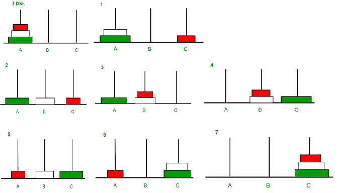

# 河内塔程序

> 原文:[https://www.geeksforgeeks.org/c-program-for-tower-of-hanoi/](https://www.geeksforgeeks.org/c-program-for-tower-of-hanoi/)

汉诺塔是一个数学难题，我们有三个杆和 n 个圆盘。拼图的目标是将整个堆栈移动到另一个杆上，遵循以下简单规则:

1.  一次只能移动一个磁盘。
2.  每次移动包括从一个堆栈中取出上层磁盘，并将其放在另一个堆栈的顶部，也就是说，只有当一个磁盘是堆栈中最上面的磁盘时，它才能被移动。
3.  任何磁盘都不能放在较小的磁盘上。

**进场:**

```
Take an example for 2 disks :
Let rod 1 = 'A', rod 2 = 'B', rod 3 = 'C'.

Step 1 : Shift first disk from 'A' to 'B'.
Step 2 : Shift second disk from 'A' to 'C'.
Step 3 : Shift first disk from 'B' to 'C'.

The pattern here is :
Shift 'n-1' disks from 'A' to 'B'.
Shift last disk from 'A' to 'C'.
Shift 'n-1' disks from 'B' to 'C'.

Image illustration for 3 disks :
```



**例:**

```
Input : 2
Output : Disk 1 moved from A to B
         Disk 2 moved from A to C
         Disk 1 moved from B to C

Input : 3
Output : Disk 1 moved from A to C
         Disk 2 moved from A to B
         Disk 1 moved from C to B
         Disk 3 moved from A to C
         Disk 1 moved from B to A
         Disk 2 moved from B to C
         Disk 1 moved from A to C
```

## C++

```
// C++ recursive function to
// solve tower of hanoi puzzle
#include <bits/stdc++.h>
using namespace std;

void towerOfHanoi(int n, char from_rod,
                    char to_rod, char aux_rod)
{
    if (n == 0)
    {
        return;
    }
    towerOfHanoi(n - 1, from_rod, aux_rod, to_rod);
    cout << "Move disk " << n << " from rod " << from_rod <<
                                " to rod " << to_rod << endl;
    towerOfHanoi(n - 1, aux_rod, to_rod, from_rod);
}

// Driver code
int main()
{
    int n = 4; // Number of disks
    towerOfHanoi(n, 'A', 'C', 'B'); // A, B and C are names of rods
    return 0;
}

// This is code is contributed by rathbhupendra
```

## Java 语言(一种计算机语言，尤用于创建网站)

```
// JAVA recursive function to
// solve tower of hanoi puzzle
import java.util.*;
import java.io.*;
import java.math.*;
class GFG
{
static void towerOfHanoi(int n, char from_rod,
                    char to_rod, char aux_rod)
{
    if (n == 0)
    {
        return;
    }
    towerOfHanoi(n - 1, from_rod, aux_rod, to_rod);
    System.out.println("Move disk "+ n + " from rod " +
                       from_rod +" to rod " + to_rod );
    towerOfHanoi(n - 1, aux_rod, to_rod, from_rod);
}

// Driver code
public static void  main(String args[])
{
    int n = 4; // Number of disks
    towerOfHanoi(n, 'A', 'C', 'B'); // A, B and C are names of rods
}
}

// This code is contributed by jyoti369
```

## 蟒蛇 3

```
# Recursive Python function to solve tower of hanoi

def TowerOfHanoi(n , from_rod, to_rod, aux_rod):
    if n == 0:
        return
    TowerOfHanoi(n-1, from_rod, aux_rod, to_rod)
    print("Move disk",n,"from rod",from_rod,"to rod",to_rod)
    TowerOfHanoi(n-1, aux_rod, to_rod, from_rod)

# Driver code
n = 4
TowerOfHanoi(n, 'A', 'C', 'B')
# A, C, B are the name of rods

# Contributed By Harshit Agrawal
```

## C#

```
// C# recursive program to solve tower of hanoi puzzle
using System;
class GFG
{
    static void towerOfHanoi(int n, char from_rod, char to_rod, char aux_rod)
    {
        if (n == 0)
        {
            return;
        }
        towerOfHanoi(n-1, from_rod, aux_rod, to_rod);
        Console.WriteLine("Move disk " + n + " from rod " + 
                          from_rod + " to rod " + to_rod);
        towerOfHanoi(n-1, aux_rod, to_rod, from_rod);
    }

    //  Driver method
    public static void Main(String []args)
    {
        int n = 4; // Number of disks
        towerOfHanoi(n, 'A', 'C', 'B');  // A, B and C are names of rods
    }
}

//This code is contributed by shivanisinghss2110
```

## 服务器端编程语言（Professional Hypertext Preprocessor 的缩写）

```
<?php

// Tower of Hanoi (n-disk) algorithm in PHP with Display of Pole/rod
// Contents the 3 poles representation
$poles = array(array(), array(), array());

function TOH($n, $A="A", $B="B", $C="C"){

    if ($n > 0){
        TOH($n-1, $A, $C, $B);
        echo "Move disk from rod $A to rod $C \n";
        move($A, $C);
        dispPoles();
        TOH($n-1, $B, $A, $C);
    }
    else {
        return;
    }
}

function initPoles($n){
    global $poles;

    for ($i=$n; $i>=1; --$i){
        $poles[0][] = $i;
    }
}

function move($source, $destination){
    global $poles;

    // get source and destination pointers
    if ($source=="A") $ptr1=0;
    elseif ($source=="B") $ptr1 = 1;
    else $ptr1 = 2;

    if ($destination=="A") $ptr2 = 0;
    elseif ($destination=="B") $ptr2 = 1;
    else $ptr2 = 2;

    $top = array_pop($poles[$ptr1]);
    array_push($poles[$ptr2], $top);
}

function dispPoles(){ 
    global $poles;
    echo "A: [".implode(", ", $poles[0])."] ";
    echo "B: [".implode(", ", $poles[1])."] ";
    echo "C: [".implode(", ", $poles[2])."] ";
    echo "\n\n";
}

$numdisks = 4;
initPoles($numdisks);
echo "Tower of Hanoi Solution for $numdisks disks: \n\n";
dispPoles();
TOH($numdisks);

// This code is contributed by ShreyakChakraborty
?>
```

## java 描述语言

```
<script>
// javascript recursive function to
// solve tower of hanoi puzzle
function towerOfHanoi(n, from_rod,  to_rod,  aux_rod)
{
        if (n == 0)
        {
            return;
        }
        towerOfHanoi(n - 1, from_rod, aux_rod, to_rod);
        document.write("Move disk " + n + " from rod " + from_rod +
        " to rod " + to_rod+"<br/>");
        towerOfHanoi(n - 1, aux_rod, to_rod, from_rod);
    }

    // Driver code
    var n = 4; // Number of disks
    towerOfHanoi(n, 'A', 'C', 'B'); // A, B and C are names of rods

// This code is contributed by gauravrajput1
</script>
```

**Output**

```
Move disk 1 from rod A to rod B
Move disk 2 from rod A to rod C
Move disk 1 from rod B to rod C
Move disk 3 from rod A to rod B
Move disk 1 from rod C to rod A
Move disk 2 from rod C to rod B
Move disk 1 from rod A to rod B
Move disk 4 from rod A to rod C
Move disk 1 from rod B to rod C
Move disk 2 from rod B to rod A
Move disk 1 from rod C to rod A
Move disk 3 from rod B to rod C
Move disk 1 from rod A to rod B
Move disk 2 from rod A to rod C
Move disk 1 from rod B to rod C
```

```
Output:

Tower of Hanoi Solution for 4 disks:

A: [4, 3, 2, 1] B: [] C: []

Move disk from rod A to rod B
A: [4, 3, 2] B: [1] C: []

Move disk from rod A to rod C
A: [4, 3] B: [1] C: [2]

Move disk from rod B to rod C
A: [4, 3] B: [] C: [2, 1]

Move disk from rod A to rod B
A: [4] B: [3] C: [2, 1]

Move disk from rod C to rod A
A: [4, 1] B: [3] C: [2]

Move disk from rod C to rod B
A: [4, 1] B: [3, 2] C: []

Move disk from rod A to rod B
A: [4] B: [3, 2, 1] C: []

Move disk from rod A to rod C
A: [] B: [3, 2, 1] C: [4]

Move disk from rod B to rod C
A: [] B: [3, 2] C: [4, 1]

Move disk from rod B to rod A
A: [2] B: [3] C: [4, 1]

Move disk from rod C to rod A
A: [2, 1] B: [3] C: [4]

Move disk from rod B to rod C
A: [2, 1] B: [] C: [4, 3]

Move disk from rod A to rod B
A: [2] B: [1] C: [4, 3]

Move disk from rod A to rod C
A: [] B: [1] C: [4, 3, 2]

Move disk from rod B to rod C
A: [] B: [] C: [4, 3, 2, 1]
```

**视频讲解**

[**https://www.youtube.com/watch?v=YstLjLCGmgg**T3】](https://www.youtube.com/watch?v=YstLjLCGmgg)

**相关文章**

*   [递归函数](https://www.geeksforgeeks.org/recursive-functions/)
*   [TOH 难题的迭代解](https://www.geeksforgeeks.org/iterative-tower-of-hanoi/)
*   [递归测验](http://quiz.geeksforgeeks.org/algorithms/recursion/)

**参考文献:**
[【http://en.wikipedia.org/wiki/Tower_of_Hanoi】](http://en.wikipedia.org/wiki/Tower_of_Hanoi)
本文由 [**罗希特·塔普利亚尔**](https://www.linkedin.com/in/rohit-thapliyal-515b5913a/) 供稿。如果你喜欢 GeeksforGeeks 并想投稿，你也可以使用[write.geeksforgeeks.org](http://www.write.geeksforgeeks.org)写一篇文章或者把你的文章邮寄到 contribute@geeksforgeeks.org。看到你的文章出现在极客博客主页上，帮助其他极客。
如果发现有不正确的地方，或者想分享更多关于上述话题的信息，请写评论。