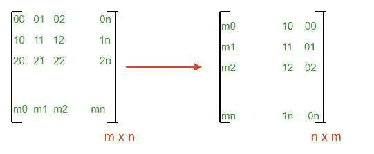

# 将图像旋转 90 度的程序

> 原文:[https://www . geesforgeks . org/c-90 度旋转图像程序/](https://www.geeksforgeeks.org/c-program-for-turn-an-image-by-90-degree/)

给定一个图像，你如何将它旋转 90 度？模糊的问题。最小化浏览器并尝试您的解决方案，然后再继续。

图像可以被视为 2D 矩阵，可以存储在缓冲器中。我们提供了矩阵维度及其基址。怎么才能扭转呢？

例如见下图，

```
* * * ^ * * *
* * * | * * *
* * * | * * *
* * * | * * *
```

向右旋转后，它出现(观察箭头方向)

```
* * * *
* * * *
* * * *
-- - - >
* * * *
* * * *
* * * *
```

想法很简单。将源矩阵的每一行转换为最终图像的所需列。我们将使用一个辅助缓冲区来转换图像。

从上图中，我们可以观察到

```
first row of source ------> last column of destination
second row of source ------> last but-one column of destination
so ... on
last row of source ------> first column of destination
```

用图示的形式，我们可以表示一个(m×n)矩阵到(n×m)矩阵的上述变换，



转换

如果你没有尝试过，至少现在就试试你的伪代码。

编写我们的伪代码会很容易。在 C/C++中，我们通常按行主顺序遍历矩阵。每行被转换成最终图像的不同列。我们需要构建最终图像的列。请参见以下算法(转换)

```
for (r = 0; r < m; r++)
{
   for (c = 0; c < n; c++)
   {
      // Hint: Map each source element indices into
      // indices of destination matrix element.
       dest_buffer [ c ] [ m - r - 1 ] = source_buffer [ r ] [ c ];
   }
}
```

请注意，有多种方法可以实现基于矩阵遍历、行主顺序或列主顺序的算法。我们有两个矩阵和两种方式(主要是行和列)来遍历每个矩阵。因此，至少可以有 4 种不同的方式将源矩阵转换为最终矩阵。

## C

```
// C program to turn an 
// image by 90 Degree
#include <stdio.h>
#include <stdlib.h>

void displayMatrix(unsigned int const *p, 
                   unsigned int row, 
                   unsigned int col);

void rotate(unsigned int *pS, 
            unsigned int *pD, 
            unsigned int row, 
            unsigned int col);

void displayMatrix(unsigned int const *p, 
                   unsigned int r, 
                   unsigned int c) 
{
    unsigned int row, col;
    printf("

");

    for (row = 0; row < r; row++)
    {
        for (col = 0; col < c; col++)
            printf("%d    ", * (p + row * c + col));
        printf("
");
    }

    printf("

");
}

void rotate(unsigned int *pS, 
            unsigned int *pD,
            unsigned int row, 
            unsigned int col)
{
    unsigned int r, c;
    for (r = 0; r < row; r++)
    {
        for (c = 0; c < col; c++)
        {
            *(pD + c * row + (row - r - 1)) = 
                            *(pS + r * col + c);
        }
    }
}

// Driver Code
int main()
{

    // declarations
    unsigned int image[][4] = {{1,2,3,4}, 
                               {5,6,7,8},
                               {9,10,11,12}};
    unsigned int *pSource;
    unsigned int *pDestination;
    unsigned int m, n;

    // setting initial values
    // and memory allocation
    m = 3, n = 4, pSource = (unsigned int *)image;
    pDestination = 
        (unsigned int *)malloc 
        (sizeof(int) * m * n);

    // process each buffer
    displayMatrix(pSource, m, n);

    rotate(pSource, pDestination, m, n);

    displayMatrix(pDestination, n, m);

    free(pDestination);

    getchar();
    return 0;
}
```

**Output :**

```

1    2    3    4    
5    6    7    8    
9    10    11    12    

9    5    1    
10    6    2    
11    7    3    
12    8    4    

```

更多详情请参考[完整文章将图像旋转 90 度](https://www.geeksforgeeks.org/turn-an-image-by-90-degree/)！