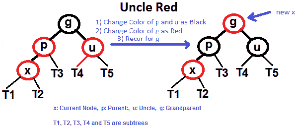
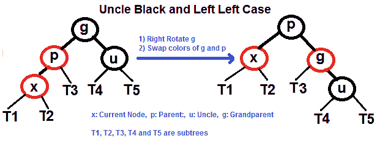
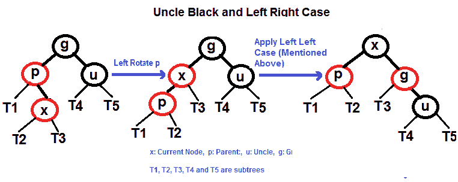
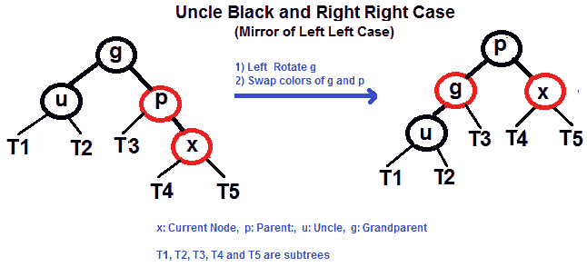
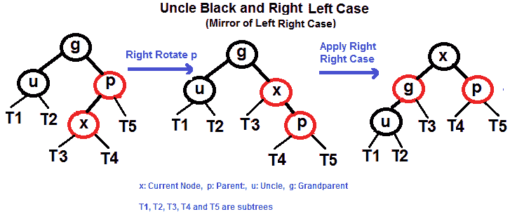
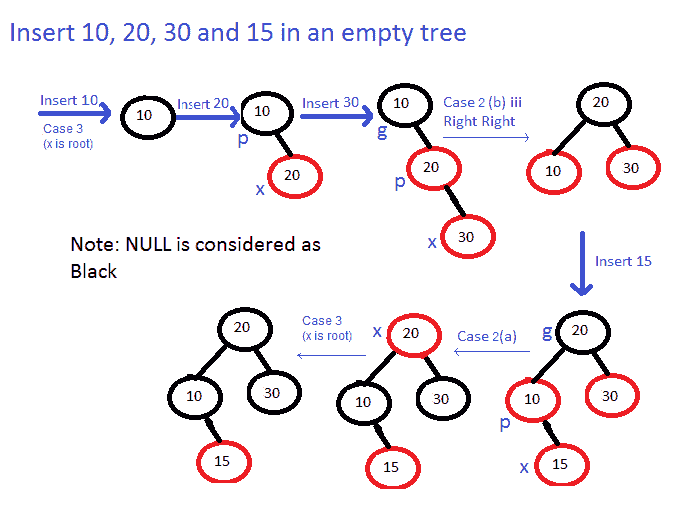

# 红黑树插入的 C 程序

> 原文:[https://www . geesforgeks . org/c-program-red-black-tree-insert/](https://www.geeksforgeeks.org/c-program-red-black-tree-insertion/)

以下文章是本文讨论文章的延伸。
在 [AVL 树插入](https://www.geeksforgeeks.org/avl-tree-set-1-insertion/)中，我们使用旋转作为工具在插入造成不平衡后做平衡。在红黑树中，我们使用两种工具来进行平衡。
**1)** 重新着色
**2)** [旋转](http://en.wikipedia.org/wiki/Tree_rotation)

我们首先尝试重新着色，如果重新着色不起作用，那么我们就进行旋转。下面是详细的算法。算法主要有两种情况，取决于大叔的肤色。如果叔叔是红色的，我们会重新着色。如果叔叔是黑人，我们会做旋转和/或重新着色。
空节点的颜色被认为是黑色。

假设 x 是新插入的节点。
**1。**执行[标准 BST 插入](https://www.geeksforgeeks.org/binary-search-tree-set-1-search-and-insertion/)并将新插入节点的颜色设为红色。
**2。**如果 x 是根，则将 x 的颜色改为黑色(全树黑色高度增加 1)。
**3。**如果 x 的父颜色不是黑色或者 x 不是根颜色，请执行以下操作。
**1。我** f x 的舅舅是 **RED** (大母一定是从[属性 4](https://www.geeksforgeeks.org/red-black-tree-set-1-introduction-2/) 黑过来的)
1。将父母和叔叔的颜色改为黑色。
2。祖父母的颜色为红色。
3。更改 x = x 的祖父母，对新 x 重复步骤 2 和 3。



**2。**如果 x 的叔叔是 BLACK，那么 x、x 的父母( **p** )和 x 的祖父母( **g** )可以有四种配置(这和 [AVL Tree](https://www.geeksforgeeks.org/avl-tree-set-1-insertion/) 类似)

1.确定配置:

1.左左大小写(p 是 g 的左子，x 是 p 的左子)。

2.左右格(p 是 g 的左子格，x 是 p 的右子格)。

3.右右案例(案例 a 的镜像)。

4.右左外壳(外壳 c 的镜像)。

2.更改 x = x 的父级，对新 x 重复步骤 2 和 3。

以下是当叔叔是黑人时，要在四个子案例中执行的操作。

## 当叔叔是黑人时的四种情况

**左左情况(见 g、p 和 x)**



**左右情况(见 g、p 和 x)**



**右箱体(见 g、p 和 x)**



**右左情况(见 g、p 和 x)**



**插入示例**



下面是 C++代码。

## C++

```
/** C++ implementation for
   Red-Black Tree Insertion
   This code is adopted from
   the code provided by
   Dinesh Khandelwal in comments **/
#include <bits/stdc++.h>
using namespace std;

enum Color {RED, BLACK};

struct Node
{
    int data;
    bool color;
    Node *left, *right, *parent;

    // Constructor
    Node(int data)
    {
       this->data = data;
       left = right = parent = NULL;
       this->color = RED;
    }
};

// Class to represent Red-Black Tree
class RBTree
{
private:
    Node *root;
protected:
    void rotateLeft(Node *&, Node *&);
    void rotateRight(Node *&, Node *&);
    void fixViolation(Node *&, Node *&);
public:
    // Constructor
    RBTree() { root = NULL; }
    void insert(const int &n);
    void inorder();
    void levelOrder();
};

// A recursive function to do inorder traversal
void inorderHelper(Node *root)
{
    if (root == NULL)
        return;

    inorderHelper(root->left);
    cout << root->data << "  ";
    inorderHelper(root->right);
}

/* A utility function to insert
    a new node with given key
   in BST */
Node* BSTInsert(Node* root, Node *pt)
{
    /* If the tree is empty, return a new node */
    if (root == NULL)
       return pt;

    /* Otherwise, recur down the tree */
    if (pt->data < root->data)
    {
        root->left  = BSTInsert(root->left, pt);
        root->left->parent = root;
    }
    else if (pt->data > root->data)
    {
        root->right = BSTInsert(root->right, pt);
        root->right->parent = root;
    }

    /* return the (unchanged) node pointer */
    return root;
}

// Utility function to do level order traversal
void levelOrderHelper(Node *root)
{
    if (root == NULL)
        return;

    std::queue<Node *> q;
    q.push(root);

    while (!q.empty())
    {
        Node *temp = q.front();
        cout << temp->data << "  ";
        q.pop();

        if (temp->left != NULL)
            q.push(temp->left);

        if (temp->right != NULL)
            q.push(temp->right);
    }
}

void RBTree::rotateLeft(Node *&root, Node *&pt)
{
    Node *pt_right = pt->right;

    pt->right = pt_right->left;

    if (pt->right != NULL)
        pt->right->parent = pt;

    pt_right->parent = pt->parent;

    if (pt->parent == NULL)
        root = pt_right;

    else if (pt == pt->parent->left)
        pt->parent->left = pt_right;

    else
        pt->parent->right = pt_right;

    pt_right->left = pt;
    pt->parent = pt_right;
}

void RBTree::rotateRight(Node *&root, Node *&pt)
{
    Node *pt_left = pt->left;

    pt->left = pt_left->right;

    if (pt->left != NULL)
        pt->left->parent = pt;

    pt_left->parent = pt->parent;

    if (pt->parent == NULL)
        root = pt_left;

    else if (pt == pt->parent->left)
        pt->parent->left = pt_left;

    else
        pt->parent->right = pt_left;

    pt_left->right = pt;
    pt->parent = pt_left;
}

// This function fixes violations
// caused by BST insertion
void RBTree::fixViolation(Node *&root, Node *&pt)
{
    Node *parent_pt = NULL;
    Node *grand_parent_pt = NULL;

    while ((pt != root) && (pt->color != BLACK) &&
           (pt->parent->color == RED))
    {

        parent_pt = pt->parent;
        grand_parent_pt = pt->parent->parent;

        /*  Case : A
            Parent of pt is left child
            of Grand-parent of pt */
        if (parent_pt == grand_parent_pt->left)
        {

            Node *uncle_pt = grand_parent_pt->right;

            /* Case : 1
               The uncle of pt is also red
               Only Recoloring required */
            if (uncle_pt != NULL && uncle_pt->color ==
                                                   RED)
            {
                grand_parent_pt->color = RED;
                parent_pt->color = BLACK;
                uncle_pt->color = BLACK;
                pt = grand_parent_pt;
            }

            else
            {
                /* Case : 2
                   pt is right child of its parent
                   Left-rotation required */
                if (pt == parent_pt->right)
                {
                    rotateLeft(root, parent_pt);
                    pt = parent_pt;
                    parent_pt = pt->parent;
                }

                /* Case : 3
                   pt is left child of its parent
                   Right-rotation required */
                rotateRight(root, grand_parent_pt);
                swap(parent_pt->color,
                           grand_parent_pt->color);
                pt = parent_pt;
            }
        }

        /* Case : B
           Parent of pt is right child
           of Grand-parent of pt */
        else
        {
            Node *uncle_pt = grand_parent_pt->left;

            /*  Case : 1
                The uncle of pt is also red
                Only Recoloring required */
            if ((uncle_pt != NULL) && (uncle_pt->color ==
                                                    RED))
            {
                grand_parent_pt->color = RED;
                parent_pt->color = BLACK;
                uncle_pt->color = BLACK;
                pt = grand_parent_pt;
            }
            else
            {
                /* Case : 2
                   pt is left child of its parent
                   Right-rotation required */
                if (pt == parent_pt->left)
                {
                    rotateRight(root, parent_pt);
                    pt = parent_pt;
                    parent_pt = pt->parent;
                }

                /* Case : 3
                   pt is right child of its parent
                   Left-rotation required */
                rotateLeft(root, grand_parent_pt);
                swap(parent_pt->color,
                         grand_parent_pt->color);
                pt = parent_pt;
            }
        }
    }

    root->color = BLACK;
}

// Function to insert a new node with given data
void RBTree::insert(const int &data)
{
    Node *pt = new Node(data);

    // Do a normal BST insert
    root = BSTInsert(root, pt);

    // fix Red Black Tree violations
    fixViolation(root, pt);
}

// Function to do inorder and level order traversals
void RBTree::inorder()     {  inorderHelper(root);}
void RBTree::levelOrder()  {  levelOrderHelper(root); }

// Driver Code
int main()
{
    RBTree tree;

    tree.insert(7);
    tree.insert(6);
    tree.insert(5);
    tree.insert(4);
    tree.insert(3);
    tree.insert(2);
    tree.insert(1);

    cout << "Inorder Traversal of Created Tree\n";
    tree.inorder();

    cout << "\n\nLevel Order Traversal of Created Tree\n";
    tree.levelOrder();

    return 0;
}
```

## C

```
/** C implementation for
    Red-Black Tree Insertion
    This code is provided by
    costheta_z **/
#include <stdio.h>
#include <stdlib.h>

// Structure to represent each
// node in a red-black tree
struct node {
    int d; // data
    int c; // 1-red, 0-black
    struct node* p; // parent
    struct node* r; // right-child
    struct node* l; // left child
};

// global root for the entire tree
struct node* root = NULL;

// function to perform BST insertion of a node
struct node* bst(struct node* trav,
                      struct node* temp)
{
    // If the tree is empty,
    // return a new node
    if (trav == NULL)
        return temp;

    // Otherwise recur down the tree
    if (temp->d < trav->d)
    {
        trav->l = bst(trav->l, temp);
        trav->l->p = trav;
    }
    else if (temp->d > trav->d)
    {
        trav->r = bst(trav->r, temp);
        trav->r->p = trav;
    }

    // Return the (unchanged) node pointer
    return trav;
}

// Function performing right rotation
// of the passed node
void rightrotate(struct node* temp)
{
    struct node* left = temp->l;
    temp->l = left->r;
    if (temp->l)
        temp->l->p = temp;
    left->p = temp->p;
    if (!temp->p)
        root = left;
    else if (temp == temp->p->l)
        temp->p->l = left;
    else
        temp->p->r = left;
    left->r = temp;
    temp->p = left;
}

// Function performing left rotation
// of the passed node
void leftrotate(struct node* temp)
{
    struct node* right = temp->r;
    temp->r = right->l;
    if (temp->r)
        temp->r->p = temp;
    right->p = temp->p;
    if (!temp->p)
        root = right;
    else if (temp == temp->p->l)
        temp->p->l = right;
    else
        temp->p->r = right;
    right->l = temp;
    temp->p = right;
}

// This function fixes violations
// caused by BST insertion
void fixup(struct node* root, struct node* pt)
{
    struct node* parent_pt = NULL;
    struct node* grand_parent_pt = NULL;

    while ((pt != root) && (pt->c != 0)
           && (pt->p->c == 1))
    {
        parent_pt = pt->p;
        grand_parent_pt = pt->p->p;

        /*  Case : A
             Parent of pt is left child
             of Grand-parent of
           pt */
        if (parent_pt == grand_parent_pt->l)
        {

            struct node* uncle_pt = grand_parent_pt->r;

            /* Case : 1
                The uncle of pt is also red
                Only Recoloring required */
            if (uncle_pt != NULL && uncle_pt->c == 1)
            {
                grand_parent_pt->c = 1;
                parent_pt->c = 0;
                uncle_pt->c = 0;
                pt = grand_parent_pt;
            }

            else {

                /* Case : 2
                     pt is right child of its parent
                     Left-rotation required */
                if (pt == parent_pt->r) {
                    leftrotate(parent_pt);
                    pt = parent_pt;
                    parent_pt = pt->p;
                }

                /* Case : 3
                     pt is left child of its parent
                     Right-rotation required */
                rightrotate(grand_parent_pt);
                int t = parent_pt->c;
                parent_pt->c = grand_parent_pt->c;
                grand_parent_pt->c = t;
                pt = parent_pt;
            }
        }

        /* Case : B
             Parent of pt is right
             child of Grand-parent of
           pt */
        else {
            struct node* uncle_pt = grand_parent_pt->l;

            /*  Case : 1
                The uncle of pt is also red
                Only Recoloring required */
            if ((uncle_pt != NULL) && (uncle_pt->c == 1))
            {
                grand_parent_pt->c = 1;
                parent_pt->c = 0;
                uncle_pt->c = 0;
                pt = grand_parent_pt;
            }
            else {
                /* Case : 2
                   pt is left child of its parent
                   Right-rotation required */
                if (pt == parent_pt->l) {
                    rightrotate(parent_pt);
                    pt = parent_pt;
                    parent_pt = pt->p;
                }

                /* Case : 3
                     pt is right child of its parent
                     Left-rotation required */
                leftrotate(grand_parent_pt);
                int t = parent_pt->c;
                parent_pt->c = grand_parent_pt->c;
                grand_parent_pt->c = t;
                pt = parent_pt;
            }
        }
    }

    root->c = 0;
}

// Function to print inorder traversal
// of the fixated tree
void inorder(struct node* trav)
{
    if (trav == NULL)
        return;
    inorder(trav->l);
    printf("%d ", trav->d);
    inorder(trav->r);
}

// driver code
int main()
{
    int n = 7;
    int a[7] = { 7, 6, 5, 4, 3, 2, 1 };

    for (int i = 0; i < n; i++) {

        // allocating memory to the node and initializing:
        // 1\. color as red
        // 2\. parent, left and right pointers as NULL
        // 3\. data as i-th value in the array
        struct node* temp
            = (struct node*)malloc(sizeof(struct node));
        temp->r = NULL;
        temp->l = NULL;
        temp->p = NULL;
        temp->d = a[i];
        temp->c = 1;

        // calling function that performs bst insertion of
        // this newly created node
        root = bst(root, temp);

        // calling function to preserve properties of rb
        // tree
        fixup(root, temp);
    }

    printf("Inorder Traversal of Created Tree\n");
    inorder(root);

    return 0;
}
```

**输出:**

```
Inorder Traversal of Created Tree
1  2  3  4  5  6  7  

Level Order Traversal of Created Tree
6  4  7  2  5  1  3   
```

本文由**莫欣·穆罕默德**供稿。如果您发现任何不正确的地方，或者您想分享更多关于上面讨论的主题的信息，请写评论