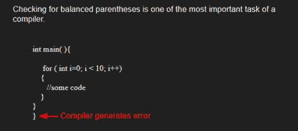

# C#程序使用堆栈检查表达式中的平衡括号(良好形式)

> 原文:[https://www . geeksforgeeks . org/c-program-to-check-for-balanced-in-a-expression-well-forming-use-stack-2/](https://www.geeksforgeeks.org/c-program-to-check-for-balanced-brackets-in-an-expression-well-formedness-using-stack-2/)

给定一个表达式字符串 exp，编写一个程序来检查“{”、“}”、“(”、“”、“[”、“]”的对和顺序在 exp 中是否正确。

**例**:

> **输入**:exp = "[()]{ } {[()]()} "
> T3】输出:平衡
> 
> **输入** : exp = "[(])"
> **输出**:不平衡



**算法:**

*   声明一个字符[栈](https://www.geeksforgeeks.org/stack-data-structure/) S。
*   现在遍历表达式字符串 exp。
    1.  如果当前字符是一个起始括号(**)(“或”“”或“[”**)，那么将其推入堆栈。
    2.  如果当前字符是结束括号(**')'或' } '或']'** )，则从堆栈中弹出，如果弹出的字符是匹配的开始括号，则精细否则括号不平衡。
*   完成遍历后，如果堆栈中还有一些起始括号，那么“不平衡”

下图是上述方法的模拟运行:


下面是上述方法的实现:

## C#

```
// C# program for checking
// balanced Brackets
using System;
using System.Collections.Generic;

public class BalancedBrackets {
    public class stack {
        public int top = -1;
        public char[] items = new char[100];

        public void push(char x)
        {
            if (top == 99) 
            {
                Console.WriteLine("Stack full");
            }
            else {
                items[++top] = x;
            }
        }

        char pop()
        {
            if (top == -1) 
            {
                Console.WriteLine("Underflow error");
                return '�';
            }
            else 
            {
                char element = items[top];
                top--;
                return element;
            }
        }

        Boolean isEmpty()
        {
            return (top == -1) ? true : false;
        }
    }

    // Returns true if character1 and character2
    // are matching left and right brackets */
    static Boolean isMatchingPair(char character1,
                                  char character2)
    {
        if (character1 == '(' && character2 == ')')
            return true;
        else if (character1 == '{' && character2 == '}')
            return true;
        else if (character1 == '[' && character2 == ']')
            return true;
        else
            return false;
    }

    // Return true if expression has balanced
    // Brackets
    static Boolean areBracketsBalanced(char[] exp)
    {
        // Declare an empty character stack */
        Stack<char> st = new Stack<char>();

        // Traverse the given expression to
        //   check matching brackets
        for (int i = 0; i < exp.Length; i++) 
        {
            // If the exp[i] is a starting
            // bracket then push it
            if (exp[i] == '{' || exp[i] == '('
                || exp[i] == '[')
                st.Push(exp[i]);

            //  If exp[i] is an ending bracket
            //  then pop from stack and check if the
            //   popped bracket is a matching pair
            if (exp[i] == '}' || exp[i] == ')'
                || exp[i] == ']') {

                // If we see an ending bracket without
                //   a pair then return false
                if (st.Count == 0) 
                {
                    return false;
                }

                // Pop the top element from stack, if
                // it is not a pair brackets of
                // character then there is a mismatch. This
                // happens for expressions like {(})
                else if (!isMatchingPair(st.Pop(),
                                         exp[i])) {
                    return false;
                }
            }
        }

        // If there is something left in expression
        // then there is a starting bracket without
        // a closing bracket

        if (st.Count == 0)
            return true; // balanced
        else 
        { 
            // not balanced
            return false;
        }
    }

    // Driver code
    public static void Main(String[] args)
    {
        char[] exp = { '{', '(', ')', '}', '[', ']' };

        // Function call
        if (areBracketsBalanced(exp))
            Console.WriteLine("Balanced ");
        else
            Console.WriteLine("Not Balanced ");
    }
}

// This code is contributed by 29AjayKumar
```

**Output**

```
Balanced
```

**时间复杂度:**O(n)
T3】辅助空间: O(n)为叠加。

更多详细信息，请参考完整文章[使用堆栈](https://www.geeksforgeeks.org/check-for-balanced-parentheses-in-an-expression/)检查表达式中的平衡括号(格式是否正确)！