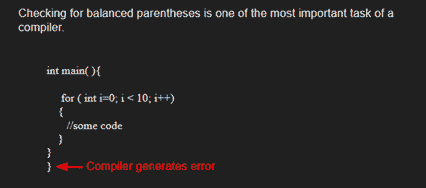
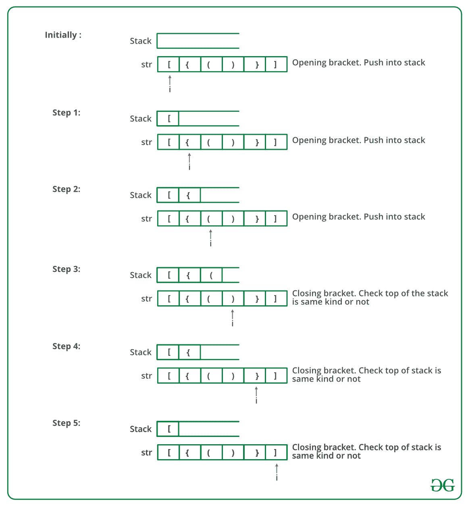

# 使用堆栈检查表达式中平衡括号的 C 程序(良好形式)

> 原文:[https://www . geesforgeks . org/c-program-to-check-for-balanced-in-in-a-expression-well-forming-use-stack/](https://www.geeksforgeeks.org/c-program-to-check-for-balanced-brackets-in-an-expression-well-formedness-using-stack/)

给定一个表达式字符串 exp，编写一个程序来检查“{”、“}”、“(”、“”、“[”、“]”的对和顺序在 exp 中是否正确。

**例**:

> **输入**:exp = "[()]{ } {[()]()} "
> T3】输出:平衡
> 
> **输入** : exp = "[(])"
> **输出**:不平衡



**算法:**

*   声明一个字符[栈](https://www.geeksforgeeks.org/stack-data-structure/) S。
*   现在遍历表达式字符串 exp。
    1.  如果当前字符是一个起始括号(**)(“或”“”或“[”**)，那么将其推入堆栈。
    2.  如果当前字符是结束括号(**')'或' } '或']'** )，则从堆栈中弹出，如果弹出的字符是匹配的开始括号，则精细否则括号不平衡。
*   完成遍历后，如果堆栈中还有一些起始括号，那么“不平衡”

下图是上述方法的模拟运行:



下面是上述方法的实现:

## C

```
#include <stdio.h>
#include <stdlib.h>
#define bool int

// structure of a stack node
struct sNode {
    char data;
    struct sNode* next;
};

// Function to push an item to stack
void push(struct sNode** top_ref, int new_data);

// Function to pop an item from stack
int pop(struct sNode** top_ref);

// Returns 1 if character1 and character2 are matching left
// and right Brackets
bool isMatchingPair(char character1, char character2)
{
    if (character1 == '(' && character2 == ')')
        return 1;
    else if (character1 == '{' && character2 == '}')
        return 1;
    else if (character1 == '[' && character2 == ']')
        return 1;
    else
        return 0;
}

// Return 1 if expression has balanced Brackets
bool areBracketsBalanced(char exp[])
{
    int i = 0;

    // Declare an empty character stack
    struct sNode* stack = NULL;

    // Traverse the given expression to check matching
    // brackets
    while (exp[i]) 
    {
        // If the exp[i] is a starting bracket then push
        // it
        if (exp[i] == '{' || exp[i] == '(' || exp[i] == '[')
            push(&stack, exp[i]);

        // If exp[i] is an ending bracket then pop from
        // stack and check if the popped bracket is a
        // matching pair*/
        if (exp[i] == '}' || exp[i] == ')'
            || exp[i] == ']') {

            // If we see an ending bracket without a pair
            // then return false
            if (stack == NULL)
                return 0;

            // Pop the top element from stack, if it is not
            // a pair bracket of character then there is a
            // mismatch.
            // his happens for expressions like {(})
            else if (!isMatchingPair(pop(&stack), exp[i]))
                return 0;
        }
        i++;
    }

    // If there is something left in expression then there
    // is a starting bracket without a closing
    // bracket
    if (stack == NULL)
        return 1; // balanced
    else
        return 0; // not balanced
}

// Driver code
int main()
{
    char exp[100] = "{()}[]";

    // Function call
    if (areBracketsBalanced(exp))
        printf("Balanced 
");
    else
        printf("Not Balanced 
");
    return 0;
}

// Function to push an item to stack
void push(struct sNode** top_ref, int new_data)
{
    // allocate node
    struct sNode* new_node
        = (struct sNode*)malloc(sizeof(struct sNode));

    if (new_node == NULL) {
        printf("Stack overflow n");
        getchar();
        exit(0);
    }

    // put in the data
    new_node->data = new_data;

    // link the old list off the new node
    new_node->next = (*top_ref);

    // move the head to point to the new node
    (*top_ref) = new_node;
}

// Function to pop an item from stack
int pop(struct sNode** top_ref)
{
    char res;
    struct sNode* top;

    // If stack is empty then error
    if (*top_ref == NULL) {
        printf("Stack overflow n");
        getchar();
        exit(0);
    }
    else {
        top = *top_ref;
        res = top->data;
        *top_ref = top->next;
        free(top);
        return res;
    }
}
```

**Output**

```
Balanced
```

**时间复杂度:**O(n)
T3】辅助空间: O(n)为叠加。

更多详细信息，请参考完整文章[使用堆栈](https://www.geeksforgeeks.org/check-for-balanced-parentheses-in-an-expression/)检查表达式中的平衡括号(格式是否正确)！