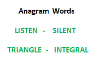

# C 程序检查两个字符串是否是彼此的字谜

> 原文:[https://www . geesforgeks . org/c-program-to-check-two-string-is-anagram-other-2/](https://www.geeksforgeeks.org/c-program-to-check-whether-two-strings-are-anagram-of-each-other-2/)

写一个函数检查两个给定的字符串是否是彼此的[字谜](http://en.wikipedia.org/wiki/Anagram)。字符串的字谜是另一个包含相同字符的字符串，只有字符的顺序可以不同。例如，“abcd”和“dabc”是彼此的字谜。



## [我们强烈建议您点击此处进行练习，然后再进入解决方案。](https://practice.geeksforgeeks.org/problems/anagram-1587115620/1)

**方法(计数字符):**
该方法假设两个字符串中可能的字符集都很小。在下面的实现中，假设使用 8 位存储字符，并且可能有 256 个字符。

1.  为两个字符串创建大小为 256 的计数数组。将计数数组中的所有值初始化为 0。
2.  遍历两个字符串的每个字符，并增加相应计数数组中的字符数。
3.  比较计数数组。如果两个计数数组相同，则返回 true。

下面是上述想法的实现:

## C

```
// C program to check if two strings
// are anagrams of each other
#include <stdio.h>
#define NO_OF_CHARS 256

/* Function to check whether two 
   strings are anagram of each other */
bool areAnagram(char* str1, char* str2)
{
    // Create 2 count arrays and initialize 
    // all values as 0
    int count1[NO_OF_CHARS] = {0};
    int count2[NO_OF_CHARS] = {0};
    int i;

    // For each character in input strings, 
    // increment count in the corresponding 
    // count array
    for (i = 0; str1[i] && str2[i]; i++) 
    {
        count1[str1[i]]++;
        count2[str2[i]]++;
    }

    // If both strings are of different length. 
    // Removing this condition will make the 
    // program fail for strings like "aaca" 
    // and "aca"
    if (str1[i] || str2[i])
        return false;

    // Compare count arrays
    for (i = 0; i < NO_OF_CHARS; i++)
        if (count1[i] != count2[i])
            return false;

    return true;
}

// Driver code
int main()
{
    char str1[] = "geeksforgeeks";
    char str2[] = "forgeeksgeeks";

    // Function Call
    if (areAnagram(str1, str2))
        printf(
        "The two strings are anagram of each other");
    else
        printf("The two strings are not anagram of each "
               "other");
    return 0;
}
```

**输出:**

```
The two strings are anagram of each other
```

更多详情请参考[整篇文章检查两个字符串是否为对方的字谜](https://www.geeksforgeeks.org/check-whether-two-strings-are-anagram-of-each-other/)！