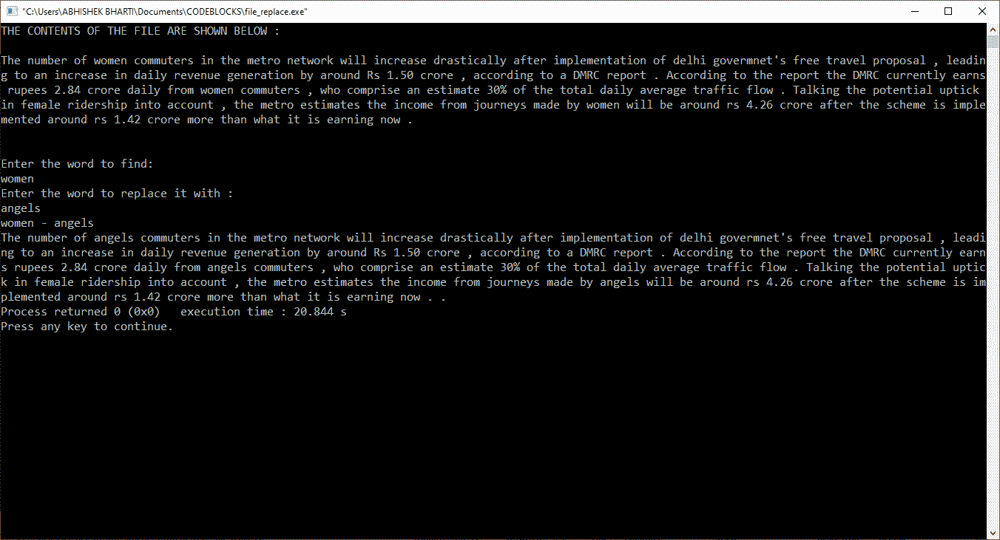

# 用另一个给定的单词查找和替换文件中的一个单词的程序

> 原文:[https://www . geeksforgeeks . org/c-program-to-find-and-replace-a-in-a-file-in-a-word-in-a-a-a-a-a-a-a-a-a-a-a-a-a-a-a-a-a-a-a-a-a-a-a-a-a](https://www.geeksforgeeks.org/c-program-to-find-and-replace-a-word-in-a-file-by-another-given-word/)

**先决条件:**[C 中的文件处理](https://www.geeksforgeeks.org/basics-file-handling-c/)
给定一个包含一些文本的**文件**，以及两个字符串**word to find**和**word to replacedwith**，任务是在文件中查找给定单词“word to find”的所有匹配项，并用给定单词“word to replacedwith”替换它们。

**示例:**

```
Input : File = "xxforxx xx for xx", 
        wordToBeFind = "xx", 
        wordToBeReplacedWith = "geeks"
Output : geeksforgeeks geeks for geeks
```

**方法:**这里的思想是从给定的文件中读取内容，处理查找和替换，然后将输出存储在另一个文件中。

1.  制作文件对象
2.  打开两个文件，一个在**读取模式**下输入文件，另一个在**写入+模式**下输入文件
3.  检查文件是否正确打开
4.  逐字阅读现有输入文件的内容
5.  由于使用 fgets 需要输入新的行字符(即回车键)，我们也只需将字符串的空字符复制回一个位置，以便换行符替换为“\0”
6.  我们运行一个循环，直到到达文件的末尾，扫描文件中的每个单词，并将其存储在变量“read”中。
7.  然后我们将“read”与“wordToBeFind”进行比较，如果结果为真，我们就用“strcpy()”将“read”替换为“wordToBeReplacedWith”。
8.  通过 printf 显示单词替换
9.  现在，我们再次在文件的开头移动文件指针，并打印输出文件的文件内容。

下面是上述方法的实现:

## C

```
// C program to find and replace a word
// in a File by another given word

#include <stdio.h>
#include <stdlib.h>
#include <string.h>

// Function to find and
// replace a word in File
void findAndReplaceInFile()
{
    FILE *ifp, *ofp;
    char word[100], ch, read[100], replace[100];
    int word_len, i, p = 0;

    ifp = fopen("file_search_input.txt", "r");
    ofp = fopen("file_replace_output.txt", "w+");
    if (ifp == NULL || ofp == NULL) {
        printf("Can't open file.");
        exit(0);
    }
    puts("THE CONTENTS OF THE FILE ARE SHOWN BELOW :\n");

    // displaying file contents
    while (1) {
        ch = fgetc(ifp);
        if (ch == EOF) {
            break;
        }
        printf("%c", ch);
    }

    puts("\n\nEnter the word to find:");
    fgets(word, 100, stdin);

    // removes the newline character from the string
    word[strlen(word) - 1] = word[strlen(word)];

    puts("Enter the word to replace it with :");
    fgets(replace, 100, stdin);

    // removes the newline character from the string
    replace[strlen(replace) - 1] = replace[strlen(replace)];

    fprintf(ofp, "%s - %s\n", word, replace);

    // comparing word with file
    rewind(ifp);
    while (!feof(ifp)) {

        fscanf(ifp, "%s", read);

        if (strcmp(read, word) == 0) {

            // for deleting the word
            strcpy(read, replace);
        }

        // In last loop it runs twice
        fprintf(ofp, "%s ", read);
    }

    // Printing the content of the Output file
    rewind(ofp);
    while (1) {
        ch = fgetc(ofp);
        if (ch == EOF) {
            break;
        }
        printf("%c", ch);
    }

    fclose(ifp);
    fclose(ofp);
}

// Driver code
void main()
{
    findAndReplaceInFile();
}
```

**如何执行上述代码:**

1.  从这里复制源代码，并将其粘贴到脱机集成开发环境中
2.  保存程序。
3.  创建一个名为 **file_search_input.txt** 的文件，并将其保存在保存上述复制程序的文件夹中。
4.  现在打开终端或离线 IDE 并运行程序

**输出:**

[](https://media.geeksforgeeks.org/wp-content/uploads/20190901205059/Untitled160.png)