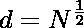
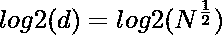
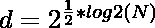

# C 程序求给定数的平方根

> 原文:[https://www . geesforgeks . org/c-程序查找给定数字的平方根/](https://www.geeksforgeeks.org/c-program-to-find-square-root-of-a-given-number/)

给定一个数字 **N** ，任务是编写一个 [C 程序](https://www.geeksforgeeks.org/c-programming-language/)来求给定数字 N 的[平方根。](https://www.geeksforgeeks.org/square-root-of-an-integer/)

**示例:**

> **输入:**N = 12
> T3】输出: 3.464102
> 
> **输入:**N = 16
> T3】输出: 4

**方法 1:使用内置的** [**sqrt()**](https://www.geeksforgeeks.org/sqrt-sqrtl-sqrtf-cpp/) **函数:**sqrt()函数返回任意数字 n 的 sqrt

下面是上述方法的实现:

## C

```
// C program for the above approach
#include <math.h>
#include <stdio.h>

// Function to find the square-root of N
double findSQRT(double N) { return sqrt(N); }

// Driver Code
int main()
{

    // Given number
    int N = 12;

    // Function call
    printf("%f ", findSQRT(N));
    return 0;
}
```

**Output:** 

```
3.464102
```

**方法二:使用** [**【二分搜索法】**](https://www.geeksforgeeks.org/binary-search/) **:** 这种方法用来求给定数字 N 的平方根，精度可达小数点后 5 位。

1.  数字 N 的平方根在 0 ≤平方根≤ N 的范围内。初始化开始= 0，结束=数字。
2.  将中间整数的平方与给定的数字进行比较。如果它等于这个数，那么我们找到了我们的整数部分，否则根据条件在 mid 的左侧或右侧寻找相同的部分。
3.  找到一个整数部分后，我们会找到小数部分。
4.  将增量变量初始化 0.1，并迭代计算小数部分至**小数点后 5 位**。
5.  对于每次迭代，将增量更改为其先前值的 1/10。
6.  最后，返回计算出的答案。

下面是上述方法的实现:

## C

```
// C program for the above approach
#include <stdio.h>
#include <stdlib.h>

// Function to find the square-root of N
float findSQRT(int number)
{
    int start = 0, end = number;
    int mid;

    // To store the answer
    float ans;

    // To find integral part of square
    // root of number
    while (start <= end) {

        // Find mid
        mid = (start + end) / 2;

        // If number is perfect square
        // then break
        if (mid * mid == number) {
            ans = mid;
            break;
        }

        // Increment start if integral
        // part lies on right side
        // of the mid
        if (mid * mid < number) {
          //first start value should be added to answer
            ans=start;
          //then start should be changed
            start = mid + 1;
        }

        // Decrement end if integral part
        // lies on the left side of the mid
        else {
            end = mid - 1;
        }
    }

    // To find the fractional part
    // of square root upto 5 decimal
    float increment = 0.1;
    for (int i = 0; i < 5; i++) {
        while (ans * ans <= number) {
            ans += increment;
        }

        // Loop terminates,
        // when ans * ans > number
        ans = ans - increment;
        increment = increment / 10;
    }
    return ans;
}

// Driver Code
int main()
{

    // Given number
    int N = 12;

    // Function call
    printf("%f ", findSQRT(N));
    return 0;
}
```

**Output:** 

```
3.464099
```

**方法三:使用**[**log2()**](https://www.geeksforgeeks.org/log2-function-in-c-with-examples/)**:**一个数 N 的平方根可以使用 log2()计算为:

> 让 d 作为我们输入数字 N 的答案，然后
> 
> 
> 
> 在两侧涂抹 log2()
> 
> 
> 
> 
> 
> 
> 
> 因此，
> 
> d =功率(2，0.5*log2(n))

下面是上述方法的实现:

## C

```
// C program for the above approach
#include <math.h>
#include <stdio.h>

// Function to find the square-root of N
double findSQRT(double N) { return pow(2, 0.5 * log2(N)); }

// Driver Code
int main()
{

    // Given number
    int N = 12;

    // Function call
    printf("%f ", findSQRT(N));
    return 0;
}
```

**Output:** 

```
3.464102
```