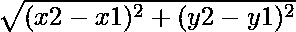
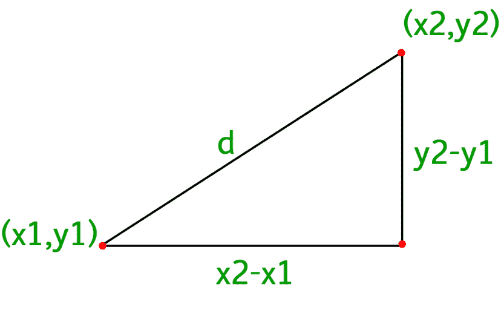

# C 程序求两点间的欧氏距离

> 原文:[https://www . geesforgeks . org/c-program-to-find-两点间的欧几里得距离/](https://www.geeksforgeeks.org/c-program-to-find-the-euclidean-distance-between-two-points/)

给定四个整数 **x1，y1，x2** 和 **y2** ，表示二维图形的两个坐标 **(x1，y1)和(x2，y2)** 。任务是找到这两点之间的**欧氏距离**。

> **两点之间的欧几里得距离**是在这两个给定点之间画出的直线的长度。

**示例:**

> **输入:** x1，y1 = (3，4)
> x2，y2 = (7，7)
> T4】输出: 5
> 
> **输入:** x1，y1 = (3，4)
> x2，y2 = (4，3)
> T4】输出: 1.41421

**方法:**由于欧氏距离只不过是两个给定点之间的直线距离，因此可以使用勾股定理导出的距离公式。两点间距离(x1，y1)和(x2，y2)的公式为
我们可以简单的应用毕达哥拉斯定理得到上面的公式



下面是上述方法的实现

## C

```
// C program for the above approach

#include <math.h>
#include <stdio.h>

// Function to calculate distance
float distance(int x1, int y1, int x2, int y2)
{
    // Calculating distance
    return sqrt(pow(x2 - x1, 2)
                + pow(y2 - y1, 2) * 1.0);
}

// Driver Code
int main()
{
    printf("%.2f", distance(3, 4, 4, 3));
    return 0;
}
```

**Output**

```
1.41
```

**时间复杂度:**O(1)
T3】辅助空间: O(1)