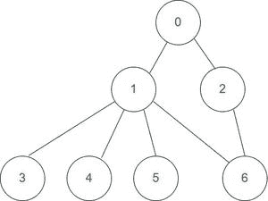

# 利用给定图中的邻接矩阵实现 DFS 遍历的 C 程序

> 原文:[https://www . geesforgeks . org/c-程序到实现-DFS-遍历-使用-给定图中的邻接矩阵/](https://www.geeksforgeeks.org/c-program-to-implement-dfs-traversal-using-adjacency-matrix-in-a-given-graph/)

给定一个有 **V** 顶点和 **E** 边的无向图。任务是执行图的 **DFS 遍历**。

**示例:**

> **输入:** V = 7，E = 7
> 连接:0-1，0-2，1-3，1-4，1-5，1-6，6-2
> 连接见图示:
> 
> 
> 
> **输出:** 0 1 3 4 5 6 2
> **说明:**遍历从 0 开始，遵循以下路径 0-1，1-3，1-4，1-5，1-6，6-2。
> 
> **输入:** V = 1，E = 0
> **输出:** 0
> **说明:**除了 0 本身没有其他顶点。

**进场:**按照下面提到的进场。

*   最初，所有顶点都标记为未访问(假)。
*   DFS 算法从图中的一个顶点 **u** 开始。从顶点 **u** 开始，它考虑从 **u** 到其他顶点的边。
    *   如果边通向已经访问过的顶点，则回溯到当前顶点 **u** 。
    *   如果一条边通向一个**未被访问的顶点，**则转到该顶点并从该顶点开始处理。这意味着新顶点成为当前遍历的根。
*   遵循此过程，直到顶点被标记为已访问。

这里邻接矩阵用于存储顶点之间的连接。

> 请看下图:
> 
> 
> 
> 该图的邻接矩阵为:
> 
> <figure class="table">
> 
> | Zero | one | one | Zero | Zero | Zero | Zero |
> | one | Zero | Zero | one | one | one | one |
> | one | Zero | Zero | Zero | Zero | Zero | one |
> | Zero | one | Zero | Zero | Zero | Zero | Zero |
> | Zero | one | Zero | Zero | Zero | Zero | Zero |
> | Zero | one | Zero | Zero | Zero | Zero | Zero |
> | Zero | one | one | Zero | Zero | Zero | Zero |
> 
> </figure>

下面是简单深度优先遍历的实现。

## C

```
// C code to implement above approach
#include <stdio.h>
#include <stdlib.h>

// Globally declared visted array
int vis[100];

// Graph structure to store number
// of vertices and edges and
// Adjacency matrix
struct Graph {
    int V;
    int E;
    int** Adj;
};

// Function to input data of graph
struct Graph* adjMatrix()
{
    struct Graph* G = (struct Graph*)
        malloc(sizeof(struct Graph));
    if (!G) {
        printf("Memory Error\n");
        return NULL;
    }
    G->V = 7;
    G->E = 7;

    G->Adj = (int**)malloc((G->V) * sizeof(int*));
    for (int k = 0; k < G->V; k++) {
        G->Adj[k] = (int*)malloc((G->V) * sizeof(int));
    }

    for (int u = 0; u < G->V; u++) {
        for (int v = 0; v < G->V; v++) {
            G->Adj[u][v] = 0;
        }
    }
    G->Adj[0][1] = G->Adj[1][0] = 1;
    G->Adj[0][2] = G->Adj[2][0] = 1;
    G->Adj[1][3] = G->Adj[3][1] = 1;
    G->Adj[1][4] = G->Adj[4][1] = 1;
    G->Adj[1][5] = G->Adj[5][1] = 1;
    G->Adj[1][6] = G->Adj[6][1] = 1;
    G->Adj[6][2] = G->Adj[2][6] = 1;

    return G;
}

// DFS function to print DFS traversal of graph
void DFS(struct Graph* G, int u)
{
    vis[u] = 1;
    printf("%d ", u);
    for (int v = 0; v < G->V; v++) {
        if (!vis[v] && G->Adj[u][v]) {
            DFS(G, v);
        }
    }
}

// Function for DFS traversal
void DFStraversal(struct Graph* G)
{
    for (int i = 0; i < 100; i++) {
        vis[i] = 0;
    }
    for (int i = 0; i < G->V; i++) {
        if (!vis[i]) {
            DFS(G, i);
        }
    }
}

// Driver code
void main()
{
    struct Graph* G;
    G = adjMatrix();
    DFStraversal(G);
}
```

**Output**

```
0 1 3 4 5 6 2 
```

**时间复杂度:**O(V+E)
T3】辅助空间: O(V)