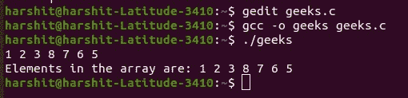

# 从一系列用空格分隔的整数中输入一个数组的程序

> 原文:[https://www . geeksforgeeks . org/c-程序-从空间分离整数序列输入数组/](https://www.geeksforgeeks.org/c-program-to-input-an-array-from-a-sequence-of-space-seperated-integers/)

给定一个由空格分隔的整数组成的[字符串](https://www.geeksforgeeks.org/string-data-structure/) **S** ，任务是编写一个 [C 程序](https://www.geeksforgeeks.org/c/)从字符串 **S** 中获取整数作为输入，并将它们存储在一个[数组](https://www.geeksforgeeks.org/introduction-to-arrays/)**arr【】**中。

**示例:**

> **输入:**S = " 1 2 3 4 "
> T3】输出: {1，2，3，4}
> 
> **输入:**S = " 32 12 "
> T3】输出: {32，12}

**方法:**解决给定问题的思路是使用 [getchar()](https://www.geeksforgeeks.org/difference-getchar-getch-getc-getche/) 函数检查在进行输入时是否发现出现 ['\n '(换行符)](https://www.geeksforgeeks.org/endl-vs-n-in-cpp/)，然后停止输入。按照以下步骤解决给定的问题:

*   初始化一个变量，比如**计数**，用来存储数组元素的索引。
*   初始化一个大小为 **10 <sup>6</sup>** 的[数组](https://www.geeksforgeeks.org/introduction-to-arrays/) **arr[]** ，将元素存储到数组中。
*   使用[边做边循环](https://www.geeksforgeeks.org/loops-in-c-and-cpp/)迭代，直到出现**新行**，并执行以下步骤:
    *   将当前值存储在索引**计数**中作为**扫描(" %d "，& arr【计数】)；**并增加**计数**的值。
    *   如果下一个字符不是**结束线**，那么[继续](https://www.geeksforgeeks.org/continue-statement-cpp/)。否则，[跳出循环](https://www.geeksforgeeks.org/break-statement-cc/)。
*   完成上述步骤后，[打印数组](https://www.geeksforgeeks.org/c-program-to-print-an-array-using-recursion/)中存储的元素。

下面是上述方法的实现:

## C

```
// C program for the above approach
#include <stdio.h>

// Driver Code
int main()
{
    // Stores the index where the
    // element is to be inserted
    int count = 0;

    // Initialize an array
    int a[1000000];

    // Perform a do-while loop
    do {

        // Take input at position count
        // and increment count
        scanf("%d", &a[count++]);

        // If '\n' (newline) has occurred
        // or the whole array is filled,
        // then exit the loop

        // Otherwise, continue
    } while (getchar() != '\n' && count < 100);

    // Resize the array size to count
    a[count];

    // Print the array elements
    for (int i = 0; i < count; i++) {
        printf("%d, ", a[i]);
    }

    return 0;
}
```

**输出:**

[](https://media.geeksforgeeks.org/wp-content/uploads/20210301173148/Screenshotfrom20210301172300.jpg)