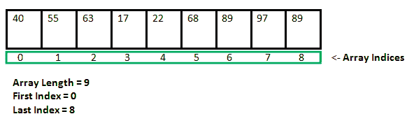

# 使用递归打印数组的 C++程序

> 原文:[https://www . geesforgeks . org/c-程序使用递归打印数组/](https://www.geeksforgeeks.org/c-program-to-print-an-array-using-recursion/)

用 C++编写一个程序，使用[递归](https://www.geeksforgeeks.org/recursion/)打印一个[数组](https://www.geeksforgeeks.org/arrays-in-c-cpp/)

[](https://media.geeksforgeeks.org/wp-content/cdn-uploads/gq/2015/05/Arrays.png)

1.  **Using [static variable](https://www.geeksforgeeks.org/static-variables-in-c/):** Static variables have a property of preserving their value even after they are out of their scope! Hence, static variables preserve their previous value in their previous scope and are not initialized again in the new scope.

    **语法:**

    ```
    static data_type var_name = var_value; 
    ```

    ```
    // C++ Program to print
    // an Array using Recursion

    #include <bits/stdc++.h>
    using namespace std;

    // Recursive function to print the array
    void print_array(int arr[], int size)
    {

        // using the static variable
        static int i;

        // base case
        if (i == size) {
            i = 0;
            cout << endl;
            return;
        }

        // print the ith element
        cout << arr[i] << " ";
        i++;

        // recursive call
        print_array(arr, size);
    }

    // Driver code
    int main()
    {

        int arr[] = { 3, 5, 6, 8, 1 };
        int n = sizeof(arr) / sizeof(arr[0]);

        print_array(arr, n);

        return 0;
    }
    ```

    **Output:**

    ```
    3 5 6 8 1

    ```

2.  **不使用静态变量:**

    ```
    // C++ Program to print
    // an Array using Recursion

    #include <bits/stdc++.h>
    using namespace std;

    // Recursive function to print the array
    void print_array(int arr[], int size, int i)
    {

        // base case
        if (i == size) {
            cout << endl;
            return;
        }

        // print the ith element
        cout << arr[i] << " ";
        i++;

        // recursive call
        print_array(arr, size, i);
    }

    // Driver code
    int main()
    {

        int arr[] = { 3, 5, 6, 8, 1 };
        int n = sizeof(arr) / sizeof(arr[0]);

        print_array(arr, n, 0);

        return 0;
    }
    ```

    **输出:**

    ```
    3 5 6 8 1

    ```