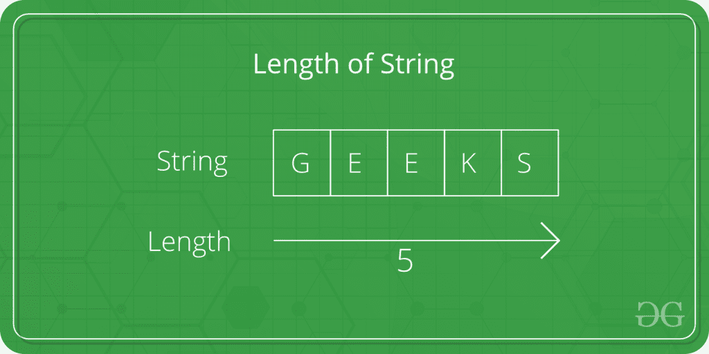
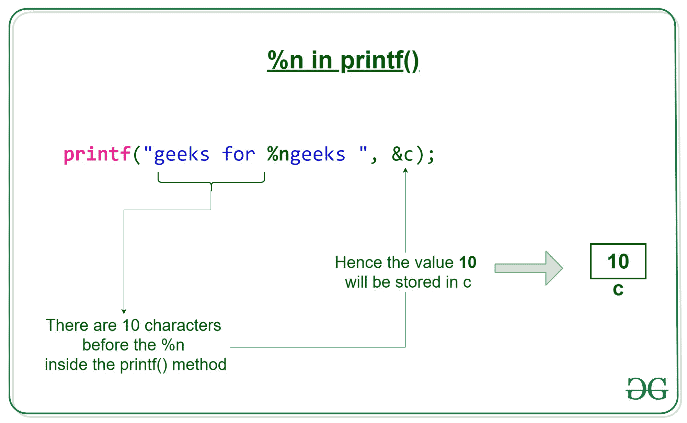

# 使用%n 格式说明符

打印字符串长度的 C 程序

> 原文:[https://www . geesforgeks . org/c-program-to-print-the-length-of-a-string-use-n-format-说明符/](https://www.geeksforgeeks.org/c-program-to-print-the-length-of-a-string-using-n-format-specifier/)

给定字符串。任务是使用%n 格式说明符找到字符串的长度

[](https://media.geeksforgeeks.org/wp-content/uploads/CommonArticleDesign19-min-1024x512.png)

**示例:**

```

Input: Geeks For Geeks
Output: 15

Input: Geeks
Output: 5

```

**逼近:**

为了找到字符串的长度，我们在 **printf 函数**中使用了特殊的格式说明符“ [%n](https://www.geeksforgeeks.org/g-fact-31/) ”。在 C printf()中，%n 是一个特殊的格式说明符，它不是打印某些内容，而是使 printf()加载相应参数所指向的变量，该变量的值等于 printf()在出现%n 之前已打印的字符数。

[](https://media.geeksforgeeks.org/wp-content/uploads/20191009172807/n-in-printf.jpg)

下面是上述方法的实现:

```
// C program to print
// the length of a String
// using %n format specifier

#include <stdio.h>

// Driver code
int main()
{
    char str[100] = "Geeks for Geeks";
    int len = 0;

    printf("%s%n", str, &len);
    printf(" = %d", len);

    return 0;
}
```

**Output:**

```
Geeks for Geeks = 15

```