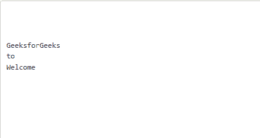

# C 程序反转文件内容并打印出来

> 原文:[https://www . geesforgeks . org/c-program-to-reverse-the-content-of-the-file-and-print-it/](https://www.geeksforgeeks.org/c-program-to-reverse-the-content-of-the-file-and-print-it/)

给定一个目录中的文本文件，任务是向后打印文件内容，即最后一行应该首先打印，第二个最后一行应该其次打印，依此类推。

**示例:**

> **输入:**
> 文件 1.txt 有:
> 欢迎
> 到
> 极客 forGeeks
> **输出:**
> 极客 forGeeks
> 到
> 欢迎
> 
> GeeksforGeeks
> **输入:**
> file1.txt 有:
> 这是第一行
> 这是第二行
> 这是第三行
> 这是第四行
> 这是第五行
> **输出:**
> 这是第五行
> 这是第四行
> 这是第三行
> 这是第二行
> 这是第一行

**进场:**

1.  将文本的前一长度初始化为 0。
2.  找到当前行的长度，并将其添加到以前的长度中。这给出了新行的下一个起始索引。
3.  重复以上步骤，直到文件结束。
4.  初始化给定文件中给定消息长度的[数组](https://www.geeksforgeeks.org/introduction-to-arrays/)。
5.  现在倒带文件指针，将文本的最后一个指针放在**arr[K–1]**上，其中 **K** 是使用 [fseek()](https://www.geeksforgeeks.org/fseek-in-c-with-example/) 的数组长度。
6.  打印最后一行的长度，将 **K** 减 1，打印文件的下一个最后一行。
7.  重复以上步骤，直到 **K** 等于 0。

下面是上述方法的实现:

```
// C program for the above approach
#include <stdio.h>
#include <string.h>
#define MAX 100

// Function to reverse the file content
void reverseContent(char* x)
{

    // Opening the path entered by user
    FILE* fp = fopen(x, "a+");

    // If file is not found then return
    if (fp == NULL) {
        printf("Unable to open file\n");
        return;
    }

    // To store the content
    char buf[100];
    int a[MAX], s = 0, c = 0, l;

    // Explicitly inserting a newline
    // at the end, so that o/p doesn't
    // get effected.
    fprintf(fp, " \n");
    rewind(fp);

    // Adding current length so far +
    // previous length of a line in
    // array such that we have starting
    // indices of upcoming lines
    while (!feof(fp)) {
        fgets(buf, sizeof(buf), fp);
        l = strlen(buf);
        a = s += l;
    }

    // Move the pointer back to 0th index
    rewind(fp);
    c -= 1;

    // Print the contents
    while (c >= 0) {
        fseek(fp, a, 0);
        fgets(buf, sizeof(buf), fp);
        printf("%s", buf);
        c--;
    }

    return ;
}

// Driver Code
int main()
{
    // File name in the directory
    char x[] = "file1.txt";

    // Function Call to reverse the
    // File Content
    reverseContent(x);
    return 0;
}
```

**输入文件:**
[](https://media.geeksforgeeks.org/wp-content/uploads/20200506182455/Screenshot-6251.png) 
**输出文件:**
[](https://media.geeksforgeeks.org/wp-content/uploads/20200506182532/Screenshot-6261.png)