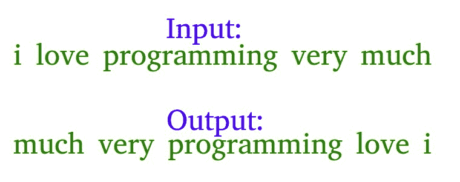

# C#程序反转给定字符串中的单词

> 原文:[https://www . geesforgeks . org/c-程序-给定字符串中的反向单词-2/](https://www.geeksforgeeks.org/c-program-to-reverse-words-in-a-given-string-2/)

示例:让输入字符串为“我非常喜欢这个程序”。该函数应该将字符串更改为“非常像我这样的程序”



**示例**:

> **输入** : s =【极客问答练习代码】
> **输出** : s =【代码练习问答极客】
> 
> **输入** : s =“擅长编码需要大量练习”
> **输出** : s =“擅长编码需要大量练习”

**算法**:

*   最初，逐个反转给定字符串的单个单词，对于上面的示例，反转单个单词后，字符串应该是“i ekil siht margorp yrev hcum”。
*   [从头到尾反转整个字符串](https://www.geeksforgeeks.org/write-a-program-to-reverse-an-array-or-string/)得到想要的输出“非常像我这个程序”在上例中。

下面是上述方法的实现:

## C#

```
// C# program to reverse 
// a String
using System;
class GFG{

// Reverse the letters 
// of the word 
static void reverse(char []str, 
                    int start, int end) 
{

  // Temporary variable to 
  // store character 
  char temp;

  while (start <= end) 
  {

    // Swapping the first and 
    // last character 
    temp = str[start];
    str[start] = str[end];
    str[end] = temp;
    start++;
    end--;
  }
}

// Function to reverse words
static char[] reverseWords(char []s)
{  
  // Reversing individual words as
  // explained in the first step

  int start = 0;
  for (int end = 0; 
           end < s.Length; end++) 
  {    
    // If we see a space, we reverse 
    // the previous word (word between 
    // the indexes start and end - 1 
    // i.e., s[start..end-1]
    if (s[end] == ' ') 
    {
      reverse(s, start, end);
      start = end + 1;
    }
  }

  // Reverse the last word
  reverse(s, start, s.Length - 1);

  // Reverse the entire String
  reverse(s, 0, s.Length - 1);
  return s;
}

// Driver Code
public static void Main(String[] args)
{
  String s = 
  "i like this program very much ";
  char []p = reverseWords(s.ToCharArray());
  Console.Write(p);
}
}
// This code is contributed by jana_sayantan
```

**输出:**

```
much very program this like i
```

**另一种方法:**

我们可以通过以相反的方式拆分和保存字符串来完成上述任务。

下面是上述方法的实现:

## C#

```
// C# program to reverse a string
using System;
public class ReverseWords 
{
    public static void Main()
    {
        string[] s = 
        "i like this program very much".Split(' ');
        string ans = "";
        for (int i = s.Length - 1; 
                 i >= 0; i--) 
        {
            ans += s[i] + " ";
        }
        Console.Write(
        "Reversed String:");
        Console.Write(ans.Substring(0, 
                      ans.Length - 1));
    }
}
```

**输出:**

```
Reversed String:
much very program this like i
```

**时间复杂度:** O(n)

**不使用任何额外空间:**
以上任务也可以从中间开始拆分直接对换字符串来完成。由于涉及直接交换，因此占用的空间也更少。

下面是上述方法的实现:

## C#

```
// C# code to reverse a string
using System;
class GFG{

// Reverse the string
public static String[] RevString(String[] s, 
                                 int l)
{    
    // Check if number of words is even
    if (l % 2 == 0)
    {        
        // Find the middle word
        int j = l / 2;

        // Starting from the middle
        // start swapping words at 
        // jth position and l-1-j position
        while (j <= l - 1)
        {
            String temp;
            temp = s[l - j - 1];
            s[l - j - 1] = s[j];
            s[j] = temp;
            j += 1;
        }
    }

    // Check if number of words is odd
    else
    {        
        // Find the middle word
        int j = (l / 2) + 1;

        // Starting from the middle start
        // swapping the words at jth 
        // position and l-1-j position
        while (j <= l - 1) 
        {
            String temp;
            temp = s[l - j - 1];
            s[l - j - 1] = s[j];
            s[j] = temp;
            j += 1;
        }
    }

    // Return the reversed sentence
    return s;
}

// Driver Code
public static void Main(String[] args)
{
    String s = "getting good at coding " + 
               "needs a lot of practice";
    String[] words = s.Split("\s");    
    words = RevString(words, words.Length);    
    s = String.Join(" ", words);    
    Console.WriteLine(s);
}
}
// This code is contributed by shivanisinghss2110
```

**输出:**

```
practice of lot a needs coding at good getting
```

更多详情请参考[给定字符串](https://www.geeksforgeeks.org/reverse-words-in-a-given-string/)倒字整篇文章！