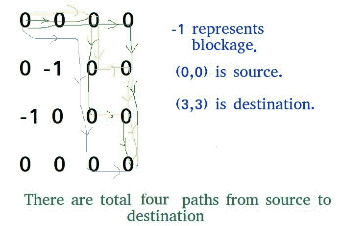

# 计算迷宫中到达目的地的路数

> 原文:[https://www . geesforgeks . org/count-number-way-reach-destination-maze/](https://www.geeksforgeeks.org/count-number-ways-reach-destination-maze/)

给定一个有障碍物的迷宫，计算从最上面最左边的单元格到达最右边最下面的单元格的路径数。给定迷宫中的一个单元如果是堵塞或死胡同，则值为-1，否则为 0。
从给定的单元格开始，我们只允许移动到单元格(i+1，j)和(I，j+1)。

**示例:**

```
Input: maze[R][C] =  {{0,  0, 0, 0},
                      {0, -1, 0, 0},
                      {-1, 0, 0, 0},
                      {0,  0, 0, 0}};
Output: 4
There are four possible paths as shown in
below diagram.
```



这个问题是下面问题的延伸。

[回溯|集合 2(迷宫中的老鼠)](https://www.geeksforgeeks.org/backttracking-set-2-rat-in-a-maze/)
在这篇文章中，讨论了一种不同的解决方案，也可以用来解决上述迷宫中的老鼠问题。
想法是修改给定的网格[][]，使得**网格[i][j]包含从(0，0)到达(I，j)的路径计数。如果(I，j)不是阻塞，否则网格[i][j]保持-1。**

```
We can recursively compute grid[i][j] using below 
formula and finally return grid[R-1][C-1]

  // If current cell is a blockage
  if (maze[i][j] == -1)
      maze[i][j] = -1; //  Do not change

  // If we can reach maze[i][j] from maze[i-1][j]
  // then increment count.
  else if (maze[i-1][j] > 0)
      maze[i][j] = (maze[i][j] + maze[i-1][j]);

  // If we can reach maze[i][j] from maze[i][j-1]
  // then increment count.
  else if (maze[i][j-1] > 0)
      maze[i][j] = (maze[i][j] + maze[i][j-1]);
```

以下是上述想法的实现。

## C++

```
// C++ program to count number of paths in a maze
// with obstacles.
#include<bits/stdc++.h>
using namespace std;
#define R 4
#define C 4

// Returns count of possible paths in a maze[R][C]
// from (0,0) to (R-1,C-1)
int countPaths(int maze[][C])
{
    // If the initial cell is blocked, there is no
    // way of moving anywhere
    if (maze[0][0]==-1)
        return 0;

    // Initializing the leftmost column
    for (int i=0; i<R; i++)
    {
        if (maze[i][0] == 0)
            maze[i][0] = 1;

        // If we encounter a blocked cell in leftmost
        // row, there is no way of visiting any cell
        // directly below it.
        else
            break;
    }

    // Similarly initialize the topmost row
    for (int i=1; i<C; i++)
    {
        if (maze[0][i] == 0)
            maze[0][i] = 1;

        // If we encounter a blocked cell in bottommost
        // row, there is no way of visiting any cell
        // directly below it.
        else
            break;
    }

    // The only difference is that if a cell is -1,
    // simply ignore it else recursively compute
    // count value maze[i][j]
    for (int i=1; i<R; i++)
    {
        for (int j=1; j<C; j++)
        {
            // If blockage is found, ignore this cell
            if (maze[i][j] == -1)
                continue;

            // If we can reach maze[i][j] from maze[i-1][j]
            // then increment count.
            if (maze[i-1][j] > 0)
                maze[i][j] = (maze[i][j] + maze[i-1][j]);

            // If we can reach maze[i][j] from maze[i][j-1]
            // then increment count.
            if (maze[i][j-1] > 0)
                maze[i][j] = (maze[i][j] + maze[i][j-1]);
        }
    }

    // If the final cell is blocked, output 0, otherwise
    // the answer
    return (maze[R-1][C-1] > 0)? maze[R-1][C-1] : 0;
}

// Driver code
int main()
{
    int maze[R][C] =  {{0,  0, 0, 0},
                       {0, -1, 0, 0},
                       {-1, 0, 0, 0},
                       {0,  0, 0, 0}};
    cout << countPaths(maze);
    return 0;
}
```

## Java 语言(一种计算机语言，尤用于创建网站)

```
// Java program to count number of paths in a maze
// with obstacles.
import java.io.*;

class GFG
{
    static int R = 4;
    static int C = 4;

    // Returns count of possible paths in
    // a maze[R][C] from (0,0) to (R-1,C-1)
    static int countPaths(int maze[][])
    {
        // If the initial cell is blocked,
        // there is no way of moving anywhere
        if (maze[0][0]==-1)
            return 0;

        // Initializing the leftmost column
        for (int i = 0; i < R; i++)
        {
            if (maze[i][0] == 0)
                maze[i][0] = 1;

            // If we encounter a blocked cell
            // in leftmost row, there is no way
            // of visiting any cell directly below it.
            else
                break;
        }

        // Similarly initialize the topmost row
        for (int i =1 ; i< C ; i++)
        {
            if (maze[0][i] == 0)
                maze[0][i] = 1;

            // If we encounter a blocked cell in
            // bottommost row, there is no way of
            // visiting any cell directly below it.
            else
                break;
        }

        // The only difference is that if a cell
        // is -1, simply ignore it else recursively
        // compute count value maze[i][j]
        for (int i = 1; i < R; i++)
        {
            for (int j = 1; j <C ; j++)
            {
                // If blockage is found,
                // ignore this cell
                if (maze[i][j] == -1)
                    continue;

                // If we can reach maze[i][j] from
                // maze[i-1][j] then increment count.
                if (maze[i - 1][j] > 0)
                    maze[i][j] = (maze[i][j] +
                                 maze[i - 1][j]);

                // If we can reach maze[i][j] from
                //  maze[i][j-1] then increment count.
                if (maze[i][j - 1] > 0)
                    maze[i][j] = (maze[i][j] +
                                  maze[i][j - 1]);
            }
        }

        // If the final cell is blocked,
        // output 0, otherwise the answer
        return (maze[R - 1][C - 1] > 0) ?
                maze[R - 1][C - 1] : 0;
    }

    // Driver code

    public static void main (String[] args)
    {
        int maze[][] = {{0, 0, 0, 0},
                       {0, -1, 0, 0},
                       {-1, 0, 0, 0},
                       {0, 0, 0, 0}};
        System.out.println (countPaths(maze));

    }

}

// This code is contributed by vt_m
```

## 蟒蛇 3

```
# Python 3 program to count number of paths
# in a maze with obstacles.

R = 4
C = 4

# Returns count of possible paths in a
# maze[R][C] from (0,0) to (R-1,C-1)
def countPaths(maze):

    # If the initial cell is blocked,
    # there is no way of moving anywhere
    if (maze[0][0] == -1):
        return 0

    # Initializing the leftmost column
    for i in range(R):
        if (maze[i][0] == 0):
            maze[i][0] = 1

        # If we encounter a blocked cell in
        # leftmost row, there is no way of
        # visiting any cell directly below it.
        else:
            break

    # Similarly initialize the topmost row
    for i in range(1, C, 1):
        if (maze[0][i] == 0):
            maze[0][i] = 1

        # If we encounter a blocked cell in
        # bottommost row, there is no way of
        # visiting any cell directly below it.
        else:
            break

    # The only difference is that if a cell is -1,
    # simply ignore it else recursively compute
    # count value maze[i][j]
    for i in range(1, R, 1):
        for j in range(1, C, 1):

            # If blockage is found, ignore this cell
            if (maze[i][j] == -1):
                continue

            # If we can reach maze[i][j] from
            # maze[i-1][j] then increment count.
            if (maze[i - 1][j] > 0):
                maze[i][j] = (maze[i][j] +
                              maze[i - 1][j])

            # If we can reach maze[i][j] from
            # maze[i][j-1] then increment count.
            if (maze[i][j - 1] > 0):
                maze[i][j] = (maze[i][j] +
                              maze[i][j - 1])

    # If the final cell is blocked,
    # output 0, otherwise the answer
    if (maze[R - 1][C - 1] > 0):
        return maze[R - 1][C - 1]
    else:
        return 0

# Driver code
if __name__ == '__main__':
    maze = [[0, 0, 0, 0],
            [0, -1, 0, 0],
            [-1, 0, 0, 0],
            [0, 0, 0, 0 ]]
    print(countPaths(maze))

# This code is contributed by
# Surendra_Gangwar
```

## C#

```
// C# program to count number of paths in a maze
// with obstacles.
using System;

class GFG {

    static int R = 4;
    static int C = 4;

    // Returns count of possible paths in
    // a maze[R][C] from (0,0) to (R-1,C-1)
    static int countPaths(int [,]maze)
    {

        // If the initial cell is blocked,
        // there is no way of moving anywhere
        if (maze[0,0]==-1)
            return 0;

        // Initializing the leftmost column
        for (int i = 0; i < R; i++)
        {
            if (maze[i,0] == 0)
                maze[i,0] = 1;

            // If we encounter a blocked cell
            // in leftmost row, there is no way
            // of visiting any cell directly below it.
            else
                break;
        }

        // Similarly initialize the topmost row
        for (int i =1 ; i< C ; i++)
        {
            if (maze[0,i] == 0)
                maze[0,i] = 1;

            // If we encounter a blocked cell in
            // bottommost row, there is no way of
            // visiting any cell directly below it.
            else
                break;
        }

        // The only difference is that if a cell
        // is -1, simply ignore it else recursively
        // compute count value maze[i][j]
        for (int i = 1; i < R; i++)
        {
            for (int j = 1; j <C ; j++)
            {
                // If blockage is found,
                // ignore this cell
                if (maze[i,j] == -1)
                    continue;

                // If we can reach maze[i][j] from
                // maze[i-1][j] then increment count.
                if (maze[i - 1,j] > 0)
                    maze[i,j] = (maze[i,j] +
                                maze[i - 1,j]);

                // If we can reach maze[i][j] from
                // maze[i][j-1] then increment count.
                if (maze[i,j - 1] > 0)
                    maze[i,j] = (maze[i,j] +
                                maze[i,j - 1]);
            }
        }

        // If the final cell is blocked,
        // output 0, otherwise the answer
        return (maze[R - 1,C - 1] > 0) ?
                maze[R - 1,C - 1] : 0;
    }

    // Driver code
    public static void Main ()
    {
        int [,]maze = { {0, 0, 0, 0},
                        {0, -1, 0, 0},
                        {-1, 0, 0, 0},
                        {0, 0, 0, 0}};

        Console.Write (countPaths(maze));
    }

}

// This code is contributed by nitin mittal.
```

## 服务器端编程语言（Professional Hypertext Preprocessor 的缩写）

```
<?php
// PHP program to count number
// of paths in a maze with obstacles.

$R = 4;
$C = 4;

// Returns count of possible
// paths in a maze[R][C]
// from (0,0) to (R-1,C-1)
function countPaths( $maze)
{
    global $R, $C;

    // If the initial cell is
    // blocked, there is no
    // way of moving anywhere
    if ($maze[0][0] == - 1)
        return 0;

    // Initializing the
    // leftmost column
    for ( $i = 0; $i < $R; $i++)
    {
        if ($maze[$i][0] == 0)
            $maze[$i][0] = 1;

        // If we encounter a blocked
        // cell in leftmost row,
        // there is no way of
        // visiting any cell
        // directly below it.
        else
            break;
    }

    // Similarly initialize
    // the topmost row
    for($i = 1; $i < $C; $i++)
    {
        if ($maze[0][$i] == 0)
            $maze[0][$i] = 1;

        // If we encounter a blocked
        // cell in bottommost row,
        // there is no way of
        // visiting any cell
        // directly below it.
        else
            break;
    }

    // The only difference is
    // that if a cell is -1,
    // simply ignore it else
    // recursively compute
    // count value maze[i][j]
    for($i = 1; $i < $R; $i++)
    {
        for($j = 1; $j < $C; $j++)
        {

            // If blockage is found,
            // ignore this cell
            if ($maze[$i][$j] == -1)
                continue;

            // If we can reach maze[i][j]
            // from maze[i-1][j]
            // then increment count.
            if ($maze[$i - 1][$j] > 0)
                $maze[$i][$j] = ($maze[$i][$j] +
                           $maze[$i - 1][$j]);

            // If we can reach maze[i][j]
            // from maze[i][j-1]
            // then increment count.
            if ($maze[$i][$j - 1] > 0)
                $maze[$i][$j] = ($maze[$i][$j] +
                             $maze[$i][$j - 1]);
        }
    }

    // If the final cell is
    // blocked, output 0,
    // otherwise the answer
    return ($maze[$R - 1][$C - 1] > 0) ?
            $maze[$R - 1][$C - 1] : 0;
}

    // Driver Code
    $maze = array(array(0, 0, 0, 0),
                  array(0, -1, 0, 0),
                  array(-1, 0, 0, 0),
                  array(0, 0, 0, 0));
    echo countPaths($maze);

// This code is contributed by anuj_67.
?>
```

## java 描述语言

```
<script>

// JavaScript program to count number
// of paths in a maze with obstacles.
let R = 4;
let C = 4;

// Returns count of possible paths in
// a maze[R][C] from (0,0) to (R-1,C-1)
function countPaths(maze)
{

    // If the initial cell is blocked,
    // there is no way of moving anywhere
    if (maze[0][0] == -1)
        return 0;

    // Initializing the leftmost column
    for(let i = 0; i < R; i++)
    {
        if (maze[i][0] == 0)
            maze[i][0] = 1;

        // If we encounter a blocked cell
        // in leftmost row, there is no way
        // of visiting any cell directly below it.
        else
            break;
    }

    // Similarly initialize the topmost row
    for(let i = 1; i < C; i++)
    {
        if (maze[0][i] == 0)
            maze[0][i] = 1;

        // If we encounter a blocked cell in
        // bottommost row, there is no way of
        // visiting any cell directly below it.
        else
            break;
    }

    // The only difference is that if a cell
    // is -1, simply ignore it else recursively
    // compute count value maze[i][j]
    for(let i = 1; i < R; i++)
    {
        for(let j = 1; j < C; j++)
        {

            // If blockage is found,
            // ignore this cell
            if (maze[i][j] == -1)
                continue;

            // If we can reach maze[i][j] from
            // maze[i-1][j] then increment count.
            if (maze[i - 1][j] > 0)
                maze[i][j] = (maze[i][j] +
                              maze[i - 1][j]);

            // If we can reach maze[i][j] from
            //  maze[i][j-1] then increment count.
            if (maze[i][j - 1] > 0)
                maze[i][j] = (maze[i][j] +
                              maze[i][j - 1]);
        }
    }

    // If the final cell is blocked,
    // output 0, otherwise the answer
    return (maze[R - 1][C - 1] > 0) ?
            maze[R - 1][C - 1] : 0;
}

// Driver Code
let maze = [ [ 0, 0, 0, 0 ],
             [ 0, -1, 0, 0 ],
             [ -1, 0, 0, 0 ],
             [ 0, 0, 0, 0 ] ];

document.write(countPaths(maze));

// This code is contributed by code_hunt

</script>
```

**输出:**

```
4
```

时间复杂度:O(R x C)

本文由 **Roshni Agarwal** 供稿。如果你喜欢 GeeksforGeeks 并想投稿，你也可以使用[write.geeksforgeeks.org](https://write.geeksforgeeks.org)写一篇文章或者把你的文章邮寄到 review-team@geeksforgeeks.org。看到你的文章出现在极客博客主页上，帮助其他极客。
如果你发现任何不正确的地方，或者你想分享更多关于上面讨论的话题的信息，请写评论。