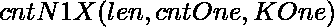

# 计数范围[L，R]内具有 K 个连续设定位的数字

> 原文:[https://www . geesforgeks . org/count-numbers-in-range-l-r-having-k-continuous-set-bits/](https://www.geeksforgeeks.org/count-numbers-in-range-l-r-having-k-consecutive-set-bits/)

给定三个正整数 **L** 、 **R** 和 **K** ，任务是找出在**【L，R】**范围内的数的计数，这些数具有 **K** 连续的 [**设置位**](https://www.geeksforgeeks.org/count-set-bits-in-an-integer/) 在其[二进制表示](https://www.geeksforgeeks.org/binary-representation-of-a-given-number/)。

**示例:**

> **输入:** L = 4，R = 15，K = 3
> **输出:** 3
> **解释:**
> 二进制表示包含 K(=3)个连续集合位的数字为:
> (7)<sub>10</sub>=(111)<sub>2</sub>
> (14)<sub>10</sub>=(1110)<sub>2</sub>
> 
> **输入:** L = 8，R = 100，K = 3
> T3】输出: 27

**天真方法:**解决这个问题最简单的方法是遍历范围**【L，R】**内所有可能的整数，对于每个数字，[检查数字的二进制表示是否包含 K 个连续的 1](https://www.geeksforgeeks.org/generate-a-binary-string-without-any-consecutive-0s-and-at-most-k-consecutive-1s/)。如果发现是真的，那么打印号码。

***时间复杂度:**O((R–L+1)* 32)*
***辅助空间:** O(1)*

**有效途径:**使用[数字 DP](https://www.geeksforgeeks.org/digit-dp-introduction/) 可以解决问题。其思想是对范围**【1，R】**内有 **K** 连续 **1** s 的数字进行计数，并减去范围**【1，L–1】**内有 **K** 连续 **1** s 的数字的计数。以下是循环关系:

> 【tex]= \ sum ^ { 1 } _ { I = 0 } CNT 1x(len+1，cntOne + i，KOne | (cntOne == K)) [/Tex]
> 
> **cntN1X(len，cntOne，KOne):** 存储范围**【1，X】**内的数字计数，约束如下:
> **len** =二进制表示的长度 **X** 。
> **cntOne** =连续 **1** s 直到索引 **len** 的计数。
> **KOne** =布尔值检查 **K** 是否连续出现在 **X** 中的 **1** 。

按照以下步骤解决问题:

*   初始化一个 4D [数组](https://www.geeksforgeeks.org/multidimensional-arrays-c-cpp/)**DP【len】【cntOne】【KOne】【紧】**计算并存储上述递推关系的所有子问题的值。
*   最后，返回**DP【len】【cntOne】【KOne】【紧绷】**的值。

下面是上述方法的实现:

## C++

```
// C++ program to implement
// the above approach

#include <bits/stdc++.h>
using namespace std;

// Function to find the count of numbers in
// range[1, X] having K consecutive set bits
int cntN1X(string str, int len, int K,
    int cntOne, int dp[32][32][2][2],
                bool KOne, bool tight)
{
    // If length of current number is
    // equal to length of string
    if (len == str.length()) {

        // If count of consecutive set bits
        // in the current string is >= K
        return (KOne == 1);
    }

    // If already computedx
    // equal occurred
    if (dp[len][cntOne][KOne][tight]
                                   != -1) {
        return dp[len][cntOne][KOne][tight];
    }

    // If tight is 1, then element present
    // at current index is element present
    // in str at current index. Otherwise, 1.
    int end = tight ? (str[len] - '0'): 1;

    // Stores count of numbers whose
    // len th bit is i.
    int res = 0;

    // Iterate over all possible
    // value present at current index.
    for(int i = 0; i <= end; i++) {

        // Stores count of consecutive 1s
        int temp = (i==1) ? (cntOne + 1): 0;

        // Update res.
        res += cntN1X(str, len + 1,
        K, temp, dp, (KOne | (temp == K)),
                    (tight & (i==end)));
    }

    return dp[len][cntOne][KOne][tight]
                                    = res;
}

// Function to find
// binary representation of N
string convertBinary(int N)
{
    // Stores binary
    // representation of N.
    string res;

    // Traverse each bit of N.
    while(N) {

        // Append current bit
        // in res
        res.push_back(N % 2 + '0');

        // Update N.
        N /= 2;
    }

    // Append 0 in binary representation
    // Of N
    while(res.length() < 32) {
        res.push_back('0');
    }

    // Reverse binary representation of N
    reverse(res.begin(), res.end());

    return res;
}

// Function to count numbers in
// range[L, R] having K consecutive 1s.
int cntN1XL_R(int L, int R, int K)
{
    // Stores binary representation
    // of (L - 1)
    string Ls = convertBinary(L - 1);

    // Stores binary representation
    // of R
    string Rs = convertBinary(R);

    // Stores values of overlapping
    // subproblems
    int dp[32][32][2][2];

    // Initialize dp[][][][] array.
    memset(dp, -1, sizeof(dp));

    // Stores count of numbers from
    // [1, L - 1] having K consecutive 1s
    int resL = cntN1X(Ls, 0, K, 0,
                            dp, 0,1);

    // Initialize dp[][][][] array.
    memset(dp, -1, sizeof(dp));

    // Stores count of numbers from
    // [1, R - 1] having K consecutive 1s
    int resR = cntN1X(Rs, 0, K, 0,
                            dp, 0, 1);

    // Return total counts having K
    // consecutive 1s in range[L, R]
    return (resR - resL);
}

// Driver Code
int main()
{
    int L = 8;
    int R = 100;
    int K = 3;
    cout<<cntN1XL_R(L, R, K);

}
```

## Java 语言(一种计算机语言，尤用于创建网站)

```
// Java program to implement
// the above approach
import java.util.*;

class GFG{

// Function to find the count of numbers in
// range[1, X] having K consecutive set bits
public static int cntN1X(String str, int len, int K,
                         int cntOne, int dp[][][][],
                         int KOne, int tight)
{

    // If length of current number is
    // equal to length of string
    if (len == str.length())
    {

        // If count of consecutive set bits
        // in the current string is >= K
        return (KOne == 1) ? 1 : 0;
    }

    // If already computedx
    // equal occurred
    if (dp[len][cntOne][KOne][tight] != -1)
    {
        return dp[len][cntOne][KOne][tight];
    }

    // If tight is 1, then element present
    // at current index is element present
    // in str at current index. Otherwise, 1.
    int end = (tight == 1) ?
              (str.charAt(len) - '0') : 1;

    // Stores count of numbers whose
    // len th bit is i.
    int res = 0;

    // Iterate over all possible
    // value present at current index.
    for(int i = 0; i <= end; i++)
    {

        // Stores count of consecutive 1s
        int temp = (i == 1) ? (cntOne + 1) : 0;

        // Update res.
        res += cntN1X(str, len + 1, K, temp, dp,
                     (int)(KOne | ((temp == K) ? 1 : 0)),
                     (int)(tight & ((i == end) ? 1 : 0)));
    }
    return dp[len][cntOne][KOne][tight] = res;
}

// Function to count numbers in
// range[L, R] having K consecutive 1s.
public static int cntN1XL_R(int L, int R, int K)
{

    // Stores binary representation
    // of (L - 1)
    String Ls = Integer.toBinaryString(L - 1);

    // Stores binary representation
    // of R
    String Rs = Integer.toBinaryString(R);

    // Stores values of overlapping
    // subproblems
    int dp[][][][] = new int[32][32][2][2];

    // Initialize dp[][][][] array.
    for(int i[][][] : dp)
        for(int j[][] : i)
            for(int k[] : j)
                Arrays.fill(k, -1);

    // Stores count of numbers from
    // [1, L - 1] having K consecutive 1s
    int resL = cntN1X(Ls, 0, K, 0, dp, 0, 1);

    // Initialize dp[][][][] array.
    for(int i[][][] : dp)
        for(int j[][] : i)
            for(int k[] : j)
                Arrays.fill(k, -1);

    // Stores count of numbers from
    // [1, R - 1] having K consecutive 1s
    int resR = cntN1X(Rs, 0, K, 0, dp, 0, 1);

    // Return total counts having K
    // consecutive 1s in range[L, R]
    return (resR - resL);
}

// Driver Code
public static void main(String args[])
{
    int L = 8;
    int R = 100;
    int K = 3;

    System.out.println(cntN1XL_R(L, R, K));
}
}

// This code is contributed by hemanth gadarla
```

## 蟒蛇 3

```
# Python3 program to implement
# the above approach

# Function to find the count of numbers in
# range[1, X] having K consecutive set bits
def cntN1X(stri, leng, K, cntOne, dp, KOne, tight):

    # If length of current number is
    # equal to length of string
    if (leng == len(stri)):

        # If count of consecutive set bits
        # in the current string is >= K
        return 1 if (KOne == 1) else 0;

    # If already computedx
    # equal occurred
    if (dp[leng][cntOne][KOne][tight]  != -1):
        return dp[leng][cntOne][KOne][tight];

    # If tight is 1, then element present
    # at current index is element present
    # in stri at current index. Otherwise, 1.
    end = (ord(stri[leng]) - ord('0')) if tight == 1 else 1;

    # Stores count of numbers whose
    # leng th bit is i.
    res = 0;

    # Iterate over all possible
    # value present at current index.
    for i in range(end + 1):

        # Stores count of consecutive 1s
        temp = (cntOne + 1) if (i == 1) else 0;

        # Update res.
        res += cntN1X(stri, leng + 1,
        K, temp, dp, 1 if(KOne | (temp == K)) else 0,
                    1 if(tight & (i == end)) else 0);

    dp[leng][cntOne][KOne][tight]= res
    return res

# Function to find
# binary representation of N
def convertBinary(N):

    # Stores binary
    # representation of N.
    res=''

    # Traverse each bit of N.
    while(N != 0):

        # Append current bit
        # in res
        res += chr((N % 2) + ord('0'));

        # Update N.
        N //= 2;

    # Append 0 in binary representation
    # Of N
    while(len(res) < 32):
        res += '0';

    # Reverse binary representation of N
    return res[::-1];

# Function to count numbers in
# range[L, R] having K consecutive 1s.
def cntN1XL_R(L, R, K):

    # Stores binary representation
    # of (L - 1)
    Ls = str(convertBinary(L - 1));

    # Stores binary representation
    # of R
    Rs = str(convertBinary(R));

    # Stores values of overlapping
    # subproblems
    dp =[[[[-1,-1] for j in range(2)] for k in range(32)] for l in range(32)]

    # Stores count of numbers from
    # [1, L - 1] having K consecutive 1s
    resL = cntN1X(Ls, 0, K, 0, dp, 0,1);

    # Initialize dp[][][][] array.
    dp = [[[[-1, -1] for j in range(2)] for k in range(32)] for l in range(32)]

    # Stores count of numbers from
    # [1, R - 1] having K consecutive 1s
    resR = cntN1X(Rs, 0, K, 0,
                            dp, 0, 1);

    # Return total counts having K
    # consecutive 1s in range[L, R]
    return (resR - resL);

# Driver Code
if __name__=='__main__':

    L = 8;
    R = 100;
    K = 3;
    print(cntN1XL_R(L, R, K))

# This code is contributed by rutvik_56
```

## C#

```
// C# program to implement
// the above approach
using System;

class GFG{

// Function to find the count of numbers in
// range[1, X] having K consecutive set bits
public static int cntN1X(String str, int len, int K,
                         int cntOne, int [,,,]dp,
                         int KOne, int tight)
{

    // If length of current number is
    // equal to length of string
    if (len == str.Length)
    {

        // If count of consecutive set bits
        // in the current string is >= K
        return (KOne == 1) ? 1 : 0;
    }

    // If already computedx
    // equal occurred
    if (dp[len, cntOne, KOne, tight] != -1)
    {
        return dp[len, cntOne, KOne, tight];
    }

    // If tight is 1, then element present
    // at current index is element present
    // in str at current index. Otherwise, 1.
    int end = (tight == 1) ?
              (str[len] - '0') : 1;

    // Stores count of numbers whose
    // len th bit is i.
    int res = 0;

    // Iterate over all possible
    // value present at current index.
    for(int i = 0; i <= end; i++)
    {

        // Stores count of consecutive 1s
        int temp = (i == 1) ? (cntOne + 1) : 0;

        // Update res.
        res += cntN1X(str, len + 1, K, temp, dp,
                     (int)(KOne | ((temp == K) ? 1 : 0)),
                     (int)(tight & ((i == end) ? 1 : 0)));
    }
    return dp[len, cntOne, KOne, tight] = res;
}

// Function to count numbers in
// range[L, R] having K consecutive 1s.
public static int cntN1XL_R(int L, int R, int K)
{

    // Stores binary representation
    // of (L - 1)
    String Ls = Convert.ToString(L - 1, 2);

    // Stores binary representation
    // of R
    String Rs = Convert.ToString(R, 2);

    // Stores values of overlapping
    // subproblems
    int [,,,]dp = new int[ 32, 32, 2, 2 ];

    // Initialize [,]dp[,] array.
    for(int i = 0; i < 32; i++)
        for(int j = 0; j < 32; j++)
            for(int k = 0; k < 2; k++)
                for(int l = 0; l < 2; l++)
                    dp[i, j, k, l] = -1;

    // Stores count of numbers from
    // [1, L - 1] having K consecutive 1s
    int resL = cntN1X(Ls, 0, K, 0, dp, 0, 1);

    // Initialize [,]dp[,] array.
    for(int i = 0; i < 32; i++)
        for(int j = 0; j < 32; j++)
            for(int k = 0; k < 2; k++)
                for(int l = 0; l < 2; l++)
                    dp[i, j, k, l] = -1;

    // Stores count of numbers from
    // [1, R - 1] having K consecutive 1s
    int resR = cntN1X(Rs, 0, K, 0, dp, 0, 1);

    // Return total counts having K
    // consecutive 1s in range[L, R]
    return (resR - resL);
}

// Driver Code
public static void Main(String []args)
{
    int L = 8;
    int R = 100;
    int K = 3;

    Console.WriteLine(cntN1XL_R(L, R, K));
}
}

// This code is contributed by gauravrajput1
```

## java 描述语言

```
<script>

    // JavaScript program to implement the above approach

    // Function to find the count of numbers in
    // range[1, X] having K consecutive set bits
    function cntN1X(str, len, K, cntOne, dp, KOne, tight)
    {

        // If length of current number is
        // equal to length of string
        if (len == str.length)
        {

            // If count of consecutive set bits
            // in the current string is >= K
            return (KOne == 1) ? 1 : 0;
        }

        // If already computedx
        // equal occurred
        if (dp[len][cntOne][KOne][tight] != -1)
        {
            return dp[len][cntOne][KOne][tight];
        }

        // If tight is 1, then element present
        // at current index is element present
        // in str at current index. Otherwise, 1.
        let end = (tight == 1) ?
                  (str[len].charCodeAt()- '0'.charCodeAt()) : 1;

        // Stores count of numbers whose
        // len th bit is i.
        let res = 0;

        // Iterate over all possible
        // value present at current index.
        for(let i = 0; i <= end; i++)
        {

            // Stores count of consecutive 1s
            let temp = (i == 1) ? (cntOne + 1) : 0;

            // Update res.
            res += cntN1X(str, len + 1, K, temp, dp,
                         (KOne | ((temp == K) ? 1 : 0)),
                         (tight & ((i == end) ? 1 : 0)));
        }
        dp[len][cntOne][KOne][tight] = res;
        return dp[len][cntOne][KOne][tight];
    }

    // Function to count numbers in
    // range[L, R] having K consecutive 1s.
    function cntN1XL_R(L, R, K)
    {

        // Stores binary representation
        // of (L - 1)
        let Ls = (L - 1).toString(2);

        // Stores binary representation
        // of R
        let Rs = (R).toString(2);

        // Stores values of overlapping
        // subproblems
        let dp = new Array(32);

        // Initialize dp[][][][] array.
        for(let i = 0; i < 32; i++)
        {
            dp[i] = new Array(32);
            for(let j = 0; j < 32; j++)
            {
                dp[i][j] = new Array(2);
                for(let k = 0; k < 2; k++)
                {
                    dp[i][j][k] = new Array(2);
                    for(let l = 0; l < 2; l++)
                    {
                        dp[i][j][k][l] = -1;
                    }
                }
            }
        }

        // Stores count of numbers from
        // [1, L - 1] having K consecutive 1s
        let resL = cntN1X(Ls, 0, K, 0, dp, 0, 1);

        // Initialize dp[][][][] array.
        for(let i = 0; i < 32; i++)
        {
            dp[i] = new Array(32);
            for(let j = 0; j < 32; j++)
            {
                dp[i][j] = new Array(2);
                for(let k = 0; k < 2; k++)
                {
                    dp[i][j][k] = new Array(2);
                    for(let l = 0; l < 2; l++)
                    {
                        dp[i][j][k][l] = -1;
                    }
                }
            }
        }

        // Stores count of numbers from
        // [1, R - 1] having K consecutive 1s
        let resR = cntN1X(Rs, 0, K, 0, dp, 0, 1);

        // Return total counts having K
        // consecutive 1s in range[L, R]
        return (resR - resL);
    }

    let L = 8;
    let R = 100;
    let K = 3;

    document.write(cntN1XL_R(L, R, K));

</script>
```

**Output**

```
27
```

***时间复杂度:**O(32<sup>2</sup>* 2<sup>3</sup>)*
***辅助空间:**O(32<sup>2</sup>* 2<sup>2</sup>)*