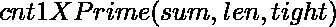

# 计数范围【L，R】内的数字，其数字之和为质数

> 原文:[https://www . geesforgeks . org/count-numbers-in-range-l-r-其位数总和是质数/](https://www.geeksforgeeks.org/count-numbers-in-range-l-r-whose-sum-of-digits-is-a-prime-number/)

给定两个整数 **L** 和 **R** ，任务是对范围**【L，R】**内的所有数字进行计数，这些数字的[和](https://www.geeksforgeeks.org/program-for-sum-of-the-digits-of-a-given-number/)是一个[素数](https://www.geeksforgeeks.org/c-program-to-check-whether-a-number-is-prime-or-not/)。

**示例:**

> **输入:** L = 1，R = 10
> **输出:** 3
> **说明:**
> L(= 1)到 R(= 10)范围内的数字，其位数之和为质数，为{3，5，7}。因此，所需的输出为 3。
> 
> **输入:** L = 11，R = 999
> T3】输出: 336

**天真法:**解决这个问题最简单的方法就是遍历**【L，R】**范围内的所有数字，对于每个数字，检查数字的[和是否为](https://www.geeksforgeeks.org/program-for-sum-of-the-digits-of-a-given-number/)[素数](https://www.geeksforgeeks.org/c-program-to-check-whether-a-number-is-prime-or-not/)。如果发现为真，则增加**计数**，最后将计数打印为所需答案。

***时间复杂度:**O((R–L+1)* sqrt(R))*
***辅助空间:** O(1)*

**有效途径:**使用[数字 DP](https://www.geeksforgeeks.org/digit-dp-introduction/) 可以解决问题。其思想是对数字之和为[质数](https://www.geeksforgeeks.org/c-program-to-check-whether-a-number-is-prime-or-not/)的**【1，R】**范围内的数字进行计数，并减去数字之和为质数的**【1，L–1】**范围内的数字的计数。以下是循环关系:

> [tex]= \sum^{9}_{i=0} cnt1x prime(sum+I，len + 1，紧\ & (i==end)) [/Tex]
> 
> **cnt1XPrime(sum，len，紧绷):**存储范围内的数字计数**【1，X】**具有以下约束:
> **sum** =存储范围内的数字位数总和**【1，X】**。
> **len** =在 **X** 中的位数。
> **紧** =检查当前位数范围是否受限的布尔值。

按照以下步骤解决问题:

*   初始化一个 3D [数组](https://www.geeksforgeeks.org/multidimensional-arrays-c-cpp/)**DP【sum】【len】【紧】**计算并存储上述递归关系的所有子问题的值。
*   最后，返回**DP【sum】【len】【紧】**的值。

下面是上述方法的实现:

## C++

```
// C++ program to implement
// the above approach

#include <bits/stdc++.h>
using namespace std;

// Function to find all prime numbers
// in the range [1, 100000] using
// Sieve of Eratosthenes technique
vector<bool> sieve()
{
    // isPrime[i] stores if i
    // is a prime number or not.
    vector<bool> isPrime(100001,
                         true);

    // 0 is not a prime number
    isPrime[0] = false;

    // 1 is not prime number
    isPrime[1] = false;

    // Traverse the range to check if
    // i is a prime number or not
    for (int i = 2; i * i < 100001;
         i++) {

        // If i is a prime number
        if (isPrime[i]) {
            for (int j = i * i;
                 j < 100001; j += i) {

                // Mark its multiples non-prime
                isPrime[j] = false;
            }
        }
    }

    return isPrime;
}

// Function to count all numbers in
// the range[1, X] whose sum of digits
// is a prime number
int cnt1XPrime(int sum, int len, bool tight,
               string X, vector<bool>& isPrime,
               int dp[1000][100][2])
{
    // If count of digits in current number
    // is equal to the count of digits in X
    if (len == X.length()) {

        // If sum is a prime number
        return isPrime[sum];
    }

    // If already computed subproblem
    // occurred
    if (dp[sum][len][tight] != -1) {
        return dp[sum][len][tight];
    }

    // Stores maximum possible value
    // at current digit of the number
    int end = tight ? (X[len] - '0') : 9;

    // Stores count of numbers by placing
    // all possible values at current index
    int res = 0;

    // Place all possible values at
    // current position
    for (int i = 0; i <= end; i++) {

        // Update res
        res += cnt1XPrime(sum + i, len + 1,
                          (tight & (i == end)),
                          X, isPrime, dp);
    }

     dp[sum][len][tight]=res;
       return res;
}

// Function to count the numbers in
// the range[L, R]
int cntLRprime(int L, int R)
{
    // Stores the value of (L - 1)
    // in the form of string
    string LStr = to_string(L - 1);

    // Stores the value of (R)
    // in the form of string
    string RStr = to_string(R);

    // Stores values of overlapping
    // subproblems
    int dp[1000][100][2];

    // Initialize dp[][][] array
    memset(dp, -1, sizeof(dp));

    // isPrime[i] stores if i
    // is a prime number or not
    vector<bool> isPrime
        = sieve();
    // Stores count of numbers in range
    // [1, LStr] with the given conditions
    int cntL = cnt1XPrime(0, 0, 1, LStr,
                          isPrime, dp);

    // Initialize dp[][][] array.
    memset(dp, -1, sizeof(dp));

    // Stores count of numbers in range
    // [1, RStr] with the given conditions
    int cntR = cnt1XPrime(0, 0, 1, RStr,
                          isPrime, dp);

    // Return numbers in the range [L, R]
    // whose sum of digits is a prime number
    return (cntR - cntL);
}

// Driver Code
int main()
{
    int L = 11, R = 999;
    cout << cntLRprime(L, R);

    return 0;
}
```

## Java 语言(一种计算机语言，尤用于创建网站)

```
// Java program to implement
// the above approach
import java.util.*;
class solution {

    // Function to find all prime
    // numbers in the range [1, 100000]
    // using Sieve of Eratosthenes
    // technique
    static boolean[] sieve()
    {
        // isPrime[i] stores if i
        // is a prime number or not
        boolean[] isPrime = new boolean[100001];

        for (int i = 0; i < 100001; i++)
            isPrime[i] = true;

        // 0 is not a prime number
        isPrime[0] = false;

        // 1 is not prime number
        isPrime[1] = false;

        // Traverse the range to check if
        // i is a prime number or not
        for (int i = 2; i * i < 100001; i++) {
            // If i is a prime number
            if (isPrime[i] == true) {
                for (int j = i * i; j < 100001; j += i) {
                    // Mark its multiples
                    // non-prime
                    isPrime[j] = false;
                }
            }
        }

        return isPrime;
    }

    // Function to count all numbers in
    // the range[1, X] whose sum of digits
    // is a prime number
    static int cnt1XPrime(int sum, int len, int tight,
                          String X, boolean[] isPrime,
                          int[][][] dp)
    {
        // If count of digits in current
        // number is equal to the count of
        // digits in X
        if (len == X.length()) {
            // If sum is a prime number
            return isPrime[sum] ? 1 : 0;
        }

        // If already computed subproblem
        // occurred
        if (dp[sum][len][tight] != -1) {
            return dp[sum][len][tight];
        }

        // Stores maximum possible value
        // at current digit of the number
        int end = (tight == 1) ? (X.charAt(len) - 48) : 9;

        // Stores count of numbers by
        // placing all possible values
        // at current index
        int res = 0;

        // Place all possible values at
        // current position
        for (int i = 0; i <= end; i++) {
            // Update res
            res += cnt1XPrime(
                sum + i, len + 1,
                (tight & ((i == end) ? 1 : 0)), X, isPrime,
                dp);
        }

        return dp[sum][len][tight] = res;
    }

    // Function to count the numbers in
    // the range[L, R]
    static int cntLRprime(int L, int R)
    {
        // Stores the value of (L - 1)
        // in the form of string
        String LStr = String.valueOf(L - 1);

        // Stores the value of (R)
        // in the form of string
        String RStr = String.valueOf(R);

        // Stores values of overlapping
        // subproblems
        int[][][] dp = new int[1000][100][2];

        // Initialize dp[][][] array
        for (int i = 0; i < 1000; i++) {
            for (int j = 0; j < 100; j++) {
                for (int k = 0; k < 2; k++)
                    dp[i][j][k] = -1;
            }
        }
        // isPrime[i] stores if i
        // is a prime number or not
        boolean[] isPrime = sieve();

        // Stores count of numbers in
        // range [1, LStr] with the
        // given conditions
        int cntL = cnt1XPrime(0, 0, 1, LStr, isPrime, dp);

        // Initialize dp[][][] array.
        for (int i = 0; i < 1000; i++) {
            for (int j = 0; j < 100; j++) {
                for (int k = 0; k < 2; k++)
                    dp[i][j][k] = -1;
            }
        }

        // Stores count of numbers in range
        // [1, RStr] with the given conditions
        int cntR = cnt1XPrime(0, 0, 1, RStr, isPrime, dp);

        // Return numbers in the range
        // [L, R] whose sum of digits
        // is a prime number
        return (cntR - cntL);
    }

    // Driver Code
    public static void main(String args[])
    {
        int L = 11, R = 999;
        System.out.print(cntLRprime(L, R));
    }
}

// This code is contributed by SURENDRA_GANGWAR
```

## 蟒蛇 3

```
# Python3 program to implement
# the above approach
isPrime = [True] * 100001

dp = [[[-1 for i in range(2)]
       for i in range(100)]
      for i in range(1000)]

# Function to find all prime numbers
# in the range [1, 100000] using
# Sieve of Eratosthenes technique

def sieve():

    # 0 is not a prime number
    isPrime[0] = False

    # 1 is not prime number
    isPrime[1] = False

    # Traverse the range to check if
    # i is a prime number or not
    for i in range(2, 100001):
        if i * i > 100001:
            break

        # If i is a prime number
        if (isPrime[i]):
            for j in range(i * i, 100001, i):

                # Mark its multiples non-prime
                isPrime[j] = False

# Function to count all numbers in
# the range[1, X] whose sum of digits
# is a prime number

def cnt1XPrime(sum, lenn, tight, X):

    # If count of digits in current number
    # is equal to the count of digits in X
    if (lenn == len(X)):

        # If sum is a prime number
        return isPrime[sum]

    # If already computed subproblem
    # occurred
    if (dp[sum][lenn][tight] != -1):
        return dp[sum][lenn][tight]

    # Stores maximum possible value
    # at current digit of the number
    end = 9

    if tight:
        end = ord(X[lenn]) - ord('0')

    # Stores count of numbers by placing
    # all possible values at current index
    res = 0

    # Place all possible values at
    # current position
    for i in range(end + 1):

        # Update res
        res += cnt1XPrime(sum + i,
                          lenn + 1,
                          (tight & (i == end)), X)

    return dp[sum][lenn][tight] = res

# Function to count the numbers in
# the range[L, R]

def cntLRprime(L, R):

    # Stores the value of (L - 1)
    # in the form of string
    LStr = str(L - 1)

    # Stores the value of (R)
    # in the form of string
    RStr = str(R)

    # isPrime[i] stores if i
    # is a prime number or not
    sieve()

    # Stores count of numbers in range
    # [1, LStr] with the given conditions
    cntL = cnt1XPrime(0, 0, 1, LStr)

    # Initialize dp[][][] array.
    for i in range(1000):
        for j in range(100):
            for z in range(2):
                dp[i][j][z] = -1

    # Stores count of numbers in range
    # [1, RStr] with the given conditions
    cntR = cnt1XPrime(0, 0, 1, RStr)

    # Return numbers in the range [L, R]
    # whose sum of digits is a prime number
    return (cntR - cntL)

# Driver code
if __name__ == '__main__':

    L = 11
    R = 999

    print(cntLRprime(L, R))

# This code is contributed by mohit kumar 29
```

## C#

```
// C# program to implement
// the above approach
using System;
class GFG {

    // Function to find all prime
    // numbers in the range [1, 100000]
    // using Sieve of Eratosthenes
    // technique
    static bool[] sieve()
    {
        // isPrime[i] stores if i
        // is a prime number or not
        bool[] isPrime = new bool[100001];

        for (int i = 0; i < 100001; i++)
            isPrime[i] = true;

        // 0 is not a prime
        // number
        isPrime[0] = false;

        // 1 is not prime
        // number
        isPrime[1] = false;

        // Traverse the range to
        // check if i is a prime
        // number or not
        for (int i = 2; i * i < 100001; i++) {
            // If i is a prime number
            if (isPrime[i] == true) {
                for (int j = i * i; j < 100001; j += i) {
                    // Mark its multiples
                    // non-prime
                    isPrime[j] = false;
                }
            }
        }

        return isPrime;
    }

    // Function to count all numbers
    // in the range[1, X] whose sum
    // of digits is a prime number
    static int cnt1XPrime(int sum, int len, int tight,
                          String X, bool[] isPrime,
                          int[, , ] dp)
    {
        // If count of digits in current
        // number is equal to the count of
        // digits in X
        if (len == X.Length) {
            // If sum is a prime number
            return isPrime[sum] ? 1 : 0;
        }

        // If already computed
        // subproblem occurred
        if (dp[sum, len, tight] != -1) {
            return dp[sum, len, tight];
        }

        // Stores maximum possible value
        // at current digit of the number
        int end = (tight == 1) ? (X[len] - 48) : 9;

        // Stores count of numbers by
        // placing all possible values
        // at current index
        int res = 0;

        // Place all possible values at
        // current position
        for (int i = 0; i <= end; i++) {
            // Update res
            res += cnt1XPrime(
                sum + i, len + 1,
                (tight & ((i == end) ? 1 : 0)), X, isPrime,
                dp);
        }

        return dp[sum, len, tight] = res;
    }

    // Function to count the numbers in
    // the range[L, R]
    static int cntLRprime(int L, int R)
    {
        // Stores the value of (L - 1)
        // in the form of string

        string LStr = (L - 1).ToString();

        // Stores the value of (R)
        // in the form of string
        string RStr = (R).ToString();

        // Stores values of overlapping
        // subproblems
        int[, , ] dp = new int[1000, 100, 2];

        // Initialize dp[][][] array
        for (int i = 0; i < 1000; i++) {
            for (int j = 0; j < 100; j++) {
                for (int k = 0; k < 2; k++)
                    dp[i, j, k] = -1;
            }
        }

        // isPrime[i] stores if i
        // is a prime number or not
        bool[] isPrime = sieve();

        // Stores count of numbers in
        // range [1, LStr] with the
        // given conditions
        int cntL = cnt1XPrime(0, 0, 1, LStr, isPrime, dp);

        // Initialize dp[][][] array.
        for (int i = 0; i < 1000; i++) {
            for (int j = 0; j < 100; j++) {
                for (int k = 0; k < 2; k++)
                    dp[i, j, k] = -1;
            }
        }

        // Stores count of numbers in
        // range [1, RStr] with the
        // given conditions
        int cntR = cnt1XPrime(0, 0, 1, RStr, isPrime, dp);

        // Return numbers in the range
        // [L, R] whose sum of digits
        // is a prime number
        return (cntR - cntL);
    }

    // Driver Code
    public static void Main(String[] args)
    {
        int L = 11, R = 999;
        Console.Write(cntLRprime(L, R));
    }
}

// This code is contributed by Chitranayal
```

## java 描述语言

```
<script>

// Javascript program to implement
// the above approach

// Function to find all prime
// numbers in the range [1, 100000]
// using Sieve of Eratosthenes
// technique
function sieve()
{

    // isPrime[i] stores if i
    // is a prime number or not
    let isPrime = new Array(100001);

    for(let i = 0; i < 100001; i++)
        isPrime[i] = true;

    // 0 is not a prime number
    isPrime[0] = false;

    // 1 is not prime number
    isPrime[1] = false;

    // Traverse the range to check if
    // i is a prime number or not
    for(let i = 2; i * i < 100001; i++)
    {

        // If i is a prime number
        if (isPrime[i] == true)
        {
            for(let j = i * i; j < 100001; j += i)
            {

                // Mark its multiples
                // non-prime
                isPrime[j] = false;
            }
        }
    }
    return isPrime;
}

// Function to count all numbers in
// the range[1, X] whose sum of digits
// is a prime number
function cnt1XPrime(sum, len, tight, X,
                    isPrime, dp)
{

    // If count of digits in current
    // number is equal to the count of
    // digits in X
    if (len == X.length)
    {

        // If sum is a prime number
        return isPrime[sum] ? 1 : 0;
    }

    // If already computed subproblem
    // occurred
    if (dp[sum][len][tight] != -1)
    {
        return dp[sum][len][tight];
    }

    // Stores maximum possible value
    // at current digit of the number
    let end = (tight == 1) ?
     (X[len].charCodeAt(0) - 48) : 9;

    // Stores count of numbers by
    // placing all possible values
    // at current index
    let res = 0;

    // Place all possible values at
    // current position
    for(let i = 0; i <= end; i++)
    {

        // Update res
        res += cnt1XPrime(sum + i, len + 1,
                       (tight & ((i == end) ? 1 : 0)),
                        X, isPrime, dp);
    }
    return dp[sum][len][tight] = res;
}

// Function to count the numbers in
// the range[L, R]
function cntLRprime(L, R)
{

    // Stores the value of (L - 1)
    // in the form of string
    let LStr = (L - 1).toString();

    // Stores the value of (R)
    // in the form of string
    let RStr = (R).toString();

    // Stores values of overlapping
    // subproblems
    let dp = new Array(1000);

    // Initialize dp[][][] array
    for(let i = 0; i < 1000; i++)
    {
        dp[i] = new Array(100);
        for(let j = 0; j < 100; j++)
        {
            dp[i][j] = new Array(2);
            for(let k = 0; k < 2; k++)
                dp[i][j][k] = -1;
        }
    }

    // isPrime[i] stores if i
    // is a prime number or not
    let isPrime = sieve();

    // Stores count of numbers in
    // range [1, LStr] with the
    // given conditions
    let cntL = cnt1XPrime(0, 0, 1, LStr,
                          isPrime, dp);

    // Initialize dp[][][] array.
    for(let i = 0; i < 1000; i++)
    {
        for(let j = 0; j < 100; j++)
        {
            for(let k = 0; k < 2; k++)
                dp[i][j][k] = -1;
        }
    }

    // Stores count of numbers in range
    // [1, RStr] with the given conditions
    let cntR = cnt1XPrime(0, 0, 1, RStr,
                          isPrime, dp);

    // Return numbers in the range
    // [L, R] whose sum of digits
    // is a prime number
    return (cntR - cntL);
}

// Driver Code
let L = 11, R = 999;

document.write(cntLRprime(L, R));

// This code is contributed by avanitrachhadiya2155

</script>
```

**Output**

```
336
```

***时间复杂度:** O(和* M * 10)*
***辅助空间:** O(和* M)* ，其中**和**表示一个数字在**【L，R】**范围内的最大位数和， **M** 表示 R 中的位数