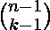
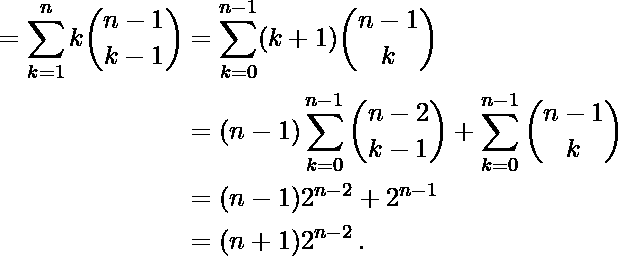

# 计算存在于 N 个分区中的数量

> 原文:[https://www . geesforgeks . org/count-numbers-present-in-partition-of-n/](https://www.geeksforgeeks.org/count-numbers-present-in-partitions-of-n/)

给定一个整数 **N** ，任务是对 **N** 的有序[整数分区](https://en.wikipedia.org/wiki/Partition_(number_theory))中的数字进行计数。
**示例:**

> **输入:**N = 3
> T3】输出:8
> N(= 3)的整数分区为{{1 + 1 + 1}、{1 + 2}、{2 + 1}、{3}}。
> N 的整数分区中的数字为:{1，1，1，1，2，2，1，3}
> 因此，N(=3)的整数分区中的数字计数为 8。
> 
> **输入:**N = 4
> T3】输出: 20

**方法:**根据以下观察结果可以解决问题:

将 **N** 精确划分为 **k** 分区的方法计数=



因此 **N** 有序整数分区中的个数为

> 

下面是上述方法的实现:

## C++

```
// C++ program to implement
// the above approach 
#include <bits/stdc++.h>
using namespace std;

// Function to count of numbers in
// ordered partitions of N
int CtOfNums(int N)
{

    // Stores count the numbers in
    // ordered integer partitions
    int res = (N + 1) * (1 << (N - 2));

    return round(res);
}

// Driver Code
int main()
{
    int N = 3;

    cout << CtOfNums(N);
}

// This code is contributed by code_hunt
```

## Java 语言(一种计算机语言，尤用于创建网站)

```
// Java program to implement
// the above approach 
import java.io.*;

class GFG{

// Function to count of numbers in
// ordered partitions of N
static int CtOfNums(int N)
{

    // Stores count the numbers in
    // ordered integer partitions
    int res = (N + 1) * (1 << (N - 2));

    return Math.round(res);
}

// Driver Code
public static void main (String[] args)
{
    int N = 3;

    System.out.print(CtOfNums(N));
}
}

// This code is contributed by code_hunt
```

## 蟒蛇 3

```
# Python3 program to implement
# the above approach

# Function to count of numbers in
# ordered partitions of N
def CtOfNums(N):

    # Stores count the numbers in
    # ordered integer partitions
    res = (N + 1) * (1<<(N - 2))

    return round(res)

# Driver code
if __name__ == '__main__':
    N = 3
    print(CtOfNums(N))
```

## C#

```
// C# program to implement
// the above approach 
using System;

class GFG{

// Function to count of numbers in
// ordered partitions of N
static int CtOfNums(int N)
{

    // Stores count the numbers in
    // ordered integer partitions
    double res = (N + 1) * (1 << (N - 2));

    return (int)Math.Round(res);
}

// Driver Code
public static void Main ()
{
    int N = 3;

    Console.Write(CtOfNums(N));
}
}

// This code is contributed by code_hunt
```

## java 描述语言

```
<script>

// Javascript program to implement
// the above approach 

// Function to count of numbers in
// ordered partitions of N
function CtOfNums(N)
{

    // Stores count the numbers in
    // ordered integer partitions
    var res = (N + 1) * (1 << (N - 2));

    return Math.round(res);
}

// Driver Code
var N = 3;
document.write(CtOfNums(N));

</script>
```

**Output:** 

```
8
```

***时间复杂度:**O(log<sub>2</sub>N)*
*T8】辅助空间: O(1)*