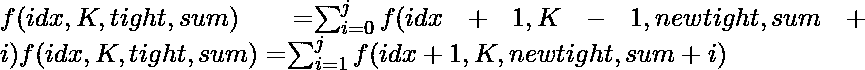

# 用正好 K 个非零数字和不同的奇数数字和来计数

> 原文:[https://www . geesforgeks . org/count-numbers-with-just-k-非零数字和-distinct-奇数数字-sum/](https://www.geeksforgeeks.org/count-numbers-with-exactly-k-non-zero-digits-and-distinct-odd-digit-sum/)

给定一个整数 **N** 和一个数字 **K** ，任务是找出从 0 到 N 之间正好有 K 个非零数字的总数，这些数字的和应该是奇数，并且和应该是**相异的。**数字 n 可以和 **10^18** 一样大。
**举例:**

> **输入:** N = 10，K = 1
> **输出:** 5
> 符合条件的数字是- >
> 1，3，5，7 和 9
> 10 的数字和即(1+0) = 1 也是奇数，但 1 已经包含在我们的计数中了。
> **输入:** N = 100，K = 2
> **输出:** 8

**先决条件** : [数字-DP](https://www.geeksforgeeks.org/digit-dp-introduction/)
**天真方法:**
一种天真方法，用于从 0 到 N 的所有元素在 O(N)中进行线性遍历，并计算 log(n)中的数字和，其中 N 是该数字中的数字数量，对于 N 的大量输入，该方法将失败。
**高效方法:**

1.  我们可以使用[动态编程](https://www.geeksforgeeks.org/dynamic-programming/)，而[数字 dp](https://www.geeksforgeeks.org/digit-dp-introduction/) 是非常有用的技术来解决这个问题。

2.  因此，我们不是保存非零整数的记录，而是保存可以保存在不同索引处的零的记录，变量 K 中的 **idx** 我们可以保存的零的数量最初可以通过用 n 中的位数减去 K 来找到

3.  我们把 N 的所有数字保存成一个向量，比如说**数字**。

4.  现在，我们通过分析 k 来计算我们可以保留在索引 idx 的元素范围。
    *   假设在索引 **idx** 处，我们剩下 **K = 1** (一个非零值)，那么我们放元素的范围是**【0，j】**，其中 j 是由从向量数字的数字的当前索引获得的紧值决定的上限。

    *   如果在 **idx** 时，我们剩下 **K = 0** ，那么我们的射程就变成**【1，j】**了，因为我们不能在那里放入 0。

5.  现在，再取一个参数 **sum** ，计算一个数字的位数之和，直到基本格命中成功。

6.  此外，还使用了一个布尔**图**，它将存储所有已经计算的奇数和，因此它给出了不同的奇数和。

7.  循环将是:
    
    ，其中 j =数字[idx]，如果紧密= 0，则 j = 9

8.  基本案例:
    *   当 **idx = digits.size()** 、 **K == 0** 和**之和**为奇数时。
        我们将总和标记为真，返回 1，否则返回 0。

    *   如果 **idx > digits.size()** 则返回 0。

所以我们创建了一个 DP 表，比如**DP[idx][K][紧][和]** ，它将存储我们从上面的循环中得到的结果，并通过将其记忆到这个 DP 表中来返回计数。
以下是上述办法的实施情况:

## C++

```
// C++ program to Count the numbers having
// exactly K non-zero digits and sum
// of digits are odd and distinct.
#include <bits/stdc++.h>
using namespace std;

// To store digits of N
vector<int> digits;

// visited map
bool vis[170] = { false };

// DP Table
int dp[19][19][2][170];

// Push all the digits of N into
// digits vector
void ConvertIntoDigit(int n)
{
    while (n) {
        int dig = n % 10;
        digits.push_back(dig);
        n /= 10;
    }
    reverse(digits.begin(), digits.end());
}

// Function returns the count
int solve(int idx, int k,
          int tight, int sum)
{
    // If desired number is formed
    // whose sum is odd
    if (idx == digits.size()
        && k == 0 && sum & 1) {
        // If it is not present in map,
        // mark it as true and return 1
        if (!vis[sum]) {
            vis[sum] = 1;
            return 1;
        }
        // Sum is present in map already
        return 0;
    }

    // Desired result not found
    if (idx > digits.size()) {
        return 0;
    }

    // If that state is already calculated
    // just return that state value
    if (dp[idx][k][tight][sum]) {
        return dp[idx][k][tight][sum];
    }

    // Upper limit
    int j;
    if (tight == 0) {
        j = digits[idx];
    }
    else {
        j = 9;
    }

    // To store the count of
    // desired numbers
    int cnt = 0;

    // If k is non-zero, i ranges from
    // 0 to j else [1, j]
    for (int i = (k ? 0 : 1);
         i <= j; i++) {
        int newtight = tight;

        if (i < j) {
            newtight = 1;
        }

        // If current digit is 0, decrement
        // k and recurse sum is not changed
        // as we are just adding 0 that
        // makes no difference
        if (i == 0)
            cnt += solve(idx + 1, k - 1,
                         newtight, sum);

        // If i is non zero, then k remains
        // unchanged and value is added to sum
        else
            cnt += solve(idx + 1, k, newtight,
                         sum + i);
    }

    // Memoize and return
    return dp[idx][k][tight][sum] = cnt;
}

// Driver code
int main()
{

    // K is the number of exact non-zero
    // elements to have in number
    int N, k;
    N = 169, k = 2;

    // break N into its digits
    ConvertIntoDigit(N);

    // We keep record of 0s we need to
    // place in the number
    k = digits.size() - k;
    cout << solve(0, k, 0, 0);
}
```

## Java 语言(一种计算机语言，尤用于创建网站)

```
// Java program to count the numbers having
// exactly K non-zero digits and sum
// of digits are odd and distinct.
import java.util.*;

class GFG{

// To store digits of N
static Vector<Integer> digits = new Vector<Integer>();

// visited map
static boolean []vis = new boolean[170];

// DP Table
static int [][][][]dp = new int[19][19][2][170];

// Push all the digits of N into
// digits vector
static void ConvertIntoDigit(int n)
{
    while (n > 0)
    {
        int dig = n % 10;
        digits.add(dig);
        n /= 10;
    }
    Collections.reverse(digits);
}

// Function returns the count
static int solve(int idx, int k,
                 int tight, int sum)
{

    // If desired number is formed
    // whose sum is odd
    if (idx == digits.size() &&
          k == 0 && sum % 2 == 1)
    {

        // If it is not present in map,
        // mark it as true and return 1
        if (!vis[sum])
        {
            vis[sum] = true;
            return 1;
        }

        // Sum is present in map already
        return 0;
    }

    // Desired result not found
    if (idx > digits.size())
    {
        return 0;
    }

    // If that state is already calculated
    // just return that state value
    if (dp[idx][k][tight][sum] > 0)
    {
        return dp[idx][k][tight][sum];
    }

    // Upper limit
    int j;
    if (idx < digits.size() && tight == 0)
    {
        j = digits.get(idx);
    }
    else
    {
        j = 9;
    }

    // To store the count of
    // desired numbers
    int cnt = 0;

    // If k is non-zero, i ranges from
    // 0 to j else [1, j]
    for(int i = (k > 0 ? 0 : 1); i <= j; i++)
    {
        int newtight = tight;

        if (i < j)
        {
            newtight = 1;
        }

        // If current digit is 0, decrement
        // k and recurse sum is not changed
        // as we are just adding 0 that
        // makes no difference
        if (i == 0)
            cnt += solve(idx + 1, k - 1,
                         newtight, sum);

        // If i is non zero, then k remains
        // unchanged and value is added to sum
        else
            cnt += solve(idx + 1, k, newtight,
                         sum + i);
    }

    // Memoize and return
    return dp[idx][k][tight][sum] = cnt;
}

// Driver code
public static void main(String[] args)
{

    // K is the number of exact non-zero
    // elements to have in number
    int N, k;
    N = 169; k = 2;

    // break N into its digits
    ConvertIntoDigit(N);

    // We keep record of 0s we need to
    // place in the number
    k = digits.size() - k;

    System.out.print(solve(0, k, 0, 0));
}
}

// This code is contributed by amal kumar choubey
```

## 蟒蛇 3

```
# Python3 program to Count the numbers having
# exactly K non-zero digits and sum
# of digits are odd and distinct.

# To store digits of N
digits = []

# visited map
vis = [False for i in range(170)]

# DP Table
dp = [[[[0 for l in range(170)] for k in range(2)] for j in range(19)] for i in range(19)]

# Push all the digits of N into
# digits vector
def ConvertIntoDigit(n):

    while (n > 0):
        dig = n % 10;
        digits.append(dig);
        n //= 10;
    digits.reverse()

# Function returns the count
def solve(idx, k, tight, sum):

    # If desired number is formed
    # whose sum is odd
    if (idx == len(digits) and k == 0 and sum % 2 == 1):

        # If it is not present in map,
        # mark it as true and return 1
        if (not vis[sum]):
            vis[sum] = True;
            return 1;

        # Sum is present in map already
        return 0;

    # Desired result not found
    if (idx > len(digits)):
        return 0;

    # If that state is already calculated
    # just return that state value
    if (dp[idx][k][tight][sum]):
        return dp[idx][k][tight][sum];

    # Upper limit
    j = 0;
    if (idx<len(digits) and tight == 0):
        j = digits[idx];

    else:
        j = 9;

    # To store the count of
    # desired numbers
    cnt = 0;

    # If k is non-zero, i ranges from
    # 0 to j else [1, j]
    for i in range(0 if k else 1, j + 1):
        newtight = tight;

        if (i < j):
            newtight = 1;

        # If current digit is 0, decrement
        # k and recurse sum is not changed
        # as we are just adding 0 that
        # makes no difference
        if (i == 0):
            cnt += solve(idx + 1, k - 1, newtight, sum);

        # If i is non zero, then k remains
        # unchanged and value is added to sum
        else:  
            cnt += solve(idx + 1, k, newtight, sum + i);

    dp[idx][k][tight][sum] = cnt

    # Memoize and return
    return cnt;

# Driver code
if __name__=='__main__':

    # K is the number of exact non-zero
    # elements to have in number
    N = 169
    k = 2;

    # break N into its digits
    ConvertIntoDigit(N);

    # We keep record of 0s we need to
    # place in the number
    k = len(digits) - k;
    print(solve(0, k, 0, 0))

# This code is contributed by rutvik_56.
```

## C#

```
// C# program to count the numbers having
// exactly K non-zero digits and sum
// of digits are odd and distinct.
using System;
using System.Collections.Generic;

class GFG{

// To store digits of N
static List<int> digits = new List<int>();

// visited map
static bool []vis = new bool[170];

// DP Table
static int [,,,]dp = new int[ 19, 19, 2, 170 ];

// Push all the digits of N into
// digits vector
static void ConvertIntoDigit(int n)
{
    while (n > 0)
    {
        int dig = n % 10;
        digits.Add(dig);
        n /= 10;
    }
    digits.Reverse();
}

// Function returns the count
static int solve(int idx, int k,
                 int tight, int sum)
{

    // If desired number is formed
    // whose sum is odd
    if (idx == digits.Count &&
          k == 0 && sum % 2 == 1)
    {

        // If it is not present in map,
        // mark it as true and return 1
        if (!vis[sum])
        {
            vis[sum] = true;
            return 1;
        }

        // Sum is present in map already
        return 0;
    }

    // Desired result not found
    if (idx > digits.Count)
    {
        return 0;
    }

    // If that state is already calculated
    // just return that state value
    if (dp[idx, k, tight, sum] > 0)
    {
        return dp[idx, k, tight, sum];
    }

    // Upper limit
    int j;
    if (idx < digits.Count && tight == 0)
    {
        j = digits[idx];
    }
    else
    {
        j = 9;
    }

    // To store the count of
    // desired numbers
    int cnt = 0;

    // If k is non-zero, i ranges from
    // 0 to j else [1, j]
    for(int i = (k > 0 ? 0 : 1); i <= j; i++)
    {
        int newtight = tight;

        if (i < j)
        {
            newtight = 1;
        }

        // If current digit is 0, decrement
        // k and recurse sum is not changed
        // as we are just adding 0 that
        // makes no difference
        if (i == 0)
            cnt += solve(idx + 1, k - 1,
                         newtight, sum);

        // If i is non zero, then k remains
        // unchanged and value is added to sum
        else
            cnt += solve(idx + 1, k, newtight,
                         sum + i);
    }

    // Memoize and return
    return dp[idx, k, tight, sum] = cnt;
}

// Driver code
public static void Main(String[] args)
{

    // K is the number of exact non-zero
    // elements to have in number
    int N, k;
    N = 169; k = 2;

    // break N into its digits
    ConvertIntoDigit(N);

    // We keep record of 0s we need to
    // place in the number
    k = digits.Count - k;

    Console.Write(solve(0, k, 0, 0));
}
}

// This code is contributed by amal kumar choubey
```

## java 描述语言

```
<script>

    // JavaScript program to count the numbers having
    // exactly K non-zero digits and sum
    // of digits are odd and distinct.

    // To store digits of N
    let digits = [];

    // visited map
    let vis = new Array(170);
    vis.fill(false);

    // DP Table
    let dp = new Array(19);
    for(let i = 0; i < 19; i++)
    {
        dp[i] = new Array(19);
        for(let j = 0; j < 19; j++)
        {
            dp[i][j] = new Array(2);
            for(let k = 0; k < 2; k++)
            {
                dp[i][j][k] = new Array(170);
                for(let l = 0; l < 170; l++)
                {
                    dp[i][j][k][l] = 0;
                }
            }
        }
    }

    // Push all the digits of N into
    // digits vector
    function ConvertIntoDigit(n)
    {
        while (n > 0)
        {
            let dig = n % 10;
            digits.push(dig);
            n = parseInt(n / 10, 10);
        }
        digits.reverse();
    }

    // Function returns the count
    function solve(idx, k, tight, sum)
    {

        // If desired number is formed
        // whose sum is odd
        if (idx == digits.length &&
              k == 0 && sum % 2 == 1)
        {

            // If it is not present in map,
            // mark it as true and return 1
            if (!vis[sum])
            {
                vis[sum] = true;
                return 1;
            }

            // Sum is present in map already
            return 0;
        }

        // Desired result not found
        if (idx > digits.length)
        {
            return 0;
        }

        // If that state is already calculated
        // just return that state value
        if (dp[idx][k][tight][sum] > 0)
        {
            return dp[idx][k][tight][sum];
        }

        // Upper limit
        let j;
        if (idx < digits.length && tight == 0)
        {
            j = digits[idx];
        }
        else
        {
            j = 9;
        }

        // To store the count of
        // desired numbers
        let cnt = 0;

        // If k is non-zero, i ranges from
        // 0 to j else [1, j]
        for(let i = (k > 0 ? 0 : 1); i <= j; i++)
        {
            let newtight = tight;

            if (i < j)
            {
                newtight = 1;
            }

            // If current digit is 0, decrement
            // k and recurse sum is not changed
            // as we are just adding 0 that
            // makes no difference
            if (i == 0)
                cnt += solve(idx + 1, k - 1,
                             newtight, sum);

            // If i is non zero, then k remains
            // unchanged and value is added to sum
            else
                cnt += solve(idx + 1, k, newtight,
                             sum + i);
        }

        // Memoize and return
        dp[idx][k][tight][sum] = cnt;
        return dp[idx][k][tight][sum];
    }

    // K is the number of exact non-zero
    // elements to have in number
    let N, k;
    N = 169; k = 2;

    // break N into its digits
    ConvertIntoDigit(N);

    // We keep record of 0s we need to
    // place in the number
    k = digits.length - k;

    document.write(solve(0, k, 0, 0));

</script>
```

**Output:** 

```
12
```