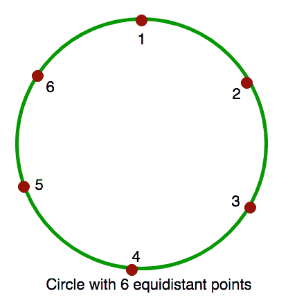

# 计算两个给定点之间有“k”个等距点的圆的钝角

> 原文:[https://www . geesforgeks . org/count-钝角-圆-k-等距-点-2-给定点/](https://www.geeksforgeeks.org/count-obtuse-angles-circle-k-equidistant-points-2-given-points/)

给定圆周上有 k 个等距点的圆。圆圈中给出了 2 个点 A 和 B。求从/_ACB 形成的所有钝角(大于 90 度的角)的计数，其中 C 可以是除 A 或 B 以外的圆上的任何点。
注:
A 和 B 不相等。
A<b
点在 1 和 K 之间(包括 1 和 K)。



**例:**

```
Input : K = 6, A = 1, B = 3.
Output : 1
Explanation : In the circle with 6 
equidistant points, when C = 2 i.e. 
/_123, we get obtuse angle.

Input : K = 6, A = 1, B = 4.
Output : 0
Explanation : In this circle, there 
is no such C that form an obtuse angle.
```

可以观察到，如果 A 和 B 之间有相等的元素，不可能有任何 C 使得 ACB 是钝角的。此外，可能的钝角的数量是 A 和 b 之间的较小弧。
下面是实现:

## C++

```
// C++ program to count number of obtuse
// angles for given two points.
#include <bits/stdc++.h>
using namespace std;

int countObtuseAngles(int a, int b, int k)
{
    // There are two arcs connecting a
    // and b. Let us count points on
    // both arcs.
    int c1 = (b - a) - 1;
    int c2 = (k - b) + (a - 1);

    // Both arcs have same number of
    // points
    if (c1 == c2)
        return 0;

    // Points on smaller arc is answer
    return min(c1, c2);
}

// Driver code
int main()
{
    int k = 6, a = 1, b = 3;
    cout << countObtuseAngles(a, b, k);
    return 0;
}
```

## Java 语言(一种计算机语言，尤用于创建网站)

```
// Java program to count number of obtuse
// angles for given two points
class GFG {

    static int countObtuseAngles(int a,
                                 int b, int k)
    {

        // There are two arcs connecting a
        // and b. Let us count points on
        // both arcs.
        int c1 = (b - a) - 1;
        int c2 = (k - b) + (a - 1);

        // Both arcs have same number of
        // points
        if (c1 == c2)
            return 0;

        // Points on smaller arc is answer
        return min(c1, c2);
    }

    // Driver Program to test above function
    public static void main(String arg[])
    {

        int k = 6, a = 1, b = 3;
        System.out.print(countObtuseAngles(a, b, k));
    }
}

// This code is contributed by Anant Agarwal.
```

## 计算机编程语言

```
# C++ program to count number of obtuse
# angles for given two points.

def countObtuseAngles( a, b, k):
    # There are two arcs connecting a
    # and b. Let us count points on
    # both arcs.
    c1 = (b - a) - 1
    c2 = (k - b) + (a - 1)

    # Both arcs have same number of
    # points
    if (c1 == c2):
       return 0

    # Points on smaller arc is answer
    return min(c1, c2)

# Driver code
k, a, b = 6, 1, 3
print countObtuseAngles(a, b, k)

# This code is contributed by Sachin Bisht
```

## C#

```
// C# program to count number of obtuse
// angles for given two points
using System;

class GFG {

    static int countObtuseAngles(int a,
                           int b, int k)
    {

        // There are two arcs connecting
        // a and b. Let us count points
        // on both arcs.
        int c1 = (b - a) - 1;
        int c2 = (k - b) + (a - 1);

        // Both arcs have same number
        // of points
        if (c1 == c2)
            return 0;

        // Points on smaller arc is
        // answer
        return Math.Min(c1, c2);
    }

    // Driver Program to test above
    // function
    public static void Main()
    {

        int k = 6, a = 1, b = 3;

        Console.WriteLine(
           countObtuseAngles(a, b, k));
    }
}

// This code is contributed by vt_m.
```

## 服务器端编程语言（Professional Hypertext Preprocessor 的缩写）

```
<?php
// PHP program to count number
// of obtuse angles for given
// two points.

function countObtuseAngles($a, $b, $k)
{
    // There are two arcs connecting a
    // and b. Let us count points on
    // both arcs.
    $c1 = ($b - $a) - 1;
    $c2 = ($k - $b) + ($a - 1);

    // Both arcs have same number of
    // points
    if ($c1 == $c2)
        return 0;

    // Points on smaller arc is answer
    return min($c1, $c2);
}

// Driver code
$k = 6; $a = 1; $b = 3;
echo countObtuseAngles($a, $b, $k);

// This code is contributed by aj_36
?>
```

## java 描述语言

```
<script>

// Javascript program to count number of obtuse
// angles for given two points   
function countObtuseAngles(a , b , k) {

        // There are two arcs connecting a
        // and b. Let us count points on
        // both arcs.
        var c1 = (b - a) - 1;
        var c2 = (k - b) + (a - 1);

        // Both arcs have same number of
        // points
        if (c1 == c2)
            return 0;

        // Points on smaller arc is answer
        return Math.min(c1, c2);
    }

    // Driver Program to test above function

        var k = 6, a = 1, b = 3;
        document.write(countObtuseAngles(a, b, k));

// This code is contributed by todaysgaurav

</script>
```

**输出:**

```
1
```

本文由 [**罗希特·塔普利亚尔**](https://www.hackerrank.com/rohit_thapliyal) 供稿。如果你喜欢 GeeksforGeeks 并想投稿，你也可以使用[contribute.geeksforgeeks.org](http://www.contribute.geeksforgeeks.org)写一篇文章或者把你的文章邮寄到 contribute@geeksforgeeks.org。看到你的文章出现在极客博客主页上，帮助其他极客。
如果发现有不正确的地方，或者想分享更多关于上述话题的信息，请写评论。