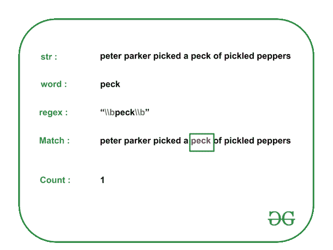

# 统计字符串中某个单词的出现次数|集合 2(使用正则表达式)

> 原文:[https://www . geesforgeks . org/count-出现次数-字符串中的单词-set-2-使用正则表达式/](https://www.geeksforgeeks.org/count-occurrences-of-a-word-in-string-set-2-using-regular-expressions/)

给定一个[字符串](https://www.geeksforgeeks.org/category/data-structures/c-strings/) **字符串**和一个单词 **w，**任务是使用[正则表达式打印给定单词在](https://www.geeksforgeeks.org/regular-expression-python-examples-set-1/)[字符串](https://www.geeksforgeeks.org/category/data-structures/c-strings/) **字符串**中的出现次数。

**示例:**

> **输入:str** =“彼得·帕克摘了一撮泡椒”， **w** =“一撮”
> **输出:** 1
> **解释:**给定字符串中“一撮”一词只出现一次。因此，输出为 1。
> 
> 
> 
> **输入:str** =“如果土拨鼠会扔木头，那么它会扔多少木头？”， **w** =【木】
> T5【输出: 2
> **说明:**给定字符串中“木”字只出现两次。
> 因此，输出为 2。
> 
> **输入:str** =“她在海边卖贝壳”， **w** =“海”
> **输出:** 0
> **说明:**给定的字符串中没有出现“海”字。因此，输出为 0。

**方法:**在给定字符串中查找所需的字符串 w 个数所需的正则表达式为**\ \ b*w*\ \ b**，其中 **\b** 为字边界。

按照步骤解决问题

*   为单词 **> 创建[正则表达式模式](https://www.geeksforgeeks.org/write-regular-expressions/)** 

*   **[遍历字符串](https://www.geeksforgeeks.org/iterate-over-characters-of-a-string-in-c/)，使用[正则表达式 _ 迭代器()](https://www.geeksforgeeks.org/regex_iterator-function-in-c-stl/)将[正则表达式](https://www.geeksforgeeks.org/regular-expression-python-examples-set-1/)与字符串**字符串**匹配。同时，更新匹配的数量。***   **Print the total number of matches obtained in the above step.

    下面是上述方法的实现:

    ## C++

    ```
    // C++ program for the above approach
    #include <iostream>
    #include <regex>
    using namespace std;

    // Function to count total occurrences
    // of word "w" in string "str"
    void countOccurrences(string str, string w)
    {
        // Get the regex to be checked
        string regexPattern = "\\b" + w + "\\b";
        const regex pattern(regexPattern);

        // Variable to count total
        // occurrences of the given word
        int count = 0;

        auto it
            = sregex_iterator(str.begin(), str.end(), pattern);

        for (it; it != sregex_iterator(); it++) {

            // Increment count
            count++;
        }

        // Print the occurrences of the word
        cout << count << endl;

        return;
    }

    // Driver Code
    int main()
    {
        // Input
        string str
            = "peter parker picked a peck of pickled peppers";
        string w = "peck";

        countOccurrences(str, w);

        return 0;
    }
    ```

    **Output**

    ```
    1
    ```

    ***时间复杂度:**O(N)*
    T5**辅助空间:** O(N)**