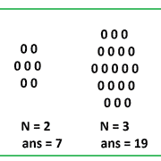

# N 级六边形中 0 的计数

> 原文:[https://www . geesforgeks . org/count-of-0s-in-an-n-level-hexagon/](https://www.geeksforgeeks.org/count-of-0s-in-an-n-level-hexagon/)

给定一个整数 **N** ，任务是在一个 **N 级**六边形中找到 **0s** 的计数。



**例:**

> **输入:** N = 2
> **输出:** 7
> **输入:** N = 3
> **输出:** 19

**方法:**对于 **N = 1、2、3、…** 的值，可以观察到一系列将形成为 **1、7、19、37、61、91、127、169、…** 。这是一个差异系列，差异在 AP 中是 **6，12，18，…** 。
因此 **N <sup>第</sup>** 项将为 1 + {6 + 12 + 18 +…..(n–1)条款}
= 1+(n–1)*(2 * 6+(n–1–1)* 6)/2
= 1+(n–1)*(12+(n–2)* 6)/2
= 1+(n–1)*(12+6n–12)/2
= 1+(n–1)*(6n)/2
**= 1+(n–1)*(3n)**

## C++

```
// C++ implementation of the approach
#include <bits/stdc++.h>
using namespace std;

// Function to return the count of
// 0s in an n-level hexagon
int count(int n)
{
    return 3 * n * (n - 1) + 1;
}

// Driver code
int main()
{
    int n = 3;

    cout << count(n);

    return 0;
}
```

## Java 语言(一种计算机语言，尤用于创建网站)

```
// Java implementation of the above approach
class GFG
{

    // Function to return the count of
    // 0s in an n-level hexagon
    static int count(int n)
    {
        return 3 * n * (n - 1) + 1;
    }

    // Driver code
    public static void main(String args[])
    {
        int n = 3;

        System.out.println(count(n));
    }
}

// This code is contributed by AnkitRai01
```

## 蟒蛇 3

```
# Python3 implementation of the approach

# Function to return the count of
# 0s in an n-level hexagon
def count(n):
    return 3 * n * (n - 1) + 1

# Driver code
n = 3

print(count(n))

# This code is contributed by Mohit Kumar
```

## C#

```
// C# implementation of the approach
using System;

class GFG
{

// Function to return the count of
// 0s in an n-level hexagon
static int count(int n)
{
    return 3 * n * (n - 1) + 1;
}

// Driver code
static public void Main ()
{
    int n = 3;

    Console.Write(count(n));
}
}

// This code is contributed by ajit
```

## java 描述语言

```
<script>

// Javascript implementation of the approach

// Function to return the count of
// 0s in an n-level hexagon
function count(n)
{
    return 3 * n * (n - 1) + 1;
}

// Driver code
var n = 3;
document.write(count(n));

// This code is contributed by rutvik_56.
</script>
```

**Output:** 

```
19
```