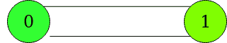
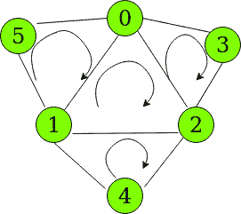

# 给定图形中没有任何内循环的所有循环的计数

> 原文:[https://www . geesforgeks . org/给定图形中没有任何内循环的所有循环计数/](https://www.geeksforgeeks.org/count-of-all-cycles-without-any-inner-cycle-in-a-given-graph/)

给定一个由编号为**【0，N-1】**和 **E** 边的 **N** 顶点组成的**无向图**，任务是计算循环数，使得一个循环的任何顶点子集都不会形成另一个循环。
**举例:**

> **输入:** N = 2，E = 2，边= [{0，1}，{1，0}]
> **输出:** 1
> **解释:**
> 两个顶点之间只存在一个循环。
> 
> 
> 
> **输入:** N = 6，E = 9，边= [{0，1}、{1，2}、{0，2}、{3，0}、{3，2}、{4，1}、{4，2}、{5，1}、{5，0}]
> **输出:** 4
> **解释:**
> 可能的循环如下图所示:
> 
> 
> 
> 诸如 5 -> 0 -> 2 -> 1 -> 5 这样的循环不被考虑，因为它包括内部循环{5 -> 0 -> 1}和{0 -> 1 -> 2}

**逼近:**
由于 V 顶点需要 V 边形成 1 个循环，所需循环数可以用公式表示:

```
(Edges - Vertices) + 1
```

**插图:**

> N = 6，E = 9，边= [{0，1}、{1，2}、{0，2}、{3，0}、{3，2}、{4，1}、{4，2}、{5，1}、{5，0}]
> 循环数= 9–6+1 = 4
> 图中的 4 个循环是:
> {5，0，1}、{0，1，2}、{3，0，2}和{1，2，4} 【T3

该公式还涵盖了单个顶点可能具有自循环的情况。
以下是上述方法的实现:

## C++

```
// C++ implementation for the
// above approach.

#include <bits/stdc++.h>
using namespace std;

// Function to return the
// count of required cycles
int numberOfCycles(int N, int E,
                   int edges[][2])
{
    vector<int> graph[N];
    for (int i = 0; i < E; i++) {
        graph[edges[i][0]]
            .push_back(edges[i][1]);
        graph[edges[i][1]]
            .push_back(edges[i][0]);
    }

    // Return the number of cycles
    return (E - N) + 1;
}

// Driver Code
int main()
{
    int N = 6;
    int E = 9;
    int edges[][2] = { { 0, 1 },
                       { 1, 2 },
                       { 2, 0 },
                       { 5, 1 },
                       { 5, 0 },
                       { 3, 0 },
                       { 3, 2 },
                       { 4, 2 },
                       { 4, 1 } };
    int k = numberOfCycles(N, E,
                           edges);

    cout << k << endl;
    return 0;
}
```

## Java 语言(一种计算机语言，尤用于创建网站)

```
// Java implementation for the
// above approach.
import java.util.*;

class GFG{

// Function to return the
// count of required cycles
static int numberOfCycles(int N, int E,
                          int edges[][])
{
    @SuppressWarnings("unchecked")
    Vector<Integer> []graph = new Vector[N];
    for(int i = 0; i < N; i++)
        graph[i] = new Vector<Integer>();

    for(int i = 0; i < E; i++)
    {
        graph[edges[i][0]].add(edges[i][1]);
        graph[edges[i][1]].add(edges[i][0]);
    }

    // Return the number of cycles
    return (E - N) + 1;
}

// Driver Code
public static void main(String[] args)
{
    int N = 6;
    int E = 9;
    int edges[][] = { { 0, 1 },
                      { 1, 2 },
                      { 2, 0 },
                      { 5, 1 },
                      { 5, 0 },
                      { 3, 0 },
                      { 3, 2 },
                      { 4, 2 },
                      { 4, 1 } };

    int k = numberOfCycles(N, E, edges);

    System.out.print(k + "\n");
}
}

// This code is contributed by Amit Katiyar
```

## 蟒蛇 3

```
# Python3 implementation for the
# above approach.

# Function to return the
# count of required cycles
def numberOfCycles(N, E, edges):

    graph=[[] for i in range(N)]

    for i in range(E):

        graph[edges[i][0]].append(edges[i][1]);
        graph[edges[i][1]].append(edges[i][0]);

    # Return the number of cycles
    return (E - N) + 1;

# Driver Code
if __name__=='__main__':

    N = 6;
    E = 9;
    edges = [ [ 0, 1 ],
                       [ 1, 2 ],
                       [ 2, 0 ],
                       [ 5, 1 ],
                       [ 5, 0 ],
                       [ 3, 0 ],
                       [ 3, 2 ],
                       [ 4, 2 ],
                       [ 4, 1 ] ];

    k = numberOfCycles(N, E,edges);
    print(k)

    # This code is contributed by rutvik_56
```

## C#

```
// C# implementation for the
// above approach.
using System;
using System.Collections.Generic;
class GFG{

// Function to return the
// count of required cycles
static int numberOfCycles(int N, int E,
                          int [,]edges)
{

    List<int> []graph = new List<int>[N];
    for(int i = 0; i < N; i++)
        graph[i] = new List<int>();

    for(int i = 0; i < E; i++)
    {
        graph[edges[i, 0]].Add(edges[i, 1]);
        graph[edges[i, 1]].Add(edges[i, 0]);
    }

    // Return the number of cycles
    return (E - N) + 1;
}

// Driver Code
public static void Main(String[] args)
{
    int N = 6;
    int E = 9;
    int [,]edges = { { 0, 1 }, { 1, 2 },
                     { 2, 0 }, { 5, 1 },
                     { 5, 0 }, { 3, 0 },
                     { 3, 2 }, { 4, 2 },
                     { 4, 1 } };

    int k = numberOfCycles(N, E, edges);

    Console.Write(k + "\n");
}
}

// This code is contributed by Rohit_ranjan
```

## java 描述语言

```
<script>

// JavaScript implementation for the
// above approach.

// Function to return the
// count of required cycles
function numberOfCycles(N, E, edges)
{
    var graph = Array.from(Array(N), ()=> Array());
    for (var i = 0; i < E; i++) {
        graph[edges[i][0]]
            .push(edges[i][1]);
        graph[edges[i][1]]
            .push(edges[i][0]);
    }

    // Return the number of cycles
    return (E - N) + 1;
}

// Driver Code
var N = 6;
var E = 9;
var edges = [ [ 0, 1 ],
                   [ 1, 2 ],
                   [ 2, 0 ],
                   [ 5, 1 ],
                   [ 5, 0 ],
                   [ 3, 0 ],
                   [ 3, 2 ],
                   [ 4, 2 ],
                   [ 4, 1 ] ];

var k = numberOfCycles(N, E,
                       edges);
document.write( k);

</script>
```

**Output:** 

```
4
```

***时间复杂度:** O(E)*
***辅助空间:** O(N)*