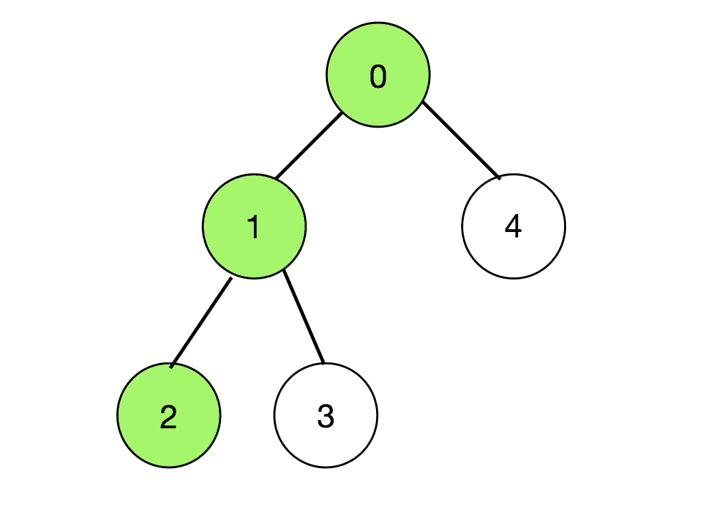
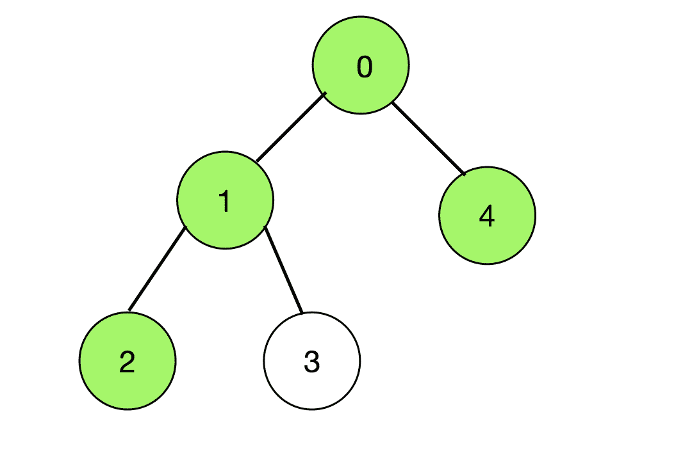
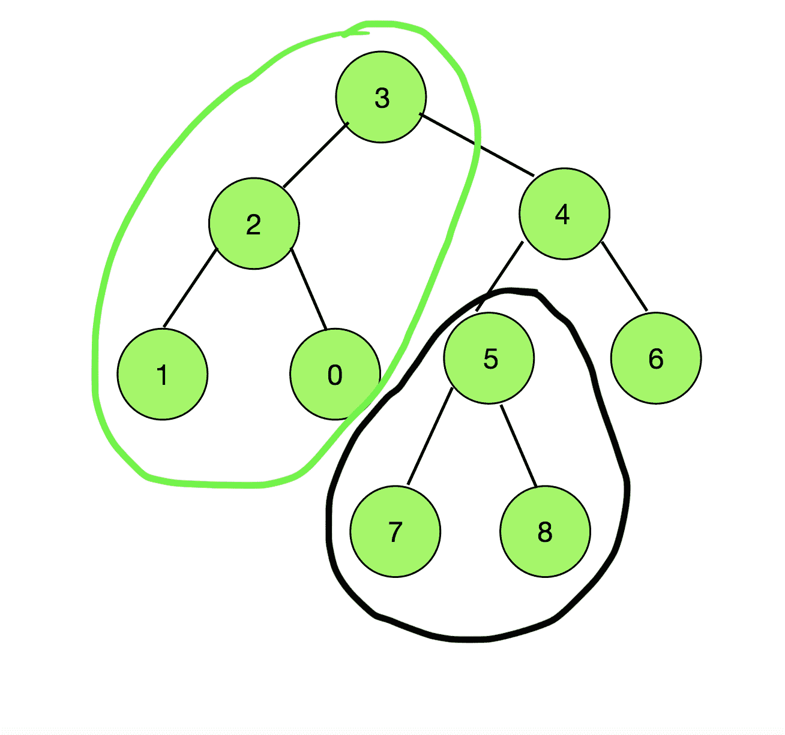

# 统计树中所有可能的路径，使得节点 X 不会出现在节点 Y 之前

> 原文:[https://www . geesforgeks . org/树中所有可能路径的计数-这样节点-x-不出现在节点-y 之前/](https://www.geeksforgeeks.org/count-of-all-possible-paths-in-a-tree-such-that-node-x-does-not-appear-before-node-y/)

给定由值在范围**【0，N–1】**和**(N–1)**边的 **N** 节点和两个节点 **X** 和 **Y** 组成的树，任务是找到树中可能路径的数量，使得节点 **X** 不出现在路径中的节点 **Y** 之前。

**示例:**

> **输入:** N = 5，A = 2，B = 0，Edges[][] = { {0，1}，{1，2}，{1，3}，{0，4} }
> **输出:** 18
> **解释:**
> 由于(X，Y)和(Y，X)被认为是不同的，因此连接任意两对顶点的所有可能路径的计数= 2 * <sup>5</sup> C <sub>2</sub>
> 在这 20 对路径中，不能选择由节点 2 和 0 以及出现在节点 0 之前的节点 2 组成的路径。
> 有两条这样的路径(颜色为绿色)，如下所示:
> 
> [ ](https://media.geeksforgeeks.org/wp-content/uploads/20200713232525/Visualisingpathfrom2to0.png) [ ](https://media.geeksforgeeks.org/wp-content/uploads/20200713232631/Visualisingpathfrom2to4.png)
> 
> 所以总共有 20–2 = 18 条这样的路径。
> 
> **输入:** N = 9，X = 5，Y = 3，Edges[][] = { {0，2}，{1，2}，{2，3}，{3，4}，{4，6}，{4，5}，{5，7}，{5，8} }
> **输出:** 60
> **解释:**
> 由于(X，Y)和(Y，X)被认为是不同的，因此连接任意两对的所有可能路径的计数
> 观察下图，从节点 5 的子树中的节点(用黑色表示)开始，连接到穿过节点 3 的顶点(用绿色表示)的任何路径，在路径中总是有 5 出现在 3 之前。
> 
> [](https://media.geeksforgeeks.org/wp-content/uploads/20200716123643/ScreenShot20200716at121626PM.png)
> 
> 因此，可能路径的总数=(黑色分组的节点总数)*(绿色分组的节点总数)= 3 * 4 = 12。
> 因此，最终答案= 72–12 = 60

**方法:**
想法是找到节点对的组合，在连接它们的路径中，节点 X 总是出现在节点 Y 之前。然后，从可能的节点对总数中减去此类对的数量= **<sup>N</sup> C <sup>2</sup>** 。将节点 **Y** 视为根节点。现在任何先遇到 **X** 再遇到 **Y 的路径，**都是从节点 **X** 的子树中的节点开始，并在节点 **Y** 的子树中的一个节点结束，但不在节点 **W** 的子树中，其中 **W** 是节点 **Y** 的直系子节点，位于 **X** 和**Y**之间

因此，最终答案可以通过下式计算:

> 计数= N *(N–1)–子树的大小(X) *(子树的大小(Y)–子树的大小(W))

如果 **Y** 作为树根。然后，**子树的大小(Y) = N** 。

> 计数= N *(N–1)–子树的大小(X) * (N-子树的大小(W))

按照以下步骤解决问题:

1.  初始化数组 **subtree_size []** 、 **visited []** 和 **check_subtree []** ，每个数组的大小为 **N + 1** 。将**访问过的[]** 的元素初始化为 **0** 。
2.  以 **Y** 为根节点执行 [DFS 遍历](https://www.geeksforgeeks.org/depth-first-search-or-dfs-for-a-graph/)，为每个节点填充 **check_subtree[]** 和 **subtree_size []** 。 **check_subtree[]** 检查当前节点的子树是否包含节点 **X** 。
3.  找到从 **X** 到 **Y** 路径中 **Y** 的孩子(说**节点 v)** 。初始化一个整数变量说**差**。
4.  将(**节点总数-子树大小【v】**)分配给**差值**。
5.  返回**(N *(N–1))–(subtree _ size[A]*(差异))**作为答案。

下面是上述方法的实现:

## C++

```
// C++ Program to implement
// the above approach
#include <bits/stdc++.h>
#define int long long int
using namespace std;

// Maximum number of nodes
const int NN = 3e5;

// Vector to store the tree
vector<int> G[NN + 1];

// Function to perform DFS Traversal
int dfs(int node, int A, int* subtree_size,
        int* visited, int* check_subtree)
{
    // Mark the node as visited
    visited[node] = true;

    // Initialize the subtree size
    // of each node as 1
    subtree_size[node] = 1;

    // If the node is same as A
    if (node == A) {

        // Mark check_subtree[node] as true
        check_subtree[node] = true;
    }

    // Otherwise
    else
        check_subtree[node] = false;

    // Iterate over the adjacent nodes
    for (int v : G[node]) {

        // If the adjacent node
        // is not visited
        if (!visited[v]) {

            // Update the size of the
            // subtree of current node
            subtree_size[node]
                += dfs(v, A, subtree_size,
                       visited, check_subtree);

            // Check if the subtree of
            // current node contains node A
            check_subtree[node] = check_subtree[node]
                                  | check_subtree[v];
        }
    }

    // Return size of subtree of node
    return subtree_size[node];
}

// Function to add edges to the tree
void addedge(int node1, int node2)
{

    G[node1].push_back(node2);
    G[node2].push_back(node1);
}

// Function to calculate the number of
// possible paths
int numberOfPairs(int N, int B, int A)
{
    // Stores the size of subtree
    // of each node
    int subtree_size[N + 1];

    // Stores which nodes are
    // visited
    int visited[N + 1];

    // Initialize all nodes as unvisited
    memset(visited, 0, sizeof(visited));

    // Stores if the subtree of
    // a node contains node A
    int check_subtree[N + 1];

    // DFS Call
    dfs(B, A, subtree_size,
        visited, check_subtree);

    // Stores the difference between
    // total number of nodes and
    // subtree size of an immediate
    // child of Y lies between the
    // path from A to B
    int difference;

    // Iterate over the adjacent nodes B
    for (int v : G[B]) {

        // If the node is in the path
        // from A to B
        if (check_subtree[v]) {

            // Calculate the difference
            difference = N - subtree_size[v];

            break;
        }
    }

    // Return the final answer
    return (N * (N - 1))
           - difference * (subtree_size[A]);
}

// Driver Code
int32_t main()
{
    int N = 9;

    int X = 5, Y = 3;

    // Insert Edges
    addedge(0, 2);
    addedge(1, 2);
    addedge(2, 3);
    addedge(3, 4);
    addedge(4, 6);
    addedge(4, 5);
    addedge(5, 7);
    addedge(5, 8);

    cout << numberOfPairs(N, Y, X);

    return 0;
}
```

## Java 语言(一种计算机语言，尤用于创建网站)

```
// Java Program to implement
// the above approach
import java.util.*;
class GFG{

// Maximum number of nodes
static int NN = (int) 3e5;

// Vector to store the tree
static Vector<Integer> []G = new Vector[NN + 1];

// Function to perform DFS Traversal
static int dfs(int node, int A, int[] subtree_size,
               int[] visited, int[] check_subtree)
{
    // Mark the node as visited
    visited[node] = 1;

    // Initialize the subtree size
    // of each node as 1
    subtree_size[node] = 1;

    // If the node is same as A
    if (node == A)
    {

        // Mark check_subtree[node] as true
        check_subtree[node] = 1;
    }

    // Otherwise
    else
        check_subtree[node] = 0;

    // Iterate over the adjacent nodes
    for (int v : G[node])
    {

        // If the adjacent node
        // is not visited
        if (visited[v] == 0)
        {

            // Update the size of the
            // subtree of current node
            subtree_size[node] += dfs(v, A, subtree_size,
                                      visited, check_subtree);

            // Check if the subtree of
            // current node contains node A
            check_subtree[node] = check_subtree[node] |
                                    check_subtree[v];
        }
    }

    // Return size of subtree of node
    return subtree_size[node];
}

// Function to add edges to the tree
static void addedge(int node1, int node2)
{
    G[node1].add(node2);
    G[node2].add(node1);
}

// Function to calculate the number of
// possible paths
static int numberOfPairs(int N, int B, int A)
{
    // Stores the size of subtree
    // of each node
    int []subtree_size = new int[N + 1];

    // Stores which nodes are
    // visited
    int []visited = new int[N + 1];

    // Stores if the subtree of
    // a node contains node A
    int []check_subtree = new int[N + 1];

    // DFS Call
    dfs(B, A, subtree_size,
        visited, check_subtree);

    // Stores the difference between
    // total number of nodes and
    // subtree size of an immediate
    // child of Y lies between the
    // path from A to B
    int difference = 0;

    // Iterate over the adjacent nodes B
    for (int v : G[B])
    {

        // If the node is in the path
        // from A to B
        if (check_subtree[v] > 0)
        {

            // Calculate the difference
            difference = N - subtree_size[v];

            break;
        }
    }

    // Return the final answer
    return (N * (N - 1)) -
              difference * (subtree_size[A]);
}

// Driver Code
public static void main(String[] args)
{
    int N = 9;

    int X = 5, Y = 3;

    for (int i = 0; i < G.length; i++)
        G[i] = new Vector<Integer>();

    // Insert Edges
    addedge(0, 2);
    addedge(1, 2);
    addedge(2, 3);
    addedge(3, 4);
    addedge(4, 6);
    addedge(4, 5);
    addedge(5, 7);
    addedge(5, 8);

    System.out.print(numberOfPairs(N, Y, X));
}
}

// This code is contributed by sapnasingh4991
```

## 蟒蛇 3

```
# Python3 program to implement
# the above approach

# Maximum number of nodes
NN = int(3e5)

# Vector to store the tree
G = []
for i in range(NN + 1):
    G.append([])

# Function to perform DFS Traversal
def dfs(node, A, subtree_size,
        visited, check_subtree):

    # Mark the node as visited
    visited[node] = True

    # Initialize the subtree size
    # of each node as 1
    subtree_size[node] = 1

    # If the node is same as A
    if (node == A):

        # Mark check_subtree[node] as true
        check_subtree[node] = True

    # Otherwise
    else:
        check_subtree[node] = False

    # Iterate over the adjacent nodes
    for v in G[node]:

        # If the adjacent node
        # is not visited
        if (not visited[v]):

            # Update the size of the
            # subtree of current node
            subtree_size[node] += dfs(v, A,
                                      subtree_size,
                                      visited,
                                      check_subtree)

            # Check if the subtree of
            # current node contains node A
            check_subtree[node] = (check_subtree[node] |
                                   check_subtree[v])

    # Return size of subtree of node
    return subtree_size[node]

# Function to add edges to the tree
def addedge(node1, node2):

    G[node1] += [node2]
    G[node2] += [node1]

# Function to calculate the number of
# possible paths
def numberOfPairs(N, B, A):

    # Stores the size of subtree
    # of each node
    subtree_size = [0] * (N + 1)

    # Stores which nodes are
    # visited
    visited = [0] * (N + 1)

    # Stores if the subtree of
    # a node contains node A
    check_subtree = [0] * (N + 1)

    # DFS Call
    dfs(B, A, subtree_size,
        visited, check_subtree)

    # Stores the difference between
    # total number of nodes and
    # subtree size of an immediate
    # child of Y lies between the
    # path from A to B
    difference = 0

    # Iterate over the adjacent nodes B
    for v in G[B]:

        # If the node is in the path
        # from A to B
        if (check_subtree[v]):

            # Calculate the difference
            difference = N - subtree_size[v]
            break

    # Return the final answer
    return ((N * (N - 1)) -
               difference * (subtree_size[A]))

# Driver Code
N = 9
X = 5
Y = 3

# Insert Edges
addedge(0, 2)
addedge(1, 2)
addedge(2, 3)
addedge(3, 4)
addedge(4, 6)
addedge(4, 5)
addedge(5, 7)
addedge(5, 8)

# Function call
print(numberOfPairs(N, Y, X))

# This code is contributed by Shivam Singh
```

## C#

```
// C# Program to implement
// the above approach
using System;
using System.Collections.Generic;

class GFG{

// Maximum number of nodes
static int NN = (int) 3e5;

// List to store the tree
static List<int> []G = new List<int>[NN + 1];

// Function to perform DFS Traversal
static int dfs(int node, int A, int[] subtree_size,
               int[] visited, int[] check_subtree)
{
    // Mark the node as visited
    visited[node] = 1;

    // Initialize the subtree size
    // of each node as 1
    subtree_size[node] = 1;

    // If the node is same as A
    if (node == A)
    {

        // Mark check_subtree[node] as true
        check_subtree[node] = 1;
    }

    // Otherwise
    else
        check_subtree[node] = 0;

    // Iterate over the adjacent nodes
    foreach (int v in G[node])
    {

        // If the adjacent node
        // is not visited
        if (visited[v] == 0)
        {

            // Update the size of the
            // subtree of current node
            subtree_size[node] += dfs(v, A, subtree_size,
                                      visited, check_subtree);

            // Check if the subtree of
            // current node contains node A
            check_subtree[node] = check_subtree[node] |
                                    check_subtree[v];
        }
    }

    // Return size of subtree of node
    return subtree_size[node];
}

// Function to add edges to the tree
static void addedge(int node1, int node2)
{
    G[node1].Add(node2);
    G[node2].Add(node1);
}

// Function to calculate the number of
// possible paths
static int numberOfPairs(int N, int B, int A)
{
    // Stores the size of subtree
    // of each node
    int []subtree_size = new int[N + 1];

    // Stores which nodes are
    // visited
    int []visited = new int[N + 1];

    // Stores if the subtree of
    // a node contains node A
    int []check_subtree = new int[N + 1];

    // DFS Call
    dfs(B, A, subtree_size,
        visited, check_subtree);

    // Stores the difference between
    // total number of nodes and
    // subtree size of an immediate
    // child of Y lies between the
    // path from A to B
    int difference = 0;

    // Iterate over the adjacent nodes B
    foreach (int v in G[B])
    {

        // If the node is in the path
        // from A to B
        if (check_subtree[v] > 0)
        {

            // Calculate the difference
            difference = N - subtree_size[v];

            break;
        }
    }

    // Return the readonly answer
    return (N * (N - 1)) -
              difference * (subtree_size[A]);
}

// Driver Code
public static void Main(String[] args)
{
    int N = 9;

    int X = 5, Y = 3;

    for (int i = 0; i < G.Length; i++)
        G[i] = new List<int>();

    // Insert Edges
    addedge(0, 2);
    addedge(1, 2);
    addedge(2, 3);
    addedge(3, 4);
    addedge(4, 6);
    addedge(4, 5);
    addedge(5, 7);
    addedge(5, 8);

    Console.Write(numberOfPairs(N, Y, X));
}
}

// This code is contributed by sapnasingh4991
```

## java 描述语言

```
<script>
    // Javascript Program to implement the above approach

    // Maximum number of nodes
    let NN = 3e5;

    // Vector to store the tree
    let G = new Array(NN + 1);

    // Function to perform DFS Traversal
    function dfs(node, A, subtree_size, visited, check_subtree)
    {
        // Mark the node as visited
        visited[node] = 1;

        // Initialize the subtree size
        // of each node as 1
        subtree_size[node] = 1;

        // If the node is same as A
        if (node == A)
        {

            // Mark check_subtree[node] as true
            check_subtree[node] = 1;
        }

        // Otherwise
        else
            check_subtree[node] = 0;

        // Iterate over the adjacent nodes
        for (let v = 0; v < G[node].length; v++)
        {

            // If the adjacent node
            // is not visited
            if (visited[G[node][v]] == 0)
            {

                // Update the size of the
                // subtree of current node
                subtree_size[node] += dfs(G[node][v], A, subtree_size,
                                          visited, check_subtree);

                // Check if the subtree of
                // current node contains node A
                check_subtree[node] = check_subtree[node] |
                                        check_subtree[G[node][v]];
            }
        }

        // Return size of subtree of node
        return subtree_size[node];
    }

    // Function to add edges to the tree
    function addedge(node1, node2)
    {
        G[node1].push(node2);
        G[node2].push(node1);
    }

    // Function to calculate the number of
    // possible paths
    function numberOfPairs(N, B, A)
    {
        // Stores the size of subtree
        // of each node
        let subtree_size = new Array(N + 1);
        subtree_size.fill(0);

        // Stores which nodes are
        // visited
        let visited = new Array(N + 1);
        visited.fill(0);

        // Stores if the subtree of
        // a node contains node A
        let check_subtree = new Array(N + 1);
        check_subtree.fill(0);

        // DFS Call
        dfs(B, A, subtree_size, visited, check_subtree);

        // Stores the difference between
        // total number of nodes and
        // subtree size of an immediate
        // child of Y lies between the
        // path from A to B
        let difference = 0;

        // Iterate over the adjacent nodes B
        for (let v = 0; v < G[B].length; v++)
        {

            // If the node is in the path
            // from A to B
            if (check_subtree[G[B][v]] > 0)
            {

                // Calculate the difference
                difference = N - subtree_size[G[B][v]];

                break;
            }
        }

        // Return the final answer
        return (N * (N - 1)) -
                  difference * (subtree_size[A]);
    }

    let N = 9;

    let X = 5, Y = 3;

    for (let i = 0; i < G.length; i++)
        G[i] = [];

    // Insert Edges
    addedge(0, 2);
    addedge(1, 2);
    addedge(2, 3);
    addedge(3, 4);
    addedge(4, 6);
    addedge(4, 5);
    addedge(5, 7);
    addedge(5, 8);

    document.write(numberOfPairs(N, Y, X));

</script>
```

**Output:** 

```
60
```

***时间复杂度:** O(N)*
***辅助空间:** O(N)*