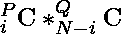

# 从 P 男 Q 女中选择至少有 X 男 Y 女的 N 个人的所有可能方式的计数

> 原文:[https://www . geesforgeks . org/count-of-all-可能的方式-选择-n-人-至少-x-男-y-女-从-p-男-q-女/](https://www.geeksforgeeks.org/count-of-all-possible-ways-to-choose-n-people-with-at-least-x-men-and-y-women-from-p-men-and-q-women/)

**给定**个整数 **N** 、 **P** 、 **Q** 、 **X** 和 **Y** ，任务是从 **P 个男人**和 **Q 个女人**中找出形成至少有**X 个男人**和 **Y 个女人**的**组 N** 人的方法数，其中【t2t

**示例:**

> **输入:** P = 4，Q = 2，N = 5，X = 3，Y = 1
> **输出:** 6
> **说明:**假设给定池为{m1，m2，m3，m4}和{w1，w2}。那么可能的组合是:
> m1 m2 m3 M4 w1
> m1 m2 m3 M4 w2
> m1 m2 m3 w1 w2
> m1 m2 M4 w1 w2
> m1 m3 M4 w1 w2
> m2 m3 M4 w1 w2
> 
> 因此计数是 6。
> 
> **输入:** P = 5，Q = 2，N = 6，X = 4，Y = 1
> T3】输出: 7

**方法:**这个问题是基于 [**组合学**](https://www.geeksforgeeks.org/combinatorics-gq/) 我们需要从 P 个可用的男性中至少选择 X 个男性，从 Q 个可用的女性中至少选择 Y 个女性，这样选择的总人数就是 N 个，考虑一下这个例子:

> P = 4，Q = 2，N = 5，X = 3，Y = 1。
> 
> 在这种情况下，可能的选择是:(4 个男人中的 4 个)* (2 个女人中的 1 个)+(4 个男人中的 3 个)*(2 个女人中的 2 个)= 4C4 * 2C1 + 4C3 * 2C2

因此，对于一些 P、Q 和 N 的一般值，该方法可以可视化为:

> 
> 
> 在哪里
> 
> 

按照下面提到的步骤来实现它:

*   从 **i = X** 开始迭代一个循环，直到 i = P
*   检查 **(N-i)是否满足**条件 **(N-i) ≥ Y** 、 **(N-i) ≤ Q** 。如果满足条件，则执行以下操作。
*   在每次迭代中，如果我们选择 I 个男人和(N-i)个女人，计算可能的方法的数量。
*   要获得每次迭代的可能途径数，使用公式

> 

*   **将每次迭代的**值与路的总数相加。
*   返回总值作为您的答案。

以下是该方法的实施情况:

## C++

```
#include <bits/stdc++.h>
using namespace std;

// Function to calculate factorial
long long int fact(int f)
{
    f++;
    long long int ans = 1;

    // Loop to calculate factorial of f
    while (--f > 0)
        ans = ans * f;
    return ans;
}

// Function to calculate combination nCr
long long int ncr(int n, int r)
{
    return (fact(n) / (fact(r) * fact(n - r)));
}

// Function to calculate the number of ways
long long int countWays(int n, int p, int q,
                        int x, int y)
{
    // Variable to store the answer
    long long int sum = 0;

    // Loop to calculate the number of ways
    for (long long int i = x; i <= p; i++) {
        if (n - i >= y && n - i <= q)
            sum += (ncr(p, i) * ncr(q, n - i));
    }
    return sum;
}

// Driver code
int main()
{
    int P = 4, Q = 2, N = 5, X = 3, Y = 1;

    // Calculate possible ways for given
    // N, P, Q, X and Y
    cout << countWays(N, P, Q, X, Y) << endl;
    return 0;
}
```

## Java 语言(一种计算机语言，尤用于创建网站)

```
import java.util.*;
public class GFG
{

  // Function to calculate factorial
  static long fact(long f)
  {
    f++;
    long ans = 1;

    // Loop to calculate factorial of f
    while (--f > 0)
      ans = ans * f;
    return ans;
  }

  // Function to calculate combination nCr
  static long ncr(long n, long r)
  {
    return (fact(n) / (fact(r) * fact(n - r)));
  }

  // Function to calculate the number of ways
  static long countWays(int n, int p, int q,
                        int x, int y)
  {
    // Variable to store the answer
    long sum = 0;

    // Loop to calculate the number of ways
    for (long i = x; i <= p; i++) {
      if (n - i >= y && n - i <= q)
        sum += ((int)ncr(p, i) * (int)ncr(q, n - i));
    }
    return sum;
  }

  // Driver code
  public static void main(String args[])
  {
    int P = 4, Q = 2, N = 5, X = 3, Y = 1;

    // Calculate possible ways for given
    // N, P, Q, X and Y
    System.out.println(countWays(N, P, Q, X, Y));
  }
}

// This code is contributed by Samim Hossain Mondal.
```

## 蟒蛇 3

```
# Function to calculate factorial
def fact (f):
    ans = 1

    # Loop to calculate factorial of f
    while (f):
        ans = ans * f
        f -= 1

    return ans

# Function to calculate combination nCr
def ncr (n, r):
    return (fact(n) // (fact(r) * fact(n - r)))

# Function to calculate the number of ways
def countWays (n, p, q, x, y) :

    # Variable to store the answer
    sum = 0

    # Loop to calculate the number of ways
    for i in range(x, p + 1):
        if (n - i >= y and n - i <= q):
            sum += (ncr(p, i) * ncr(q, n - i))   
    return sum

# Driver code
P = 4
Q = 2
N = 5
X = 3
Y = 1

# Calculate possible ways for given
# N, P, Q, X and Y
print(countWays(N, P, Q, X, Y))

# This code is contributed by gfgking
```

## C#

```
using System;
class GFG
{

// Function to calculate factorial
static long fact(long f)
{
    f++;
    long ans = 1;

    // Loop to calculate factorial of f
    while (--f > 0)
        ans = ans * f;
    return ans;
}

// Function to calculate combination nCr
static long ncr(long n, long r)
{
    return (fact(n) / (fact(r) * fact(n - r)));
}

// Function to calculate the number of ways
static long countWays(int n, int p, int q,
                        int x, int y)
{
    // Variable to store the answer
    long sum = 0;

    // Loop to calculate the number of ways
    for (long i = x; i <= p; i++) {
        if (n - i >= y && n - i <= q)
            sum += ((int)ncr(p, i) * (int)ncr(q, n - i));
    }
    return sum;
}

// Driver code
public static void Main()
{
    int P = 4, Q = 2, N = 5, X = 3, Y = 1;

    // Calculate possible ways for given
    // N, P, Q, X and Y
    Console.Write(countWays(N, P, Q, X, Y));
}
}

// This code is contributed by Samim Hossain Mondal.
```

## java 描述语言

```
<script>

    // Function to calculate factorial
    const fact = (f) => {
        f++;
        let ans = 1;

        // Loop to calculate factorial of f
        while (--f > 0)
            ans = ans * f;
        return ans;
    }

    // Function to calculate combination nCr
    const ncr = (n, r) => {
        return (fact(n) / (fact(r) * fact(n - r)));
    }

    // Function to calculate the number of ways
    const countWays = (n, p, q, x, y) => {

        // Variable to store the answer
        let sum = 0;

        // Loop to calculate the number of ways
        for (let i = x; i <= p; i++) {
            if (n - i >= y && n - i <= q)
                sum += (ncr(p, i) * ncr(q, n - i));
        }
        return sum;
    }

    // Driver code

    let P = 4, Q = 2, N = 5, X = 3, Y = 1;

    // Calculate possible ways for given
    // N, P, Q, X and Y
    document.write(countWays(N, P, Q, X, Y));

// This code is contributed by rakeshsahni

</script>
```

**Output**

```
6
```

**时间复杂度:**O(N<sup>2</sup>)
T5】辅助空间: O(1)