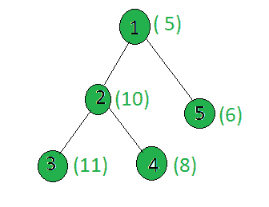

# 给定树中给定节点之间的所有素权重节点的计数

> 原文:[https://www . geeksforgeeks . org/给定树中给定节点之间的所有素权重节点计数/](https://www.geeksforgeeks.org/count-of-all-prime-weight-nodes-between-given-nodes-in-the-given-tree/)

给定一个包含 **N** 节点的**加权树**，以及两个节点 **u** 和 **v** ，任务是在 **u 和 v(包括两者)**之间的简单路径上找到具有 [**质数**](https://www.geeksforgeeks.org/count-the-nodes-in-the-given-tree-whose-weight-is-prime/) 的节点数。

**示例:**

> **输入:**
> 
> 
> 
> u = 3，v = 5
> **输出:** 2
> **解释:**
> 路径 3 到 5 上的质数为[11，5]。因此，答案是 2。

**方法:**解决上面提到的问题，思路是在找到两个节点的 [LCA](https://www.geeksforgeeks.org/lowest-common-ancestor-binary-tree-set-1/) 的时候用基本概念。

*   使用[筛选法](https://www.geeksforgeeks.org/sieve-of-eratosthenes/)预先计算所有[质数](https://www.geeksforgeeks.org/prime-numbers/)直到最大值，以检查一个数是否是 O(1)中的质数
*   给定两个节点 u 和 v，我们将使两个节点处于同一水平，通过向上移动更大的水平节点。当我们向上移动时，我们也会检查重量是否是质数。
*   如果 **v == u** 那么我们将简单的检查当前节点的权重并返回计数。
*   如果 **v 不等于 u** ，那么我们将把**u 和 v 都向上移动 1** 直到它们不一样。
*   现在我们将最终检查 u 或 v 的第一个祖先的重量，并返回计数。

下面是上述方法的实现:

## C++

```
// C++ program Count prime weight
// nodes between two nodes in the given tree

#include <bits/stdc++.h>
using namespace std;
#define MAX 1000

int weight[MAX];
int level[MAX];
int par[MAX];
bool prime[MAX + 1];
vector<int> graph[MAX];

// Function to perform
// Sieve Of Eratosthenes for prime number
void SieveOfEratosthenes()
{
    // Initialize all entries of prime it as true
    // A value in prime[i] will finally be false
    // if i is Not a prime, else true.
    memset(prime, true, sizeof(prime));

    for (int p = 2; p * p <= MAX; p++) {

        // Check if prime[p] is not changed,
        // then it is a prime
        if (prime[p] == true) {

            // Update all multiples
            // of p greater than or
            // equal to the square of it
            // numbers which are multiple
            // of p and are less than p^2
            // are already been marked.
            for (int i = p * p; i <= MAX; i += p)
                prime[i] = false;
        }
    }
}

// Function to perform dfs
void dfs(int node, int parent, int h)
{
    // Stores parent of each node
    par[node] = parent;

    // Stores level of each node from root
    level[node] = h;

    for (int child : graph[node]) {
        if (child == parent)
            continue;
        dfs(child, node, h + 1);
    }
}

// Function to perform prime
// number between the path
int findPrimeOnPath(int u, int v)
{
    int count = 0;

    // The node which is present farthest
    // from the root node is taken as v
    // If u is farther from root node
    // then swap the two
    if (level[u] > level[v])
        swap(u, v);

    int d = level[v] - level[u];

    // Find the ancestor of v
    // which is at same level as u
    while (d--) {

        // If Weight is prime
        // increment count
        if (prime[weight[v]])
            count++;

        v = par[v];
    }

    // If u is the ancestor of v
    // then u is the LCA of u and v
    // Now check if weigh[v]
    // is prime or not
    if (v == u) {
        if (prime[weight[v]])
            count++;
        return count;
    }

    // When v and u are on the same level but
    // are in different subtree. Now move both
    // u and v up by 1 till they are not same
    while (v != u) {
        if (prime[weight[v]])
            count++;

        if (prime[weight[u]])
            count++;

        u = par[u];
        v = par[v];
    }
    // If weight of first ancestor
    // is prime
    if (prime[weight[v]])
        count++;

    return count;
}

// Driver code
int main()
{
    // Precompute all the prime
    // numbers till MAX
    SieveOfEratosthenes();

    // Weights of the node
    weight[1] = 5;
    weight[2] = 10;
    weight[3] = 11;
    weight[4] = 8;
    weight[5] = 6;

    // Edges of the tree
    graph[1].push_back(2);
    graph[2].push_back(3);
    graph[2].push_back(4);
    graph[1].push_back(5);

    dfs(1, -1, 0);
    int u = 3, v = 5;
    cout << findPrimeOnPath(u, v)
         << endl;

    return 0;
}
```

## Java 语言(一种计算机语言，尤用于创建网站)

```
// Java program to count
// prime weight nodes
// between two nodes
// in the given tree
import java.util.*;
class GFG{

static final int MAX = 1000;
static int []weight =
       new int[MAX];
static int []level =
       new int[MAX];
static int []par =
       new int[MAX];
static boolean []prime =
       new boolean[MAX + 1];
static Vector<Integer>[] graph =
       new Vector[MAX]; 

// Function to perform
// Sieve Of Eratosthenes
// for prime number
static void SieveOfEratosthenes()
{
  // Initialize all entries of
  // prime it as true a value in
  // prime[i] will finally be false
  // if i is Not a prime, else true.
  for (int i = 0;
           i < prime.length; i++)
    prime[i] = true;

  for (int p = 2;
           p * p <= MAX; p++)
  {
    // Check if prime[p]
    // is not changed,
    // then it is a prime
    if (prime[p] == true)
    {
      // Update all multiples
      // of p greater than or
      // equal to the square of it
      // numbers which are multiple
      // of p and are less than p^2
      // are already been marked.
      for (int i = p * p;
               i <= MAX; i += p)
        prime[i] = false;
    }
  }
}

// Function to perform dfs
static void dfs(int node,
                int parent, int h)
{
  // Stores parent of each node
  par[node] = parent;

  // Stores level of each
  // node from root
  level[node] = h;

  for (int child : graph[node])
  {
    if (child == parent)
      continue;
    dfs(child, node, h + 1);
  }
}

// Function to perform prime
// number between the path
static int findPrimeOnPath(int u,
                           int v)
{
  int count = 0;

  // The node which is present
  // farthest from the root
  // node is taken as v
  // If u is farther from
  // root node then swap the two
  if (level[u] > level[v])
  {
    int temp = v;
    v = u;
    u = temp;
  }

  int d = level[v] - level[u];

  // Find the ancestor of v
  // which is at same level as u
  while (d-- > 0)
  {
    // If Weight is prime
    // increment count
    if (prime[weight[v]])
      count++;
    v = par[v];
  }

  // If u is the ancestor of v
  // then u is the LCA of u and v
  // Now check if weigh[v]
  // is prime or not
  if (v == u)
  {
    if (prime[weight[v]])
      count++;   
    return count;
  }

  // When v and u are on the
  // same level but are in
  // different subtree. Now
  // move both u and v up by
  // 1 till they are not same
  while (v != u)
  {
    if (prime[weight[v]])
      count++;

    if (prime[weight[u]])
      count++;

    u = par[u];
    v = par[v];
  }

  // If weight of first
  // ancestor is prime
  if (prime[weight[v]])
    count++;
  return count;
}

// Driver code
public static void main(String[] args)
{
  for (int i = 0; i < graph.length; i++)
    graph[i] = new Vector<Integer>();

  // Precompute all the prime
  // numbers till MAX
  SieveOfEratosthenes();

  // Weights of the node
  weight[1] = 5;
  weight[2] = 10;
  weight[3] = 11;
  weight[4] = 8;
  weight[5] = 6;

  // Edges of the tree
  graph[1].add(2);
  graph[2].add(3);
  graph[2].add(4);
  graph[1].add(5);

  dfs(1, -1, 0);
  int u = 3, v = 5;
  System.out.print(findPrimeOnPath(u, v));
}
}

// This code is contributed by shikhasingrajput
```

## 蟒蛇 3

```
# Python3 program count prime weight
# nodes between two nodes in the given tree
MAX = 1000

weight = [0 for i in range(MAX)]
level = [0 for i in range(MAX)]
par = [0 for i in range(MAX)]
prime = [True for i in range(MAX + 1)]
graph = [[] for i in range(MAX)]

# Function to perform
# Sieve Of Eratosthenes
# for prime number
def SieveOfEratosthenes():

    # Initialize all entries of prime it
    # as true. A value in prime[i] will
    # finally be false if i is Not a prime,
    # else true. memset(prime, true,
    # sizeof(prime))
    for p in range(2, MAX + 1):
        if p * p > MAX + 1:
            break

        # Check if prime[p] is not changed,
        # then it is a prime
        if (prime[p] == True):

            # Update all multiples
            # of p greater than or
            # equal to the square of it
            # numbers which are multiple
            # of p and are less than p^2
            # are already been marked.
            for i in range(p * p, MAX + 1, p):
                prime[i] = False

# Function to perform dfs
def dfs(node, parent, h):

    # Stores parent of each node
    par[node] = parent

    # Stores level of each node from root
    level[node] = h

    for child in graph[node]:
        if (child == parent):
            continue

        dfs(child, node, h + 1)

# Function to perform prime
# number between the path
def findPrimeOnPath(u, v):

    count = 0

    # The node which is present farthest
    # from the root node is taken as v
    # If u is farther from root node
    # then swap the two
    if (level[u] > level[v]):
        u, v = v, u

    d = level[v] - level[u]

    # Find the ancestor of v
    # which is at same level as u
    while (d):

        # If Weight is prime
        # increment count
        if (prime[weight[v]]):
            count += 1

        v = par[v]
        d -= 1

    # If u is the ancestor of v
    # then u is the LCA of u and v
    # Now check if weigh[v]
    # is prime or not
    if (v == u):
        if (prime[weight[v]]):
            count += 1

        return count

    # When v and u are on the same level but
    # are in different subtree. Now move both
    # u and v up by 1 till they are not same
    while (v != u):
        if (prime[weight[v]]):
            count += 1

        if (prime[weight[u]]):
            count += 1

        u = par[u]
        v = par[v]

    # If weight of first ancestor
    # is prime
    if (prime[weight[v]]):
        count += 1

    return count

# Driver code
if __name__ == '__main__':

    # Precompute all the prime
    # numbers till MAX
    SieveOfEratosthenes()

    # Weights of the node
    weight[1] = 5
    weight[2] = 10
    weight[3] = 11
    weight[4] = 8
    weight[5] = 6

    # Edges of the tree
    graph[1].append(2)
    graph[2].append(3)
    graph[2].append(4)
    graph[1].append(5)

    dfs(1, -1, 0)
    u = 3
    v = 5

    print(findPrimeOnPath(u, v))

# This code is contributed by mohit kumar 29
```

## C#

```
// C# program to count prime weight
// nodes between two nodes in the
// given tree
using System;
using System.Collections.Generic;

class GFG{

static readonly int MAX = 1000;
static int []weight = new int[MAX];
static int []level = new int[MAX];
static int []par = new int[MAX];
static bool []prime = new bool[MAX + 1];
static List<int>[] graph = new List<int>[MAX]; 

// Function to perform
// Sieve Of Eratosthenes
// for prime number
static void SieveOfEratosthenes()
{

  // Initialize all entries of
  // prime it as true a value in
  // prime[i] will finally be false
  // if i is Not a prime, else true.
  for(int i = 0;
          i < prime.Length; i++)
    prime[i] = true;

  for(int p = 2;
          p * p <= MAX; p++)
  {

    // Check if prime[p]
    // is not changed,
    // then it is a prime
    if (prime[p] == true)
    {

      // Update all multiples
      // of p greater than or
      // equal to the square of it
      // numbers which are multiple
      // of p and are less than p^2
      // are already been marked.
      for(int i = p * p;
              i <= MAX; i += p)
        prime[i] = false;
    }
  }
}

// Function to perform dfs
static void dfs(int node, int parent,
                int h)
{

  // Stores parent of each node
  par[node] = parent;

  // Stores level of each
  // node from root
  level[node] = h;

  foreach(int child in graph[node])
  {
    if (child == parent)
      continue;

    dfs(child, node, h + 1);
  }
}

// Function to perform prime
// number between the path
static int findPrimeOnPath(int u,
                           int v)
{
  int count = 0;

  // The node which is present
  // farthest from the root
  // node is taken as v
  // If u is farther from
  // root node then swap the two
  if (level[u] > level[v])
  {
    int temp = v;
    v = u;
    u = temp;
  }

  int d = level[v] - level[u];

  // Find the ancestor of v
  // which is at same level as u
  while (d-- > 0)
  {

    // If Weight is prime
    // increment count
    if (prime[weight[v]])
      count++;

    v = par[v];
  }

  // If u is the ancestor of v
  // then u is the LCA of u and v
  // Now check if weigh[v]
  // is prime or not
  if (v == u)
  {
    if (prime[weight[v]])
      count++; 

    return count;
  }

  // When v and u are on the
  // same level but are in
  // different subtree. Now
  // move both u and v up by
  // 1 till they are not same
  while (v != u)
  {
    if (prime[weight[v]])
      count++;

    if (prime[weight[u]])
      count++;

    u = par[u];
    v = par[v];
  }

  // If weight of first
  // ancestor is prime
  if (prime[weight[v]])
    count++;

  return count;
}

// Driver code
public static void Main(String[] args)
{
  for(int i = 0; i < graph.Length; i++)
    graph[i] = new List<int>();

  // Precompute all the prime
  // numbers till MAX
  SieveOfEratosthenes();

  // Weights of the node
  weight[1] = 5;
  weight[2] = 10;
  weight[3] = 11;
  weight[4] = 8;
  weight[5] = 6;

  // Edges of the tree
  graph[1].Add(2);
  graph[2].Add(3);
  graph[2].Add(4);
  graph[1].Add(5);

  dfs(1, -1, 0);
  int u = 3, v = 5;

  Console.Write(findPrimeOnPath(u, v));
}
}

// This code is contributed by Amit Katiyar
```

## java 描述语言

```
<script>

// Javascript program Count prime weight
// nodes between two nodes in the given tree
var MAX = 1000;

var weight = Array(MAX);
var level = Array(MAX);
var par = Array(MAX);
var prime = Array(MAX+1).fill(true);
var graph = Array.from(Array(MAX), ()=>Array());

// Function to perform
// Sieve Of Eratosthenes for prime number
function SieveOfEratosthenes()
{

    for (var p = 2; p * p <= MAX; p++) {

        // Check if prime[p] is not changed,
        // then it is a prime
        if (prime[p] == true) {

            // Update all multiples
            // of p greater than or
            // equal to the square of it
            // numbers which are multiple
            // of p and are less than p^2
            // are already been marked.
            for (var i = p * p; i <= MAX; i += p)
                prime[i] = false;
        }
    }
}

// Function to perform dfs
function dfs(node, parent, h)
{
    // Stores parent of each node
    par[node] = parent;

    // Stores level of each node from root
    level[node] = h;

    graph[node].forEach(child => {

        if (child != parent)
            dfs(child, node, h + 1);
    });
}

// Function to perform prime
// number between the path
function findPrimeOnPath(u, v)
{
    var count = 0;

    // The node which is present farthest
    // from the root node is taken as v
    // If u is farther from root node
    // then swap the two
    if (level[u] > level[v])
    {
        [u,v] = [v,u]
    }

    var d = level[v] - level[u];

    // Find the ancestor of v
    // which is at same level as u
    while (d--) {

        // If Weight is prime
        // increment count
        if (prime[weight[v]])
            count++;

        v = par[v];
    }

    // If u is the ancestor of v
    // then u is the LCA of u and v
    // Now check if weigh[v]
    // is prime or not
    if (v == u) {
        if (prime[weight[v]])
            count++;
        return count;
    }

    // When v and u are on the same level but
    // are in different subtree. Now move both
    // u and v up by 1 till they are not same
    while (v != u) {
        if (prime[weight[v]])
            count++;

        if (prime[weight[u]])
            count++;

        u = par[u];
        v = par[v];
    }
    // If weight of first ancestor
    // is prime
    if (prime[weight[v]])
        count++;

    return count;
}

// Driver code
// Precompute all the prime
// numbers till MAX
SieveOfEratosthenes();
// Weights of the node
weight[1] = 5;
weight[2] = 10;
weight[3] = 11;
weight[4] = 8;
weight[5] = 6;
// Edges of the tree
graph[1].push(2);
graph[2].push(3);
graph[2].push(4);
graph[1].push(5);
dfs(1, -1, 0);
var u = 3, v = 5;
document.write( findPrimeOnPath(u, v));

</script>
```

**Output:** 

```
2
```

**<u>复杂度分析:</u>**

*   **时间复杂度:** O(N)。
    在 dfs 中，树的每个节点都被处理一次，因此如果树中总共有 N 个节点，由于 dfs 而导致的复杂性是 O(N)。此外，为了处理每个节点，使用了 SieveOfEratosthenes()函数，该函数的复杂度也是 O(sqrt(N))，但是由于该函数只执行一次，因此不会影响整体的时间复杂度。因此，时间复杂度为 O(N)。
*   **辅助空间:** O(N)。
    质数数组使用额外空间，因此空间复杂度为 O(N)。