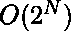

# 相邻对乘积之和等于 K 的大小为 N 的二进制数组的计数

> 原文:[https://www . geeksforgeeks . org/大小为 n 的二进制数组的计数与相邻对的乘积之和等于 k/](https://www.geeksforgeeks.org/count-of-binary-arrays-of-size-n-with-sum-of-product-of-adjacent-pairs-equal-to-k/)

给定两个整数 **N** 和 **K** ，任务是找到大小为 N 的可能二进制数组的总数，使得该数组中相邻对的乘积之和正好等于 **K** 。

**示例:**

> **输入:** N = 5，K = 3
> **输出** : 2
> **说明:**大小为 N 的数组 A 的两个组合，其相邻对的乘积之和加起来就是 K = 3。
> A = [1，1，1，1，0]:Value =(1 * 1)+(1 * 1)+(1 * 0)= 3
> A =[0，1，1，1，1，1]:Value =(0 * 1)+(1 * 1)+(1 * 1)+(1 * 1)= 3
> 
> **输入:** N = 5，K = 4
> **输出** : 1
> **解释**:
> A =【1，1，1，1，1】:值= (1*1) + (1*1) + (1*1) + (1*1) = 4
> 
> **输入:** N=2，K = 3
> T3】输出: 0

**天真** **方法:**最简单的方法是找出数组所有可能的组合，并逐个检查每个组合的和是否等于 K。
**时间复杂度:** 

**有效方法:**上面解释的简单方法可以通过在大小为(K+1，N+1，2)的 3d 矩阵 dp 中记录每个递归调用的结果来优化，即 dp[K+1][N+1][2]。这里，这个 dp 矩阵的每个节点，比如说 **dp[a][b]** 代表大小为 **b** 的可能组合的数量，其总和为 **a** ，最后一个元素为 **c** ，其中 c 只能为 0 或 1。现在按照以下步骤解决这个问题:

1.  首先，用参数 **(N，idx，prev，val，K)** 创建一个函数**combination sample**，其中 **N** 是要形成的数组的大小， **idx** 是数组的所有可能组合都可能存在的索引(最初为 0)， **prev** 是新形成的数组中的前一个元素(只能为 0 或 1)， **val** 是直到 idx 和的乘积之和该函数将返回可能组合的数量，直到索引 **idx** 具有总和**值**和前一个元素 **prev** 。此外，返回时请记住结果。
2.  现在，从主函数调用上述函数**组合可能的**两次，所有初始值相同，但只在一个中把 **prev 改为 0，在另一个中把**改为 1，以计算从 0 和 1 开始的所有数组的可能组合。
3.  在每次通话中，检查以下基本情况:
    *   如果**值> K** :返回 0，因为在这个指数之后有 0 个组合的总和 K 已经超过。
    *   如果 **idx=N-1** :这意味着形成了 N 大小的整个数组。所以只要返回 1，即可能的组合数，如果**值**是 **K.** 否则，返回 0。
4.  此外，在每次递归调用中，检查其结果是否已经被记录。如果是，就从 **dp** 数组中返回。
5.  现在，如果前面的元素是 1，进行两次递归调用:
    *   考虑以 1 作为当前元素的可能组合。因此，在此调用中，将**值**增加 1，因为当前元素和上一个元素的乘积(1*1=1)将为当前总和加 1。
    *   考虑以 0 作为当前元素的可能组合。在这种情况下，**值**将保持不变。
6.  如果前一个元素是 0，那么也进行两次递归调用，一次考虑将 1 作为当前元素的组合，另一次考虑将 0 作为当前元素的组合。在这两种情况下，**值**将保持不变。
7.  将以上四个函数调用返回的所有值相加，并在内存化后从当前函数返回这个相加的值。
8.  根据以上观察打印答案。

*以下是上述方法的实现:*

## C++

```
// C++ program for the above approach

#include <bits/stdc++.h>
using namespace std;

// Function to return the number of total
// possible combinations of 0 and 1 to form
// an array of size N having sum of product
// of consecutive elements K
int combinationsPossible(int N, int idx, int prev, int val,
                         int K,
                         vector<vector<vector<int> > >& dp)
{

    // If value is greater than K, then
    // return 0 as no combination is
    // possible to have sum K
    if (val > K) {
        return 0;
    }

    // Check if the result of this recursive
    // call is memoised already, if it is then
    // just return the previously calculated result
    if (dp[val][idx][prev] != -1) {
        return dp[val][idx][prev];
    }

    // Check if the value is equal to K at N, if
    // it is then return 1 as this combination
    // is possible. Otherwise return 0.
    if (idx == N - 1) {
        if (val == K) {
            return 1;
        }
        return 0;
    }
    int ans = 0;

    // If previous element is 1
    if (prev == 1) {

        // If current element is 1 as well, then
        // add 1 to value
        ans += combinationsPossible(N, idx + 1, 1, val + 1,
                                    K, dp);

        // If current element is 0, then value
        // will remain same
        ans += combinationsPossible(N, idx + 1, 0, val, K,
                                    dp);
    }

    // If previous element is 0, then value will
    // remain same irrespective of the current element
    else {
        ans += combinationsPossible(N, idx + 1, 1, val, K,
                                    dp);
        ans += combinationsPossible(N, idx + 1, 0, val, K,
                                    dp);
    }

    // Memoise and return the ans
    return dp[val][idx][prev] = ans;
}

// Driver Code
int main()
{
    int N = 5;
    int K = 3;
    vector<vector<vector<int> > > dp(
        K + 1,
        vector<vector<int> >(N + 1, vector<int>(2, -1)));

    // As the array can be started by 0 or 1, so take both
    // cases while calculating the total possible
    // combinations
    cout << (combinationsPossible(N, 0, 0, 0, K, dp)
             + combinationsPossible(N, 0, 1, 0, K, dp));
}
```

## Java 语言(一种计算机语言，尤用于创建网站)

```
// Java program for the above approach
import java.util.*;

class GFG
{

    // Function to return the number of total
    // possible combinations of 0 and 1 to form
    // an array of size N having sum of product
    // of consecutive elements K
    static int combinationsPossible(int N, int idx, int prev,
                                    int val, int K, int[][][] dp)
    {

        // If value is greater than K, then
        // return 0 as no combination is
        // possible to have sum K
        if (val > K) {
            return 0;
        }

        // Check if the result of this recursive
        // call is memoised already, if it is then
        // just return the previously calculated result
        if (dp[val][idx][prev] != -1) {
            return dp[val][idx][prev];
        }

        // Check if the value is equal to K at N, if
        // it is then return 1 as this combination
        // is possible. Otherwise return 0.
        if (idx == N - 1) {
            if (val == K) {
                return 1;
            }
            return 0;
        }
        int ans = 0;

        // If previous element is 1
        if (prev == 1) {

            // If current element is 1 as well, then
            // add 1 to value
            ans += combinationsPossible(N, idx + 1, 1, val + 1, K, dp);

            // If current element is 0, then value
            // will remain same
            ans += combinationsPossible(N, idx + 1, 0, val, K, dp);
        }

        // If previous element is 0, then value will
        // remain same irrespective of the current element
        else {
            ans += combinationsPossible(N, idx + 1, 1, val, K, dp);
            ans += combinationsPossible(N, idx + 1, 0, val, K, dp);
        }

        // Memoise and return the ans
        dp[val][idx][prev] = ans;
        return dp[val][idx][prev];
    }

    // Driver Code
    public static void main(String[] args) {
        int N = 5;
        int K = 3;
        int[][][] dp = new int[K + 1][N + 1][2];
        for (int i = 0; i < K + 1; i++) {
            for (int j = 0; j < N + 1; j++) {
                for (int k = 0; k < 2; k++)
                    dp[i][j][k] = -1;
            }
        }

        // As the array can be started by 0 or 1, so take both
        // cases while calculating the total possible
        // combinations
        System.out.print(combinationsPossible(N, 0, 0, 0, K, dp) + combinationsPossible(N, 0, 1, 0, K, dp));
    }
}

// This code is contributed by 29AjayKumar
```

## 蟒蛇 3

```
# Python 3 program for the above approach

# Function to return the number of total
# possible combinations of 0 and 1 to form
# an array of size N having sum of product
# of consecutive elements K
def combinationsPossible(N, idx, prev, val, K, dp):
    # If value is greater than K, then
    # return 0 as no combination is
    # possible to have sum K
    if (val > K):
        return 0

    # Check if the result of this recursive
    # call is memoised already, if it is then
    # just return the previously calculated result
    if (dp[val][idx][prev] != -1):
        return dp[val][idx][prev]

    # Check if the value is equal to K at N, if
    # it is then return 1 as this combination
    # is possible. Otherwise return 0.
    if (idx == N - 1):
        if(val == K):
            return 1
        return 0
    ans = 0

    # If previous element is 1
    if (prev == 1):
        # If current element is 1 as well, then
        # add 1 to value
        ans += combinationsPossible(N, idx + 1, 1, val + 1, K, dp)

        # If current element is 0, then value
        # will remain same
        ans += combinationsPossible(N, idx + 1, 0, val, K, dp)

    # If previous element is 0, then value will
    # remain same irrespective of the current element
    else:
        ans += combinationsPossible(N, idx + 1, 1, val, K, dp)
        ans += combinationsPossible(N, idx + 1, 0, val, K, dp)

    # Memoise and return the ans
    dp[val][idx][prev] = ans
    return ans

# Driver Code
if __name__ == '__main__':
    N = 5
    K = 3
    dp = [[[-1 for i in range(2)] for j in range(N+1)] for k in range(K+1)]
    # As the array can be started by 0 or 1, so take both
    # cases while calculating the total possible
    # combinations
    print(combinationsPossible(N, 0, 0, 0, K, dp) + combinationsPossible(N, 0, 1, 0, K, dp))

    # This code is contributed by SURENDRA_GANGWAR.
```

## C#

```
// C# program for the above approach
using System;
class GFG
{

    // Function to return the number of total
    // possible combinations of 0 and 1 to form
    // an array of size N having sum of product
    // of consecutive elements K
    static int combinationsPossible(int N, int idx,
                                    int prev, int val,
                                    int K, int[, , ] dp)
    {

        // If value is greater than K, then
        // return 0 as no combination is
        // possible to have sum K
        if (val > K) {
            return 0;
        }

        // Check if the result of this recursive
        // call is memoised already, if it is then
        // just return the previously calculated result
        if (dp[val, idx, prev] != -1) {
            return dp[val, idx, prev];
        }

        // Check if the value is equal to K at N, if
        // it is then return 1 as this combination
        // is possible. Otherwise return 0.
        if (idx == N - 1) {
            if (val == K) {
                return 1;
            }
            return 0;
        }
        int ans = 0;

        // If previous element is 1
        if (prev == 1) {

            // If current element is 1 as well, then
            // add 1 to value
            ans += combinationsPossible(N, idx + 1, 1,
                                        val + 1, K, dp);

            // If current element is 0, then value
            // will remain same
            ans += combinationsPossible(N, idx + 1, 0, val,
                                        K, dp);
        }

        // If previous element is 0, then value will
        // remain same irrespective of the current element
        else {
            ans += combinationsPossible(N, idx + 1, 1, val,
                                        K, dp);
            ans += combinationsPossible(N, idx + 1, 0, val,
                                        K, dp);
        }

        // Memoise and return the ans
        return dp[val, idx, prev] = ans;
    }

    // Driver Code
    public static void Main()
    {
        int N = 5;
        int K = 3;
        int[, , ] dp = new int[K + 1, N + 1, 2];
        for (int i = 0; i < K + 1; i++)
            for (int j = 0; j < N + 1; j++)
                for (int l = 0; l < 2; l++)
                    dp[i, j, l] = -1;

        // As the array can be started by 0 or 1, so take
        // both cases while calculating the total possible
        // combinations
        Console.WriteLine(
            combinationsPossible(N, 0, 0, 0, K, dp)
            + combinationsPossible(N, 0, 1, 0, K, dp));
    }
}

// This code is contributed by ukasp.
```

## java 描述语言

```
<script>
        // JavaScript Program to implement
        // the above approach

        // Function to return the number of total
        // possible combinations of 0 and 1 to form
        // an array of size N having sum of product
        // of consecutive elements K
        function combinationsPossible(N, idx, prev, val,
            K,
            dp) {

            // If value is greater than K, then
            // return 0 as no combination is
            // possible to have sum K
            if (val > K) {
                return 0;
            }

            // Check if the result of this recursive
            // call is memoised already, if it is then
            // just return the previously calculated result
            if (dp[val][idx][prev] != -1) {
                return dp[val][idx][prev];
            }

            // Check if the value is equal to K at N, if
            // it is then return 1 as this combination
            // is possible. Otherwise return 0.
            if (idx == N - 1) {
                if (val == K) {
                    return 1;
                }
                return 0;
            }
            let ans = 0;

            // If previous element is 1
            if (prev == 1) {

                // If current element is 1 as well, then
                // add 1 to value
                ans += combinationsPossible(N, idx + 1, 1, val + 1,
                    K, dp);

                // If current element is 0, then value
                // will remain same
                ans += combinationsPossible(N, idx + 1, 0, val, K,
                    dp);
            }

            // If previous element is 0, then value will
            // remain same irrespective of the current element
            else {
                ans += combinationsPossible(N, idx + 1, 1, val, K,
                    dp);
                ans += combinationsPossible(N, idx + 1, 0, val, K,
                    dp);
            }

            // Memoise and return the ans
            return dp[val][idx][prev] = ans;
        }

        // Driver Code
        let N = 5;
        let K = 3;
        let dp = new Array(K + 1);
        for (i = 0; i < dp.length; i++) {
            dp[i] = new Array(N + 1);
        }
        for (i = 0; i < dp.length; i++) {
            for (j = 0; j < dp[0].length; j++) {
                dp[i][j] = new Array(2).fill(-1);
            }
        }

        // As the array can be started by 0 or 1, so take both
        // cases while calculating the total possible
        // combinations
        document.write(combinationsPossible(N, 0, 0, 0, K, dp)
            + combinationsPossible(N, 0, 1, 0, K, dp));

     // This code is contributed by Potta Lokesh
    </script>
```

**Output**

```
2
```

**时间复杂度:** *O(N*K)*