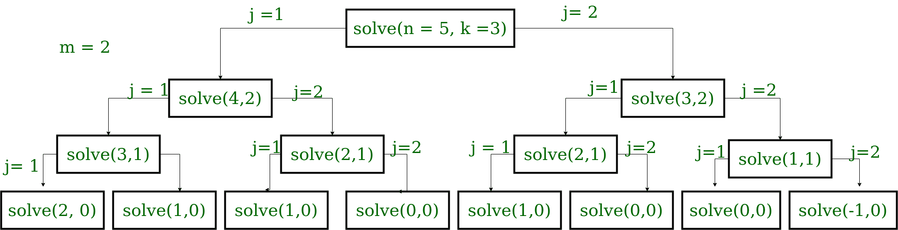

# 长度为 N 的二进制字符串的计数，最多有 M 个连续的 1 或 0，交替正好为 K 次

> 原文:[https://www . geesforgeks . org/count-of-binary-strings-of-length-n-having-atmat-m-continuous-1s-or-0s-alternative-just-k-times/](https://www.geeksforgeeks.org/count-of-binary-strings-of-length-n-having-atmost-m-consecutive-1s-or-0s-alternatively-exactly-k-times/)

给定三个整数， **N，K** 和 **M.** 任务是找出长度为 **N** 的 [**二进制串**的个数，该串总是以 **1** 开始，其中最多可以有 **M** 个连续的 1 或 0，它们正好交替出现 **K** 次。
**举例:**](https://www.geeksforgeeks.org/tag/binary-string/) 

> **输入:** N = 5，K = 3，M = 2
> **输出:** 3
> 三个配置为:
> 11001
> 10011
> 11011
> **说明:**
> 注意 1 和 0 的组交替正好 K 次
> **输入:** N = 7，K = 4，M = 3

****方法:**由于该问题涉及[重叠子问题](https://www.geeksforgeeks.org/overlapping-subproblems-property-in-dynamic-programming-dp-1/)和[最优子结构](https://www.geeksforgeeks.org/optimal-substructure-property-in-dynamic-programming-dp-2/)。所以，这个问题可以用[动态编程](https://www.geeksforgeeks.org/dynamic-programming/)来解决。** 

*   ****子问题** : **DP[i][j]** 表示到目前为止具有 **j** 交替组的长度为 **i** 的二进制字符串的数量。所以，要计算 dp[N][K]如果我们知道 dp[n-j][k-1]的值，那么我们可以很容易地通过将 j = 1 到 m 上的子问题值求和得到结果(DP[N][K]代表最终答案)。
    如下图递归树图所示，观察到很多子问题重叠。因此，需要缓存结果以避免冗余计算。** 

****

*   ****最优子结构:**
    ![$dp[i][j]=$\sum_{j=1}^{M} f(N-j, K-1)     ](img/b2cd0676424caa84501845c18825c1a4.png "Rendered by QuickLaTeX.com")** 
*   ****按照自上而下的 DP 方法:**
    由于我们可以有一个长度为 **M** 的组，所以我们迭代每一个可能的长度，用新的 **N** 和递减的**K**1 重复，形成一个新的组。子问题的解决方案被缓存和汇总以给出最终结果 dp[N][K]。** 
*   ****基本情况:**

    1.  当 N 为 0，K 为 0 时，返回 1
    2.  当 N 为 0 但 K 不为 0 时，则返回 0
    3.  当 N 不为 0 但 K 为 0 时，则返回 0
    4.  当两者都为负时，返回 0** 

**以下是上述方法的实现:** 

## **C++**

```
// C++ program to find the count
// of Binary strings of length N
// having atmost M consecutive 1s or 0s
// alternatively exactly K times

#include <bits/stdc++.h>
using namespace std;

// Array to contain the final result
int dp[1000][1000];

// Function to get the number
// of desirable binary strings
int solve(int n, int k, int m)
{

    // if we reach end of string
    // and groups are exhausted,
    // return 1
    if (n == 0 && k == 0)
        return 1;

    // if length is exhausted but
    // groups are still to be made,
    // return 0
    if (n == 0 && k != 0)
        return 0;

    // if length is not exhausted
    // but groups are exhausted,
    // return 0
    if (n != 0 && k == 0)
        return 0;

    // if both are negative
    // just return 0
    if (n < 0 || k < 0)
        return 0;

    // if already calculated,
    // return it
    if (dp[n][k])
        return dp[n][k];

    // initialise answer
    // for each state
    int ans = 0;

    // loop through every
    // possible m
    for (int j = 1; j <= m; j++) {
        ans += solve(n - j, k - 1, m);
    }
    return dp[n][k] = ans;
}

// Driver code
int main()
{

    int N = 7, K = 4, M = 3;
    cout << solve(N, K, M);
}
```

## **Java 语言(一种计算机语言，尤用于创建网站)**

```
// Java program to find the count of
// Binary Strings of length N having
// atmost M consecutive 1s or 0s
// alternatively exactly K times
import java.util.*;

class GFG{

// Array to contain the final result
static int [][]dp = new int[1000][1000];

// Function to get the number
// of desirable binary strings
static int solve(int n, int k, int m)
{

    // If we reach end of string
    // and groups are exhausted,
    // return 1
    if (n == 0 && k == 0)
        return 1;

    // If length is exhausted but
    // groups are still to be made,
    // return 0
    if (n == 0 && k != 0)
        return 0;

    // If length is not exhausted
    // but groups are exhausted,
    // return 0
    if (n != 0 && k == 0)
        return 0;

    // If both are negative
    // just return 0
    if (n < 0 || k < 0)
        return 0;

    // If already calculated,
    // return it
    if (dp[n][k] > 0)
        return dp[n][k];

    // Initialise answer
    // for each state
    int ans = 0;

    // Loop through every
    // possible m
    for(int j = 1; j <= m; j++)
    {
       ans += solve(n - j, k - 1, m);
    }
    return dp[n][k] = ans;
}

// Driver code
public static void main(String[] args)
{
    int N = 7, K = 4, M = 3;
    System.out.print(solve(N, K, M));
}
}

// This code is contributed by Rajput-Ji
```

## **蟒蛇 3**

```
# Python3 program to find the count
# of Binary strings of length N
# having atmost M consecutive 1s or
# 0s alternatively exactly K times

# List to contain the final result
rows, cols = (1000, 1000)
dp = [[0 for i in range(cols)]
         for j in range(rows)]

# Function to get the number
# of desirable binary strings
def solve(n, k, m):

    # If we reach end of string
    # and groups are exhausted,
    # return 1
    if n == 0 and k == 0:
        return 1

    # If length is exhausted but
    # groups are still to be made,
    # return 0
    if n == 0 and k != 0:
        return 0

    # If length is not exhausted
    # but groups are exhausted,
    # return 0
    if n != 0 and k == 0:
        return 0

    # If both are negative
    # just return 0
    if n < 0 or k < 0:
        return 0

    # If already calculated,
    # return it
    if dp[n][k]:
        return dp[n][k]

    # Initialise answer
    # for each state
    ans = 0

    # Loop through every
    # possible m
    for j in range(1, m + 1):
        ans = ans + solve(n - j,
                          k - 1, m)
    dp[n][k] = ans

    return dp[n][k]

# Driver code
N = 7
K = 4
M = 3

print(solve(N, K, M))

# This code is contributed by ishayadav181
```

## **C#**

```
// C# program to find the count of
// binary strings of length N having
// atmost M consecutive 1s or 0s
// alternatively exactly K times
using System;

class GFG{

// Array to contain the readonly result
static int [,]dp = new int[1000, 1000];

// Function to get the number
// of desirable binary strings
static int solve(int n, int k, int m)
{

    // If we reach end of string
    // and groups are exhausted,
    // return 1
    if (n == 0 && k == 0)
        return 1;

    // If length is exhausted but
    // groups are still to be made,
    // return 0
    if (n == 0 && k != 0)
        return 0;

    // If length is not exhausted
    // but groups are exhausted,
    // return 0
    if (n != 0 && k == 0)
        return 0;

    // If both are negative
    // just return 0
    if (n < 0 || k < 0)
        return 0;

    // If already calculated,
    // return it
    if (dp[n, k] > 0)
        return dp[n, k];

    // Initialise answer
    // for each state
    int ans = 0;

    // Loop through every
    // possible m
    for(int j = 1; j <= m; j++)
    {
       ans += solve(n - j, k - 1, m);
    }
    return dp[n, k] = ans;
}

// Driver code
public static void Main(String[] args)
{
    int N = 7, K = 4, M = 3;

    Console.Write(solve(N, K, M));
}
}

// This code is contributed by gauravrajput1
```

## **java 描述语言**

```
<script>

// Javascript program to find the count of
// Binary Strings of length N having
// atmost M consecutive 1s or 0s
// alternatively exactly K times

    // Array to contain the final result
     dp = Array(1000);
     for(i =0;i<1000;i++)
         dp[i] = Array(1000).fill(0);

    // Function to get the number
    // of desirable binary strings
    function solve(n , k , m)
    {

        // If we reach end of string
        // and groups are exhausted,
        // return 1
        if (n == 0 && k == 0)
            return 1;

        // If length is exhausted but
        // groups are still to be made,
        // return 0
        if (n == 0 && k != 0)
            return 0;

        // If length is not exhausted
        // but groups are exhausted,
        // return 0
        if (n != 0 && k == 0){
            return 0;
            }

        // If both are negative
        // just return 0
        if (n < 0 || k < 0)
            return 0;

        // If already calculated,
        // return it
        if (dp[n][k] > 0)
            return dp[n][k];

        // Initialise answer
        // for each state
        var ans = 0;

        // Loop through every
        // possible m
        for (var j = 1; j <= m; j++) {
            ans += solve(n - j, k - 1, m);
           // document.write(ans);
        }
        return dp[n][k] = ans;
    }

    // Driver code

        var N = 7, K = 4, M = 3;
        document.write(solve(N, K, M));

// This code contributed by umadevi9616

</script>
```

****Output:** 

```
16
```** 

*****时间复杂度:**O(N * K * M)*
T5】辅助空间: O(1000*1000)**