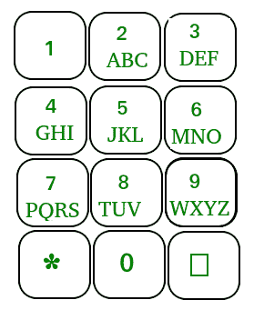

# 键盘手机中按下的按钮数

> 原文:[https://www . geeksforgeeks . org/按下按钮数-小键盘-手机/](https://www.geeksforgeeks.org/count-of-buttons-pressed-in-a-keypad-mobile/)

给定一个字符串 **str** ，任务是统计如果有一个像下图这样的移动键形成给定的字符串，总共会按多少次键。



**例:**

> **输入:** str = "abcdef"
> **输出:** 12
> 1 为 a，2 为 b，3 为 c，1 为 d，2 为 e，3 为 f
> 合计= 1 + 2 + 3 + 1 + 2 + 3 = 12
> **输入:** str = "ssss"
> **输出:** 16

**方法:**使用一个数组来存储输入特定字符需要按下按钮的次数，然后逐个字符遍历给定的字符串，并将所有相应的按键次数添加到 sum 变量中。
以下是上述办法的实施情况:

## C++

```
// C++ implementation of the approach
#include <bits/stdc++.h>
using namespace std;

// Array to store how many times a button
// has to be pressed for typing
// a particular character
const int arr[] = { 1, 2, 3, 1, 2, 3, 1, 2, 3, 1, 2, 3, 1,
                    2, 3, 1, 2, 3, 4, 1, 2, 3, 1, 2, 3, 4 };

// Function to return the count of
// buttons pressed to type the given string
int countKeyPressed(string str, int len)
{
    int count = 0;

    // Count the key presses
    for (int i = 0; i < len; i++)
        count = count + arr[str[i] - 'a'];

    // Return the required count
    return count;
}

// Driver code
int main()
{
    string str = "abcdef";
    int len = str.length();
    cout << countKeyPressed(str, len);

    return 0;
}
```

## Java 语言(一种计算机语言，尤用于创建网站)

```
// Java implementation of the approach
class GFG {

    // Array to store how many times a button
    // has to be pressed for typing
    // a particular character
    static final int arr[] = { 1, 2, 3, 1, 2, 3, 1, 2, 3, 1, 2, 3, 1,
                               2, 3, 1, 2, 3, 4, 1, 2, 3, 1, 2, 3, 4 };

    // Function to return the count of
    // buttons pressed to type the given string
    public static int countKeyPressed(String str, int len)
    {
        int count = 0;

        // Count the key presses
        for (int i = 0; i < len; i++)
            count = count + arr[str.charAt(i) - 'a'];

        // Return the required count
        return count;
    }

    // Driver code
    public static void main(String[] args)
    {
        String str = "abcdef";
        int len = str.length();
        System.out.print(countKeyPressed(str, len));
    }
}
```

## 蟒蛇 3

```
# Python3 implementation of the approach

# Array to store how many times a button
# has to be pressed for typing
# a particular character
arr = [ 1, 2, 3, 1, 2, 3, 1, 2, 3, 1, 2, 3, 1,
        2, 3, 1, 2, 3, 4, 1, 2, 3, 1, 2, 3, 4 ];

# Function to return the count of
# buttons pressed to type the given string
def countKeyPressed(string, length) :
    count = 0;

    # Count the key presses
    for i in range(length) :
        count += arr[ord(string[i]) - ord('a')];

    # Return the required count
    return count;

# Driver code
if __name__ == "__main__" :
    string = "abcdef";
    length = len(string);

    print(countKeyPressed(string, length));

# This code is contributed by Ryuga
```

## C#

```
// C# implementation of the approach
using System;
class GFG {

    // Array to store how many times a button
    // has to be pressed for typing
    // a particular character
    static readonly int[] arr = { 1, 2, 3, 1, 2, 3, 1, 2, 3, 1, 2, 3, 1,
                                  2, 3, 1, 2, 3, 4, 1, 2, 3, 1, 2, 3, 4 };

    // Function to return the count of
    // buttons pressed to type the given string
    public static int countKeyPressed(String str, int len)
    {
        int count = 0;

        // Count the key presses
        for (int i = 0; i < len; i++)
            count = count + arr[str[i] - 'a'];

        // Return the required count
        return count;
    }

    // Driver code
    public static void Main()
    {
        String str = "abcdef";
        int len = str.Length;
        Console.Write(countKeyPressed(str, len));
    }
}
```

## 服务器端编程语言（Professional Hypertext Preprocessor 的缩写）

```
<?php
// PHP implementation of the approach

// Array to store how many times a
// button has to be pressed for
// typing a particular character
$arr = array( 1, 2, 3, 1, 2, 3,
              1, 2, 3, 1, 2, 3, 1,
              2, 3, 1, 2, 3, 4, 1,
              2, 3, 1, 2, 3, 4 );

// Function to return the count of
// buttons pressed to type the given string
function countKeyPressed($str, $len)
{
    global $arr;
    $count = 0;

    // Count the key presses
    for ($i = 0; $i < $len; $i++)
        $count = $count + $arr[ord($str[$i]) -
                               ord('a')];

    // Return the required count
    return $count;
}

// Driver code
$str = "abcdef";
$len = strlen($str);
echo countKeyPressed($str, $len);

// This code is contributed by ita_c
?>
```

## java 描述语言

```
<script>

// Javascript implementation of the approach

// Array to store how many times a button
// has to be pressed for typing
// a particular character
var arr = [ 1, 2, 3, 1, 2, 3, 1, 2, 3, 1, 2, 3, 1,
                    2, 3, 1, 2, 3, 4, 1, 2, 3, 1, 2, 3, 4 ]

// Function to return the count of
// buttons pressed to type the given string
function countKeyPressed(str, len)
{
    var count = 0;

    // Count the key presses
    for (var i = 0; i < len; i++)
        count = count + arr[str.charCodeAt(i) - 97];

    // Return the required count
    return count;
}

// Driver code
var str = "abcdef";
var len = str.length;
document.write(countKeyPressed(str, len));

// This code is contributed by noob2000.
</script>
```

**Output:** 

```
12
```

**时间复杂度:** O(n)