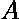

# 与其他二进制串异或的循环置换计数为 0

> 原文:[https://www . geeksforgeeks . org/循环置换计数-与其他二进制字符串进行异或运算-0/](https://www.geeksforgeeks.org/count-of-cyclic-permutations-having-xor-with-other-binary-string-as-0/)

给定两个二进制字符串和。让被设置为字符串的所有循环排列。任务是找出在设置时用【XORed 给的结果有多少根弦。
**示例:**

> **输入:**A =“101”，B =“101”
> T3】输出:1
> S = {“101”、“011”、“110”}
> 仅“101”异或“101”= 0
> **输入:**A =“111”，B =“111”
> **输出:** 3

**方法:**将与连接起来，使其包含所有的循环排列作为子串。现在问题简化为寻找字符串中模式的出现次数，可以使用 [Z 算法](https://www.geeksforgeeks.org/z-algorithm-linear-time-pattern-searching-algorithm/)求解(用于线性时间模式搜索)。
以下是上述方法的实施:

## C++

```
// C++ program to find bitwise XOR between binary
// string A and all the cyclic permutations
// of binary string B
#include <bits/stdc++.h>
using namespace std;

// Implementation of Z-algorithm
// for linear time pattern searching
void compute_z(string s, int z[])
{
    int l = 0, r = 0;
    int n = s.length();
    for (int i = 1; i <= n - 1; i++) {
        if (i > r) {
            l = i, r = i;
            while (r < n && s[r - l] == s[r])
                r++;
            z[i] = r - l;
            r--;
        }
        else {
            int k = i - l;
            if (z[k] < r - i + 1) {
                z[i] = z[k];
            }
            else {
                l = i;
                while (r < n && s[r - l] == s[r])
                    r++;
                z[i] = r - l;
                r--;
            }
        }
    }
}

// Function to get the count of the cyclic
// permutations of b that given 0 when XORed with a
int countPermutation(string a, string b)
{
    // concatenate b with b
    b = b + b;

    // new b now contains all the cyclic
    // permutations of old b as it's sub-strings
    b = b.substr(0, b.size() - 1);

    // concatenate pattern with text
    int ans = 0;
    string s = a + "{content}quot; + b;
    int n = s.length();

    // Fill z array used in Z algorithm  
    int z[n];
    compute_z(s, z);

    for (int i = 1; i <= n - 1; i++) {

        // pattern occurs at index i since
        // z value of i equals pattern length
        if (z[i] == a.length())
            ans++;
    }
    return ans;
}

// Driver code
int main()
{
    string a = "101";
    string b = "101";

    cout << countPermutation(a, b) << endl;

    return 0;
}
```

## Java 语言(一种计算机语言，尤用于创建网站)

```
// Java program to find bitwise XOR between binary
// string A and all the cyclic permutations
// of binary string B

public class GFG{

    // Implementation of Z-algorithm
    // for linear time pattern searching
    static void compute_z(String s, int z[])
    {
        int l = 0, r = 0;
        int n = s.length();
        for (int i = 1; i <= n - 1; i++) {
            if (i > r) {
                l = i;
                r = i;
                while (r < n && s.charAt(r - l) == s.charAt(r))
                    r++;
                z[i] = r - l;
                r--;
            }
            else {
                int k = i - l;
                if (z[k] < r - i + 1) {
                    z[i] = z[k];
                }
                else {
                    l = i;
                    while (r < n && s.charAt(r - l) == s.charAt(r))
                        r++;
                    z[i] = r - l;
                    r--;
                }
            }
        }
    }

    // Function to get the count of the cyclic
    // permutations of b that given 0 when XORed with a
    static int countPermutation(String a, String b)
    {
        // concatenate b with b
        b = b + b;
        // new b now contains all the cyclic
        // permutations of old b as it's sub-strings
        b = b.substring(0, b.length() - 1);

        // concatenate pattern with text
        int ans = 0;
        String s = a + "{content}quot; + b;
        int n = s.length();

        // Fill z array used in Z algorithm  
        int z[] = new int[n];
        compute_z(s, z);

        for (int i = 1; i <= n - 1; i++) {

            // pattern occurs at index i since
            // z value of i equals pattern length
            if (z[i] == a.length())
                ans++;
        }
        return ans;
    }

    // Driver Code
     public static void main(String []args){

               String a = "101";
               String b = "101";
               System.out.println(countPermutation(a, b)) ;
     }
     // This code is contributed by ANKITRAI1
}
```

## 蟒蛇 3

```
# Python 3 program to find bitwise XOR
# between binary string A and all the
# cyclic permutations of binary string B

# Implementation of Z-algorithm
# for linear time pattern searching
def compute_z(s, z):
    l = 0
    r = 0
    n = len(s)
    for i in range(1, n, 1):
        if (i > r):
            l = i
            r = i
            while (r < n and s[r - l] == s[r]):
                r += 1
            z[i] = r - l
            r -= 1

        else:
            k = i - l
            if (z[k] < r - i + 1):
                z[i] = z[k]

            else:
                l = i
                while (r < n and s[r - l] == s[r]):
                    r += 1
                z[i] = r - l
                r -= 1

# Function to get the count of the cyclic
# permutations of b that given 0 when XORed with a
def countPermutation(a, b):

    # concatenate b with b
    b = b + b

    # new b now contains all the cyclic
    # permutations of old b as it's sub-strings
    b = b[0:len(b) - 1]

    # concatenate pattern with text
    ans = 0
    s = a + "{content}quot; + b
    n = len(s)

    # Fill z array used in Z algorithm
    z = [0 for i in range(n)]
    compute_z(s, z)

    for i in range(1, n, 1):

        # pattern occurs at index i since
        # z value of i equals pattern length
        if (z[i] == len(a)):
            ans += 1

    return ans

# Driver code
if __name__ == '__main__':
    a = "101"
    b = "101"

    print(countPermutation(a, b))

# This code is contributed by
# Surendra_Gangwar
```

## C#

```
// C# program to find bitwise XOR between
// binary string A and all the cyclic
// permutations of binary string B
using System;

class GFG
{

// Implementation of Z-algorithm
// for linear time pattern searching
public static void compute_z(string s,
                             int[] z)
{
    int l = 0, r = 0;
    int n = s.Length;
    for (int i = 1; i <= n - 1; i++)
    {
        if (i > r)
        {
            l = i;
            r = i;
            while (r < n && s[r - l] == s[r])
            {
                r++;
            }
            z[i] = r - l;
            r--;
        }
        else
        {
            int k = i - l;
            if (z[k] < r - i + 1)
            {
                z[i] = z[k];
            }
            else
            {
                l = i;
                while (r < n && s[r - l] == s[r])
                {
                    r++;
                }
                z[i] = r - l;
                r--;
            }
        }
    }
}

// Function to get the count of the
// cyclic permutations of b that
// given 0 when XORed with a
public static int countPermutation(string a,
                                   string b)
{
    // concatenate b with b
    b = b + b;

    // new b now contains all the cyclic
    // permutations of old b as it's sub-strings
    b = b.Substring(0, b.Length - 1);

    // concatenate pattern with text
    int ans = 0;
    string s = a + "{content}quot; + b;
    int n = s.Length;

    // Fill z array used in Z algorithm
    int[] z = new int[n];
    compute_z(s, z);

    for (int i = 1; i <= n - 1; i++)
    {

        // pattern occurs at index i since
        // z value of i equals pattern length
        if (z[i] == a.Length)
        {
            ans++;
        }
    }
    return ans;
}

// Driver Code
public static void Main(string[] args)
{
    string a = "101";
    string b = "101";
    Console.WriteLine(countPermutation(a, b));
}
}

// This code is contributed by Shrikant13
```

## java 描述语言

```
<script>

      // JavaScript program to find bitwise XOR between
      // binary string A and all the cyclic
      // permutations of binary string B
      // Implementation of Z-algorithm
      // for linear time pattern searching
      function compute_z(s, z) {
        var l = 0,
          r = 0;
        var n = s.length;
        for (var i = 1; i <= n - 1; i++) {
          if (i > r) {
            l = i;
            r = i;
            while (r < n && s[r - l] === s[r]) {
              r++;
            }
            z[i] = r - l;
            r--;
          } else {
            var k = i - l;
            if (z[k] < r - i + 1) {
              z[i] = z[k];
            } else {
              l = i;
              while (r < n && s[r - l] === s[r]) {
                r++;
              }
              z[i] = r - l;
              r--;
            }
          }
        }
      }

      // Function to get the count of the
      // cyclic permutations of b that
      // given 0 when XORed with a
      function countPermutation(a, b) {
        // concatenate b with b
        b = b + b;

        // new b now contains all the cyclic
        // permutations of old b as it's sub-strings
        b = b.substring(0, b.length - 1);

        // concatenate pattern with text
        var ans = 0;
        var s = a + "{content}quot; + b;
        var n = s.length;

        // Fill z array used in Z algorithm
        var z = new Array(n).fill(0);
        compute_z(s, z);

        for (var i = 1; i <= n - 1; i++) {
          // pattern occurs at index i since
          // z value of i equals pattern length
          if (z[i] === a.length) {
            ans++;
          }
        }
        return ans;
      }

      // Driver Code
      var a = "101";
      var b = "101";
      document.write(countPermutation(a, b));

</script>
```

**Output:** 

```
1
```