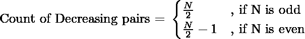

# 从数字 1 到 N 形成的递减对的计数

> 原文:[https://www . geeksforgeeks . org/从数字-1 到-n 形成的递减对计数/](https://www.geeksforgeeks.org/count-of-decreasing-pairs-formed-from-numbers-1-to-n/)

给定一个**整数 N** ，任务是计算从数字 1 到 N 的递减对

> 如果 x > y，一对(x，y)被认为是递减的

**例:**

> **输入:** N = 8
> **输出:** 3
> **解释:**
> 递减对为:(7，1)、(6，2)、(5，3)。
> **输入:** N = 9
> **输出:** 4
> **说明:**
> 递减对为:(8，1)、(7，2)、(6，3)、(5，4)。

**方法:**考虑以下情况:

> 如果 N = 1 = >计数= 0
> 如果 N = 2 = >计数= 1 {(2，1)}
> 如果 N = 3 = >计数= 1 {(3，1)或(3，2)}
> 如果 N = 4 = >计数= 2 {(4，3)，(2，1)}
> 如果 N = 5 = >计数= 2 {(5，4)，(3，2)}
> 如果 N = 6 = >
> 。
> 等等

可以清楚地观察到

下面是上述方法的实施:

## C++

```
// C++ program to count decreasing
// pairs formed from numbers 1 to N

#include <bits/stdc++.h>
using namespace std;

// Function to count the
// possible number of pairs
int divParts(int N)
{
    if (N % 2 == 0)

        // if the number is even
        // then the answer in (N/2)-1
        cout << (N / 2) - 1 << endl;

    else
        // if the number is odd
        // then the answer in N/2
        cout << N / 2 << endl;
}

// Driver code
int main()
{
    int N = 8;

    divParts(N);

    return 0;
}
```

## Java 语言(一种计算机语言，尤用于创建网站)

```
// Java program to count decreasing
// pairs formed from numbers 1 to N
import java.util.*;
class GFG{

// Function to count the
// possible number of pairs
static void divParts(int N)
{
    if (N % 2 == 0)

        // if the number is even
        // then the answer in (N/2)-1
        System.out.println((N / 2) - 1);

    else
        // if the number is odd
        // then the answer in N/2
        System.out.println((N / 2));
}

// Driver code
public static void main(String[] args)
{
    int N = 8;

    divParts(N);
}
}

// This code is contributed by offbeat
```

## 蟒蛇 3

```
# Python3 program to count decreasing
# pairs formed from numbers 1 to N

# Function to count the
# possible number of pairs
def divParts(N):

    if (N % 2 == 0):

        # if the number is even
        # then the answer in (N/2)-1
        print((N / 2) - 1);

    else:

        # if the number is odd
        # then the answer in N/2
        print(N / 2);

# Driver code
N = 8;
divParts(N);

# This code is contributed by Code_Mech
```

## C#

```
// C# program to count decreasing
// pairs formed from numbers 1 to N
using System;
class GFG{

// Function to count the
// possible number of pairs
static void divParts(int N)
{
    if (N % 2 == 0)

        // if the number is even
        // then the answer in (N/2)-1
        Console.WriteLine((N / 2) - 1);

    else
        // if the number is odd
        // then the answer in N/2
        Console.WriteLine((N / 2));
}

// Driver code
public static void Main()
{
    int N = 8;

    divParts(N);
}
}

// This code is contributed by Code_Mech
```

## java 描述语言

```
<script>

// Javascript program to count decreasing
// pairs formed from numbers 1 to N

// Function to count the
// possible number of pairs
function divParts(N)
{
    if (N % 2 == 0)

        // if the number is even
        // then the answer in (N/2)-1
        document.write((N / 2) - 1);

    else
        // if the number is odd
        // then the answer in N/2
        document.write((N / 2));
}

// Driver Code

    let N = 8;

    divParts(N);

</script>
```

**Output:** 

```
3
```