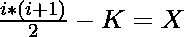

# N 步获得 K 所需的减量操作计数

> 原文:[https://www . geesforgeks . org/count-of-减量-operations-required-to-get-k-in-n-steps/](https://www.geeksforgeeks.org/count-of-decrement-operations-required-to-obtain-k-in-n-steps/)

给定两个整数 **N** 和 **K** ，分别表示允许的操作次数和执行 N 次操作后需要得到的次数。考虑一个值 **S** ，最初 **0** ，任务是通过以任何方式执行以下操作 **N** 次将 **S** 转换为 **K** :

1.  从 **S** 中减去 **1** 。
2.  将 **P + 1** 加到 **S** 上，其中 **P** 为之前添加的数字(*最初为 **0*** )。

如果无法将 **S** 转换为 **K** ，则打印 **-1** 。否则，打印需要执行的减量操作的数量。
**注意:** **S** 每次手术后必须为阳性。

**示例:**

> **输入:** N = 5，K = 4
> **输出:** 2
> **解释:**
> 执行 **N** 运算的顺序:
> **步骤 1:** 将 1 加到 S 转换 S = 1
> **步骤 2:** 将 2 加到 S 转换 S = 3
> **步骤 3:** 从 S 转换 S = 2
> 中减去 1 T21
> 由于在 N(= 5)次运算后 S 等于 K，所以当执行 2 次递减运算时，答案是 2。
> 
> **输入:** N = 10，K = 3
> **输出:** -1

**天真方法:**最简单的想法是在范围**【1，N】**上迭代一个循环，并检查以下条件:

> 
> 
> 和 **i + K = N** 。

如果在满足上述条件的**【1，N】**范围内存在 **i** 的值，则打印 **i** 的值。否则，打印**-1”**。
***时间复杂度:** O(N)，其中 N 为允许的最大步数。*
***辅助空间:** O(1)*

**高效途径:**优化上述途径，思路是使用[二分搜索法](https://www.geeksforgeeks.org/binary-search/)。以下是步骤:

1.  初始化两个变量**开始**为 **0** 结束**为 **N** 。**
2.  取**开始**和**结束**的平均值，求上述两个变量的中间指标。
3.  检查我们是否可以有一个**类型 1** 的**中间**步数。如果是，则打印**中期**并停止迭代。
4.  否则根据检查**中间**得到的结果更新**开始** 或**结束** ，从第 2 步开始重复。
5.  如果不存在满足给定条件的 mid，则打印**-1”**。

下面是上述方法的实现:

## C++

```
// C++ program for the above approach

#include <bits/stdc++.h>
using namespace std;

// Function to check whether m number
// of steps of type 1 are valid or not
int isValid(int n, int m, int k)
{

    // If m and n are the count of operations
    // of type 1 and type 2 respectively,
    // then n - m operations are performed
    int step2 = n - m;

    // Find the value of S after step 2
    int cnt = (step2 * (step2 + 1)) / 2;

    // If m steps of type 1 is valid
    if (cnt - m == k)
        return 0;

    if (cnt - m > k)
        return 1;

    return -1;
}

// Function to find the number of
// operations of type 1 required
void countOfOperations(int n, int k)
{
    int start = 0, end = n;
    bool ok = 1;

    // Iterate over the range
    while (start <= end) {

        // Find the value of mid
        int mid = (start + end) / 2;

        // Check if m steps of type 1
        // are valid or not
        int temp = isValid(n, mid, k);

        // If mid is the valid
        // number of steps
        if (temp == 0) {
            ok = 0;
            cout << mid;
            break;
        }

        else if (temp == 1) {
            start = mid + 1;
        }

        else {
            end = mid - 1;
        }
    }

    // If no valid number
    // of steps exist
    if (ok)
        cout << "-1";
}

// Driver Code
int main()
{
    // Given and N, K
    int N = 5, K = 4;

    // Function Call
    countOfOperations(N, K);
    return 0;
}
```

## Java 语言(一种计算机语言，尤用于创建网站)

```
// Java program for the above approach
import java.util.*;

class GFG{

// Function to check whether m number
// of steps of type 1 are valid or not
static int isValid(int n, int m, int k)
{

    // If m and n are the count of operations
    // of type 1 and type 2 respectively,
    // then n - m operations are performed
    int step2 = n - m;

    // Find the value of S after step 2
    int cnt = (step2 * (step2 + 1)) / 2;

    // If m steps of type 1 is valid
    if (cnt - m == k)
    return 0;

    if (cnt - m > k)
        return 1;

    return -1;
}

// Function to find the number of
// operations of type 1 required
static void countOfOperations(int n, int k)
{
    int start = 0, end = n;
    boolean ok = true;

    // Iterate over the range
    while (start <= end)
    {

        // Find the value of mid
        int mid = (start + end) / 2;

        // Check if m steps of type 1
        // are valid or not
        int temp = isValid(n, mid, k);

        // If mid is the valid
        // number of steps
        if (temp == 0)
        {
            ok = false;
            System.out.print(mid);
            break;
        }

        else if (temp == 1)
        {
            start = mid + 1;
        }
        else
        {
            end = mid - 1;
        }
    }

    // If no valid number
    // of steps exist
    if (ok)
        System.out.print("-1");
}

// Driver Code
public static void main(String[] args)
{

    // Given and N, K
    int N = 5, K = 4;

    // Function call
    countOfOperations(N, K);
}
}

// This code is contributed by gauravrajput1
```

## 蟒蛇 3

```
# Python3 program for the above approach

# Function to check whether m number
# of steps of type 1 are valid or not
def isValid(n, m, k):

    # If m and n are the count of operations
    # of type 1 and type 2 respectively,
    # then n - m operations are performed
    step2 = n - m

    # Find the value of S after step 2
    cnt = (step2 * (step2 + 1)) // 2

    # If m steps of type 1 is valid
    if (cnt - m == k):
        return 0

    if (cnt - m > k):
        return 1

    return -1

# Function to find the number of
# operations of type 1 required
def countOfOperations(n, k):

    start = 0
    end = n
    ok = 1

    # Iterate over the range
    while(start <= end):

        # Find the value of mid
        mid = (start + end) // 2

        # Check if m steps of type 1
        # are valid or not
        temp = isValid(n, mid, k)

        # If mid is the valid
        # number of steps
        if (temp == 0):
            ok = 0
            print(mid)
            break

        elif (temp == 1):
            start = mid + 1
        else:
            end = mid - 1

    # If no valid number
    # of steps exist
    if (ok):
        print("-1")

# Driver Code

# Given and N, K
N = 5
K = 4

# Function call
countOfOperations(N, K)

# This code is contributed by Shivam Singh
```

## C#

```
// C# program for
// the above approach
using System;
class GFG{

// Function to check
// whether m number of steps
// of type 1 are valid or not
static int isValid(int n,
                   int m, int k)
{
  // If m and n are the
  // count of operations
  // of type 1 and type 2
  // respectively, then n - m
  // operations are performed
  int step2 = n - m;

  // Find the value of S
  // after step 2
  int cnt = (step2 *
            (step2 + 1)) / 2;

  // If m steps of
  // type 1 is valid
  if (cnt - m == k)
    return 0;

  if (cnt - m > k)
    return 1;

  return -1;
}

// Function to find the
// number of operations
// of type 1 required 
static void countOfOperations(int n,
                              int k)
{
  int start = 0, end = n;
  bool ok = true;

  // Iterate over the range
  while (start <= end)
  {
    // Find the value of mid
    int mid = (start + end) / 2;

    // Check if m steps of type 1
    // are valid or not
    int temp = isValid(n, mid, k);

    // If mid is the valid
    // number of steps
    if (temp == 0)
    {
      ok = false;
      Console.Write(mid);
      break;
    }

    else if (temp == 1)
    {
      start = mid + 1;
    }
    else
    {
      end = mid - 1;
    }
  }

  // If no valid number
  // of steps exist
  if (ok)
    Console.Write("-1");
}

// Driver Code
public static void Main(String[] args)
{
  // Given and N, K
  int N = 5, K = 4;

  // Function call
  countOfOperations(N, K);
}
}

// This code is contributed by Amit Katiyar
```

## java 描述语言

```
<script>
// Javascript program for the above approach

// Function to check whether m number
// of steps of type 1 are valid or not
function isValid(n, m, k)
{

    // If m and n are the count of operations
    // of type 1 and type 2 respectively,
    // then n - m operations are performed
    var step2 = n - m;

    // Find the value of S after step 2
    var cnt = parseInt((step2 * (step2 + 1)) / 2);

    // If m steps of type 1 is valid
    if (cnt - m == k)
        return 0;

    if (cnt - m > k)
        return 1;

    return -1;
}

// Function to find the number of
// operations of type 1 required
function countOfOperations(n, k)
{
    var start = 0, end = n;
    var ok = 1;

    // Iterate over the range
    while (start <= end) {

        // Find the value of mid
        var mid = parseInt((start + end) / 2);

        // Check if m steps of type 1
        // are valid or not
        var temp = isValid(n, mid, k);

        // If mid is the valid
        // number of steps
        if (temp == 0) {
            ok = 0;
            document.write( mid);
            break;
        }

        else if (temp == 1) {
            start = mid + 1;
        }

        else {
            end = mid - 1;
        }
    }

    // If no valid number
    // of steps exist
    if (ok)
        document.write( "-1");
}

// Driver Code
// Given and N, K
var N = 5, K = 4;
// Function Call
countOfOperations(N, K);

</script>
```

**Output:** 

```
2
```

***时间复杂度:** O(log <sub>2</sub> N)，其中 N 为给定的步数*
***空间复杂度:** O(1)*