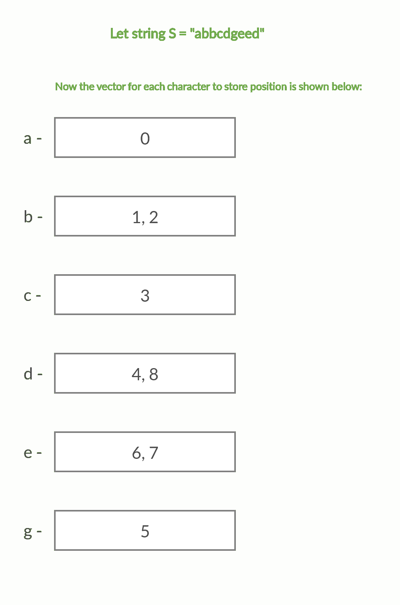

# Q 查询给定范围内子串中不同字符的计数

> 原文:[https://www . geesforgeks . org/q-query 按给定范围对子串中的不同字符进行计数/](https://www.geeksforgeeks.org/count-of-distinct-characters-in-a-substring-by-given-range-for-q-queries/)

给定一个由大小为 **N** 和 **Q** 的小写字母组成的字符串 **S** 在范围**【L，R】**内进行查询，任务是为每个查询按给定的范围打印子字符串中不同字符的计数。

**示例:**

> **输入:**S =“geeks forgeeks”，Q[][] = {{0，4}，{3，7}}
> **输出:**
> 4
> 5
> **说明:**
> 子串 S[0:4]中的区别字符为‘g’、‘e’、‘k’和‘S’
> 子串 S[3:7]中的区别字符为‘k’、‘S’f’、‘o’和‘r’
> 
> **输入:**S = " geeksforgeiksacomputerscienceportal "，Q[][] = {{0，10}，{15，18}，{12，20}}
> **输出:**
> 7
> 4
> 8

**天真方法:**想法是使用[哈希](https://www.geeksforgeeks.org/hashing-data-structure/)来保持给定子串中每个字符的[频率，然后计数频率等于 1 的字符。
以下是上述方法的实现:](https://www.geeksforgeeks.org/print-characters-frequencies-order-occurrence/)

## C++

```
// C++ Program for Naive Approach

#include <bits/stdc++.h>
using namespace std;

void findCount(string s, int L, int R)
{
    // counter to count distinct char
    int distinct = 0;

    // Initializing frequency array to
    // count characters as the appear in
    // substring S[L:R]
    int frequency[26] = {};

    // Iterating over S[L] to S[R]
    for (int i = L; i <= R; i++) {

        // incrementing the count
        // of s[i] character in frequency array
        frequency[s[i] - 'a']++;
    }

    for (int i = 0; i < 26; i++) {

        // if frequency of any character is > 0
        // then increment the counter
        if (frequency[i] > 0)
            distinct++;
    }

    cout << distinct << endl;
}

/* Driver code*/
int main()
{
    string s = "geeksforgeeksisacomputerscienceportal";
    int queries = 3;
    int Q[queries][2] = { { 0, 10 },
                          { 15, 18 },
                          { 12, 20 } };

    for (int i = 0; i < queries; i++)
        findCount(s, Q[i][0], Q[i][1]);

    return 0;
}
```

## Java 语言(一种计算机语言，尤用于创建网站)

```
// Java program for the naive approach
class GFG{

static void findCount(String s, int L,
                                int R)
{

    // Counter to count distinct char
    int distinct = 0;

    // Initializing frequency array
    // to count characters as the
    // appear in subString S[L:R]
    int []frequency = new int[26];

    // Iterating over S[L] to S[R]
    for(int i = L; i <= R; i++)
    {

       // Incrementing the count of s[i]
       // character in frequency array
       frequency[s.charAt(i) - 'a']++;
    }

    for(int i = 0; i < 26; i++)
    {

       // If frequency of any character
       // is > 0 then increment the counter
       if (frequency[i] > 0)
           distinct++;
    }
    System.out.print(distinct + "\n");
}

// Driver code
public static void main(String[] args)
{
    String s = "geeksforgeeksisa" +
               "computerscienceportal";
    int queries = 3;
    int Q[][] = { { 0, 10 },
                  { 15, 18 },
                  { 12, 20 } };

    for(int i = 0; i < queries; i++)
       findCount(s, Q[i][0], Q[i][1]);
}
}

// This code is contributed by sapnasingh4991
```

## 蟒蛇 3

```
# Python3 program for Naive Approach

def findCount(s, L, R):

    # Counter to count distinct char
    distinct = 0

    # Initializing frequency array to
    # count characters as the appear in
    # substring S[L:R]
    frequency = [0 for i in range(26)]

    # Iterating over S[L] to S[R]
    for i in range(L, R + 1, 1):

        # Incrementing the count of s[i]
        # character in frequency array
        frequency[ord(s[i]) - ord('a')] += 1

    for i in range(26):

        # If frequency of any character is > 0
        # then increment the counter
        if (frequency[i] > 0):
            distinct += 1

    print(distinct)

# Driver code
if __name__ == '__main__':

    s = "geeksforgeeksisacomputerscienceportal"
    queries = 3
    Q = [ [ 0, 10 ],
          [ 15, 18 ],
          [ 12, 20 ] ]

    for i in range(queries):
        findCount(s, Q[i][0], Q[i][1])

# This code is contributed by Bhupendra_Singh
```

## C#

```
// C# program for the naive approach
using System;
class GFG{

static void findCount(String s, int L,
                                int R)
{

    // Counter to count distinct char
    int distinct = 0;

    // Initializing frequency array
    // to count characters as the
    // appear in subString S[L:R]
    int []frequency = new int[26];

    // Iterating over S[L] to S[R]
    for(int i = L; i <= R; i++)
    {

        // Incrementing the count of s[i]
        // character in frequency array
        frequency[s[i] - 'a']++;
    }

    for(int i = 0; i < 26; i++)
    {

        // If frequency of any character
        // is > 0 then increment the counter
        if (frequency[i] > 0)
            distinct++;
    }
    Console.Write(distinct + "\n");
}

// Driver code
public static void Main(String[] args)
{
    String s = "geeksforgeeksisa" +
               "computerscienceportal";
    int queries = 3;
    int [,]Q = {{ 0, 10 },
                { 15, 18 },
                { 12, 20 }};

    for(int i = 0; i < queries; i++)
    findCount(s, Q[i, 0], Q[i, 1]);
}
}

// This code is contributed by sapnasingh4991
```

## java 描述语言

```
<script>

// Javascript Program for Naive Approach

function findCount(s, L, R)
{
    // counter to count distinct char
    var distinct = 0;

    // Initializing frequency array to
    // count characters as the appear in
    // substring S[L:R]
    var frequency = Array(26).fill(0);

    // Iterating over S[L] to S[R]
    for (var i = L; i <= R; i++) {

        // incrementing the count
        // of s[i] character in frequency array
        frequency[s[i].charCodeAt(0) - 'a'.charCodeAt(0)]++;
    }

    for (var i = 0; i < 26; i++) {

        // if frequency of any character is > 0
        // then increment the counter
        if (frequency[i] > 0)
            distinct++;
    }

    document.write( distinct + "<br>");
}

/* Driver code*/
var s = "geeksforgeeksisacomputerscienceportal";
var queries = 3;
var Q = [ [ 0, 10 ],
                      [ 15, 18 ],
                      [ 12, 20 ] ];
for (var i = 0; i < queries; i++)
    findCount(s, Q[i][0], Q[i][1]);

</script>
```

**Output:** 

```
7
4
8
```

***时间复杂度:** O(Q×N)*

**有效的方法:**一种有效的方法是将每个字符在字符串中出现时的位置存储在一个数组中。对于每个给定的查询，我们将遍历所有 26 个小写字母。如果当前字母在子串 S[L: R]中，那么对应位置向量中大于或等于 L 的第一个元素应该存在并且小于或等于 R，即 L 和 R 之间必须有一个位置值，表示查询范围内存在字母表。
*例如:*



下面是上述方法的实现:

## C++

```
// C++ Program for Efficient Approach
// to count the no. of distinct characters
// in a substring using STL

#include <bits/stdc++.h>
using namespace std;

// vector of vector to store
// position of all characters
// as they appear in string
vector<vector<int> > v(26);

void build_position_vector(string s)
{
    for (int i = 0; i < s.size(); i++) {

        // inserting position of
        // character as they appear
        v[s[i] - 'a'].push_back(i);
    }
}

void findCount(string s, int L, int R)
{

    build_position_vector(s);

    // counter to count distinct char
    int distinct = 0;

    // iterating over all 26 characters
    for (int i = 0; i < 26; i++) {

        // Finding the first element
        // which is greater than or equal to L
        auto first = lower_bound(
            v[i].begin(),
            v[i].end(), L);

        // Check if first pointer exists
        // and is less than or equal to R
        if (first != v[i].end()
            && *first <= R) {
            distinct++;
        }
    }

    cout << distinct << endl;
}

/* Driver code*/
int main()
{
    string s = "geeksforgeeksisacomputerscienceportal";
    int queries = 3;
    int Q[queries][2] = { { 0, 10 },
                          { 15, 18 },
                          { 12, 20 } };

    for (int i = 0; i < queries; i++)
        findCount(s, Q[i][0], Q[i][1]);

    return 0;
}
```

**Output:** 

```
7
4
8
```

***时间复杂度:**O(N+Q logN)*T4】